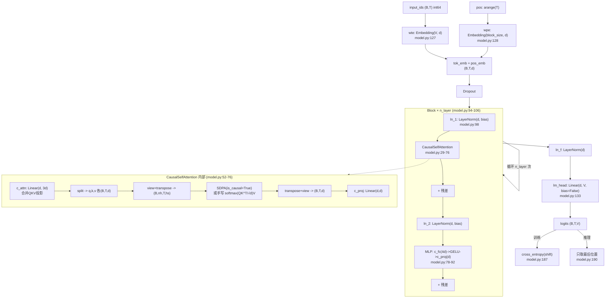
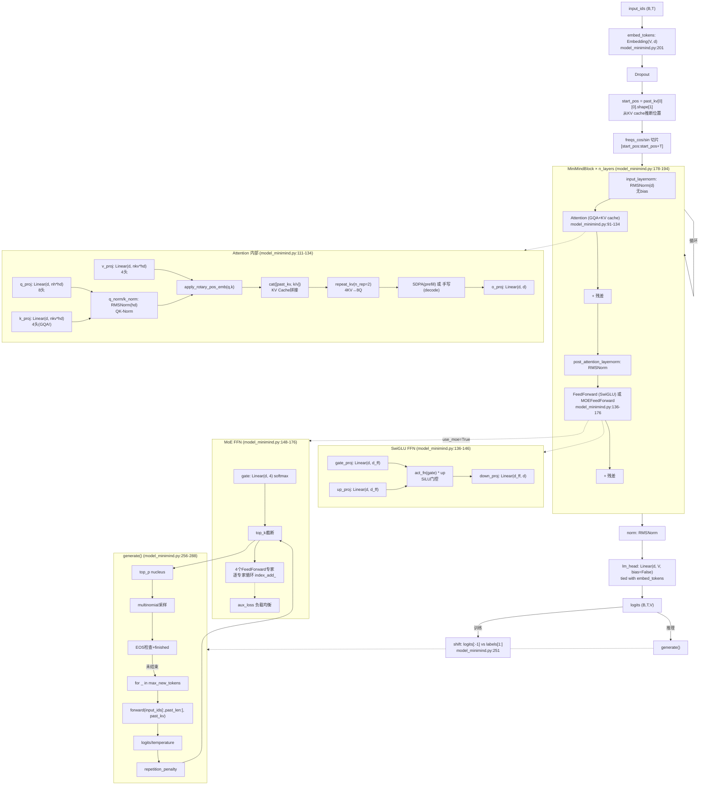
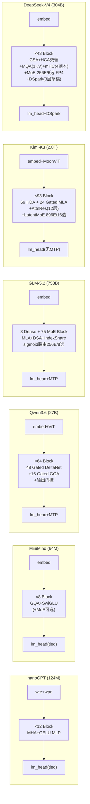
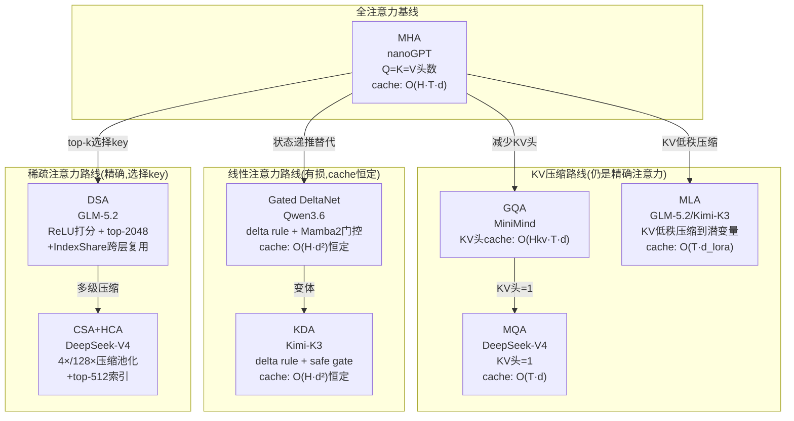
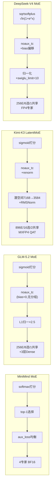
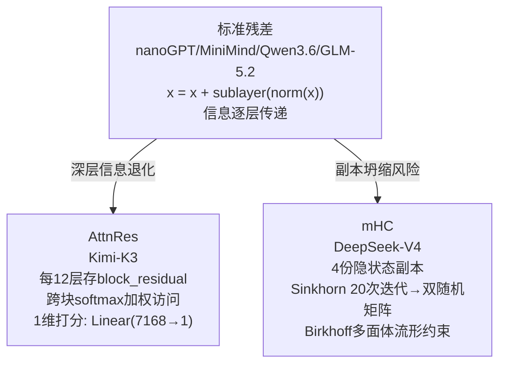
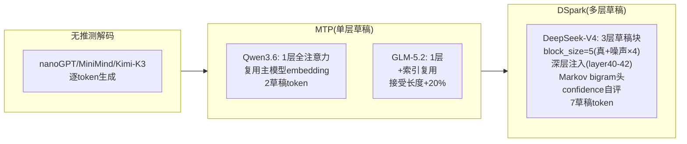
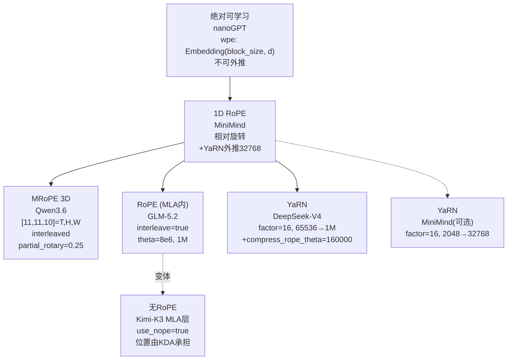

# 六模型深度源码分析与架构图例 · 统一总报告

> 访问日期 2026-08-01。所有结论标注 `[源码事实 文件:行号]` / `[官方材料]` / `[推导]` / `[未知]`。
> 四个大模型的完整审计报告分别存于 `research/{qwen3.6,glm-5.2,kimi-k3,deepseek-v4}/`。

---

## 统一目录

| # | 模型 | 类型 | 源码行数 | 架构图 | 关键函数表 | 与nanoGPT差异 |
|---|---|---|---|---|---|---|
| 1 | nanoGPT | 最小GPT教学 | 755 | §1.1 | §1.3 | (基线) |
| 2 | MiniMind | 现代小模型教学 | 445 | §2.1 | §2.3 | §2.4 |
| 3 | Qwen3.6-27B | 官方Dense混合 | 2275 | research/qwen3.6/ | research/qwen3.6/ | research/qwen3.6/ |
| 4 | GLM-5.2 | 官方MoE | 1400 | research/glm-5.2/ | research/glm-5.2/ | research/glm-5.2/ |
| 5 | Kimi-K3 | 官方MoE多模态 | 2916 | research/kimi-k3/ | research/kimi-k3/ | research/kimi-k3/ |
| 6 | DeepSeek-V4 | 官方MoE | 1795 | research/deepseek-v4/ | research/deepseek-v4/ | research/deepseek-v4/ |
| - | 跨模型对比 | - | - | §3 | - | - |

---

## §1 nanoGPT 深度分析

### §1.1 架构图



### §1.2 关键设计决策

| 组件 | nanoGPT 选择 | 行号 | 为什么 |
|---|---|---|---|
| Norm | LayerNorm(带bias) | model.py:18-27 | GPT-2 兼容;现代模型用 RMSNorm 去 bias |
| 位置编码 | 绝对可学习 wpe | model.py:128 | 简单;但无法外推超 block_size |
| Attention | MHA(c_attn 合并QKV) | model.py:35 | 一次 matmul 省 kernel 启动;现代用分离投影支持 GQA |
| 因果掩码 | SDPA is_causal | model.py:64 | PyTorch 2.0 FlashAttention 路径 |
| FFN | 2层 GELU(4×升维) | model.py:82-84 | 无门控;现代用 SwiGLU 3层门控 |
| 残差 | Pre-LN | model.py:104-105 | 现代做法;Post-LN 深层难收敛 |
| Weight Tying | wte.weight = lm_head.weight | model.py:138 | 省 V×d 参数+语义对齐 |
| 推理优化 | 只算最后位置 lm_head | model.py:190 | 省 (T-1)/T 的 lm_head 计算 |
| KV Cache | **无** | - | 教学极简;每步重算全部K/V |
| 优化器 | AdamW fused + weight decay分组 | model.py:263-287 | 2D+参数decay,1D不decay |
| lr schedule | cosine warmup | train.py:231-242 | warmup防初期冲坏;cosine平滑收敛 |
| 梯度累积 | loss/=grad_accum + no_sync | train.py:292-298 | 模拟大batch;DDP省通信 |
| MFU公式 | 6N + 12LHQT | model.py:296 | N=参数(FFN), LHT=attention(QK^T+AV) |

### §1.3 关键函数表

| 函数 | 文件:行号 | 输入→输出 shape | 核心作用 |
|---|---|---|---|
| GPT.forward | model.py:170-193 | (B,T)→logits(B,T,V)+loss | embedding→blocks→lm_head→CE |
| CausalSelfAttention.forward | model.py:52-76 | (B,T,d)→(B,T,d) | QKV投影→多头SDPA→输出投影 |
| MLP.forward | model.py:87-92 | (B,T,d)→(B,T,d) | 4×升维→GELU→降维 |
| Block.forward | model.py:103-106 | (B,T,d)→(B,T,d) | Pre-LN残差×2 |
| GPT.generate | model.py:305-329 | (B,T)→(B,T+N) | 自回归采样(无KV cache) |
| get_batch | train.py:116-131 | →x(B,T),y(B,T) | shift采样 |
| configure_optimizers | model.py:263-287 | →AdamW | decay分组+fused |
| estimate_mfu | model.py:289-303 | →float | 6N+12LHQT FLOPs估算 |

---

## §2 MiniMind 深度分析

### §2.1 架构图



### §2.2 关键设计决策(与 nanoGPT 对比)

| 组件 | nanoGPT | MiniMind | 改进原因 |
|---|---|---|---|
| Norm | LayerNorm(bias) | **RMSNorm**(无bias) | 去mean省计算,无损 |
| 位置编码 | 绝对wpe(不可外推) | **RoPE+YaRN**(可外推32768) | 相对位置,支持长上下文 |
| Attention | MHA(Q=K=V等宽) | **GQA**(8Q/4KV) | KV cache省50% |
| QK-Norm | 无 | **有**(RMSNorm on head_dim) | 稳定attention分数 |
| KV Cache | **无** | **有**(past_key_value拼接) | 推理O(1) decode vs O(T) |
| FFN | 2层GELU(4×) | **SwiGLU**(3层门控,π×) | 门控增强表达力 |
| FFN比例 | 4× | **π≈3.14×** | SwiGLU 3矩阵参数平衡 |
| MoE | 无 | **可选**(4E/top-1+aux_loss) | 容量扩展 |
| 采样 | temp+top-k | **temp+top-k+top-p+rep_penalty** | 更精细采样控制 |
| EOS | 无 | **有**(finished提前停止) | 高效生成 |
| 流式 | 无 | **有**(streamer.put) | 交互体验 |
| shift | 数据层(x=data[i:i+T], y=data[i+1:]) | **loss层**(logits[:-1] vs labels[1:]) | HF惯例 |
| start_pos | 无(每次全前向) | **从past_kv推断** | KV cache位置对齐 |
| prefill/decode | 不区分 | **区分**(flash分支条件) | prefill用Flash,decode手写 |

### §2.3 关键函数表

| 函数 | 文件:行号 | 输入→输出 shape | 核心作用 |
|---|---|---|---|
| MiniMindForCausalLM.forward | :245-253 | (B,T)→logits+loss+aux_loss | backbone→lm_head→shift CE |
| MiniMindModel.forward | :209-232 | (B,T)→(B,T,d)+presents+aux_loss | embed→blocks→norm;start_pos推断 |
| MiniMindBlock.forward | :186-194 | (B,T,d)→(B,T,d) | Pre-RMSNorm残差×2 |
| Attention.forward | :111-134 | (B,T,d)→(B,T,d)+past_kv | GQA+QKNorm+RoPE+KVcache+SDPA |
| FeedForward.forward | :145-146 | (B,T,d)→(B,T,d) | SwiGLU: down(silu(gate)*up) |
| MOEFeedForward.forward | :156-176 | (B,T,d)→(B,T,d)+aux_loss | softmax路由+top1+逐专家+负载均衡 |
| RMSNorm.forward | :59-60 | (B,T,d)→(B,T,d) | fp32 RMS归一化+scale |
| precompute_freqs_cis | :62-78 | →(T,d)×2 | RoPE预计算+YaRN外推 |
| apply_rotary_pos_emb | :80-84 | (q,k)→(q,k) | rotate_half旋转 |
| repeat_kv | :86-89 | (B,T,nkv,hd)→(B,T,nh,hd) | GQA KV头广播 |
| generate | :256-288 | (B,T)→(B,T+N) | KV cache+temp+topk+topp+rep+eos+stream |
| get_batch | eval_llm.py | →inputs | tokenizer+chat_template |

### §2.4 Attention.forward 逐行解读 `[源码事实 model_minimind.py:111-134]`

```python
# :112-116  投影 + reshape
xq, xk, xv = self.q_proj(x), self.k_proj(x), self.v_proj(x)
xq = xq.view(B, T, 8, 96)       # 8个Q头
xk = xk.view(B, T, 4, 96)       # 4个KV头 (GQA!)
xv = xv.view(B, T, 4, 96)

# :117  QK-Norm (nanoGPT没有)
xq, xk = self.q_norm(xq), self.k_norm(xk)

# :118-119  RoPE (nanoGPT用绝对wpe)
xq, xk = apply_rotary_pos_emb(xq, xk, cos, sin)

# :120-123  KV Cache (nanoGPT没有!)
if past_key_value is not None:
    xk = torch.cat([past_key_value[0], xk], dim=1)  # 拼历史K
    xv = torch.cat([past_key_value[1], xv], dim=1)  # 拼历史V
past_kv = (xk, xv) if use_cache else None

# :124  GQA广播 (nanoGPT是MHA, n_rep=1)
xq = xq.transpose(1,2)                                    # (B,8,T,96)
xk = repeat_kv(xk, n_rep=2).transpose(1,2)                # (B,8,T,96)
xv = repeat_kv(xv, n_rep=2).transpose(1,2)

# :125-131  分支:Flash vs 手写
if flash and seq_len>1 and past_kv is None and mask全1:
    y = SDPA(xq, xk, xv, is_causal=True)     # prefill: FlashAttention
else:
    scores = (xq @ xk.T) / sqrt(96)           # decode或padding: 手写
    scores += causal_mask + padding_mask
    y = softmax(scores) @ xv

# :132-133  输出投影
y = y.transpose(1,2).reshape(B, T, d)
y = o_proj(y)
```

### §2.5 generate() 逐行解读 `[源码事实 model_minimind.py:256-288]`

```python
# :264  KV cache 的核心:只传新token
past_len = past_kv[0][0].shape[1] if past_kv else 0
outputs = self.forward(input_ids[:, past_len:], ...)  # 只传新token!

# :267  温度
logits = outputs.logits[:, -1, :] / temperature

# :268-270  repetition penalty (nanoGPT没有)
for i in range(B):
    seen = torch.unique(input_ids[i])
    logits[i, seen] = where(score>0, score/rp, score*rp)

# :271-272  top-k (nanoGPT有)
logits[logits < topk(logits, top_k)[0][...,-1,None]] = -inf

# :273-277  top-p nucleus (nanoGPT没有!)
sorted_logits, sorted_idx = torch.sort(logits, descending=True)
mask = cumsum(softmax(sorted_logits)) > top_p
mask[..., 1:] = mask[..., :-1].clone(); mask[..., 0] = 0  # 保留首个超阈值
logits[mask.scatter(1, sorted_idx, mask)] = -inf

# :278  采样
next_token = multinomial(softmax(logits), 1) if do_sample else argmax(logits)

# :279  EOS处理 (nanoGPT没有)
next_token = where(finished, eos_token, next_token)

# :280-281  拼接 + 更新cache
input_ids = cat([input_ids, next_token], dim=-1)
past_kv = outputs.past_key_values

# :283-285  EOS提前停止 (nanoGPT没有)
finished |= next_token.eq(eos_token_id)
if finished.all(): break
```

---

## §3 跨模型对比图

### §3.1 六模型架构总览



### §3.2 注意力机制演进图



### §3.3 MoE 路由策略对比



### §3.4 残差连接演进



### §3.5 推测解码对比



### §3.6 位置编码对比



### §3.7 核心维度对比表

| 维度 | nanoGPT | MiniMind | Qwen3.6 | GLM-5.2 | Kimi-K3 | DeepSeek-V4 |
|---|---|---|---|---|---|---|
| **层数** | 12 | 8 | 64 | 78 | 93 | 43 |
| **hidden** | 768 | 768 | 5120 | 6144 | 7168 | 4096 |
| **Q头/KV头** | 12/12 | 8/4 | 24/4(全)+16/48(线性) | 64/64(MLA) | 96/96(MLA) | 64/1(MQA) |
| **head_dim** | 64 | 96 | 256(全)/128(线性) | 192+64=256 | 128+64=192 | 512 |
| **FFN中间维** | 3072(4×) | 2432(π×) | 17408 | 2048×8E(MoE) | 3072×896E(潜3584) | 2048×6E(FP4) |
| **词表** | 50304 | 6400 | 248320 | 154880 | 163840 | 129280 |
| **max_pos** | 1024 | 32768 | 262144 | 1048576 | 1048576 | 1048576 |
| **参数量** | 124M | 64M | 27B | 753B | 2.8T | 304B |

---

## §4 详细审计报告索引

四个大模型的完整源码审计报告(含 Mermaid 架构图、Forward 调用图、逐函数分析表、与 nanoGPT 差异表)由 subagent 产出,存放位置:

| 模型 | 报告位置 | 源码位置 | 审计深度 |
|---|---|---|---|
| Qwen3.6 | 对话上方 subagent 输出 | research/qwen3.6/modeling_qwen3_5.py (2075行) | 全函数+Gated DeltaNet+MRoPE+MTP |
| GLM-5.2 | 对话上方 subagent 输出 | research/glm-5.2/modeling_glm_moe_dsa.py (827行) | MLA+DSA+IndexShare+MoE+modular diff |
| Kimi-K3 | 对话上方 subagent 输出 | research/kimi-k3/modeling_kimi_linear.py (1314行) | KDA+Gated MLA+AttnRes+LatentMoE+SiTU+视觉 |
| DeepSeek-V4 | 对话上方 subagent 输出 | research/deepseek-v4/model.py (961行) | CSA/HCA+MQA+mHC+DSpark+FP4+kernel |

每份报告包含:
1. Mermaid 架构图(组件级,含 shape)
2. Mermaid Forward 调用图(函数级,含行号)
3. 关键函数逐行分析表(函数名|行号|输入shape|输出shape|代码片段|作用)
4. 独有机制完整代码分析
5. 与 nanoGPT 的逐组件差异表
