# DeepSeek-V4 架构分析（基于 `research/deepseek-v4/` 真实源码）

> 全部结论以 `[源码事实 文件:行号]` 标注。本文严格区分两类取值：
> - **代码默认值（测试配置）**：`ModelArgs` dataclass 默认值，`__main__` 测试入口使用的值（`model.py:949-961`）。`n_layers=7`、`n_routed_experts=8`、`n_activated_experts=2`、`expert_dtype=None`、`swiglu_limit=0.0`、`dspark_block_size=0`、`dspark_target_layer_ids=()`、`n_mtp_layers=1`、`compress_ratios=(0,0,4,128,4,128,4,0)`（8 元素，对应 7 层索引 0–6，第 8 元素未用）`[源码事实 model.py:34-86,953]`。
> - **生产 config 值**：本文按题目给定 `43 层 / 256 专家 / 6 选 / FP4 / swiglu_limit=10 / DSpark block_size=5 / DSpark target=[40,41,42] / n_mtp_layers=3`。注意：43 元素的 `compress_ratios` 数组、256 专家数等**不在所给源码字面中**，源码 dataclass 默认是 7 层/8 专家的测试值；生产值由外部 config JSON 注入 `ModelArgs` `（model.py:34-36 "Field names match the config JSON keys"）`。下文凡涉及生产值均显式注明"生产 config"。

---

## 1. 总体数据流架构图（Mermaid flowchart）

下图按**生产 config**（43 层 / hc_mult=4 / dim=4096 / n_heads=64 / head_dim=512 / rope_head_dim=64 / window=128 / 256 专家 6 选 / FP4 / DSpark 3 层 block_size=5）绘制，从 `input_ids` 到 `logits`（含 DSpark 投机分支）。每个节点标注关键 shape 与源码行号。

```mermaid
flowchart TD
    %% ============= 主干 =============
    IN["input_ids<br/>shape: [b, s]<br/>model.py:913"]
    EMB["ParallelEmbedding(129280×4096)<br/>vocab分片: part=vocab//world_size<br/>mask+all_reduce<br/>shape: [b, s, 4096]<br/>model.py:89-111, 892, 914"]
    HCEXP["HC 展开<br/>h.unsqueeze(2).repeat(1,1,4,1)<br/>shape: [b, s, 4, 4096]<br/>model.py:916"]
    IN --> EMB --> HCEXP

    subgraph MAIN["主干 43 层 Block（生产 config n_layers=43；默认测试 n_layers=7）"]
        direction TB
        subgraph BLK["Block.forward  (model.py:652-707)  每层循环 i=0..42"]
            direction TB
            PRE1["hc_pre (attn)<br/>x[b,s,4,4096]->flatten[b,s,4*4096]<br/>RMSNorm+Linear hc_attn_fn[24,4*4096]<br/>hc_split_sinkhorn 20轮<br/>pre[b,s,4] post[b,s,4] comb[b,s,4,4]<br/>y=sum(pre*x)->[b,s,4096]<br/>model.py:680-688, 697"]
            ANORM["attn_norm RMSNorm(4096)<br/>[b,s,4096]<br/>model.py:698, 665"]
            subgraph ATT["Attention.forward (model.py:442-548)"]
                direction TB
                WQA["wq_a 4096->1024<br/>[b,s,4096]->[b,s,1024]<br/>model.py:463, 502"]
                QN["q_norm RMSNorm(1024)<br/>qr=[b,s,1024] (复用给Indexer)<br/>model.py:464, 502"]
                WQB["wq_b 1024->64*512=32768<br/>->unflatten [b,s,64,512]<br/>model.py:465, 503"]
                QRMS["q*=rsqrt(mean(sq)+eps)<br/>model.py:504"]
                QROPE["RoPE 仅末64维<br/>q[...,-64:] apply_rotary_emb<br/>model.py:505"]
                WKV["wkv 4096->512 单头MQA<br/>[b,s,4096]->[b,s,512]<br/>model.py:466, 508"]
                KNORM["kv_norm RMSNorm(512)<br/>model.py:467, 509"]
                KROPE["RoPE 末64维 (kv[...,-64:])<br/>model.py:510"]
                KQ["FP8仿真非RoPE维 act_quant(kv[...,:-64],64)<br/>model.py:512"]
                WTOPK["window topk_idxs (sliding_window=128)<br/>get_window_topk_idxs<br/>model.py:513, 260-271"]
                subgraph CMP["压缩分支：按 compress_ratios[layer_id]"]
                    direction TB
                    C0["ratio=0: 无压缩<br/>纯滑动窗 (rope_theta,无YaRN)<br/>model.py:483-485"]
                    C4["ratio=4 CSA: overlap=True<br/>Compressor门控池化<br/>+ Indexer top-512<br/>model.py:474-475"]
                    C128["ratio=128 HCA: overlap=False<br/>Compressor门控池化<br/>无Indexer<br/>model.py:476-477"]
                end
                SP["sparse_attn kernel<br/>q[b,s,64,512] × kv<br/>topk = 128窗 + (512压缩 或 全压缩)<br/>attn_sink 可学习<br/>o[b,s,64,512]<br/>model.py:533,538; kernel.py:276-368"]
                OROPE["o 末64维 de-RoPE<br/>model.py:539"]
                WOA["wo_a 分组低秩 8组<br/>view[8,1024,512]<br/>einsum 'bsgd,grd->bsgr'<br/>[b,s,8,1024]<br/>model.py:468, 542-546"]
                WOB["wo_b 8*1024=8192 -> 4096<br/>[b,s,4096]<br/>model.py:469, 547"]
                WQA --> QN --> WQB --> QRMS --> QROPE
                WKV --> KNORM --> KROPE --> KQ
                QROPE --> SP
                KQ --> SP
                WTOPK --> SP
                CMP --> SP
                SP --> OROPE --> WOA --> WOB
            end
            PRE1 --> ANORM --> ATT
            POST1["hc_post (attn)<br/>y=post*x + sum(comb*residual)<br/>[b,s,4096]->[b,s,4,4096]<br/>model.py:690-693, 700"]
            PRE2["hc_pre (ffn)<br/>同 PRE1 用 hc_ffn_fn<br/>[b,s,4,4096]->[b,s,4096]<br/>model.py:703"]
            FNORM["ffn_norm RMSNorm(4096)<br/>model.py:704, 666"]
            subgraph MOE["MoE.forward (model.py:614-649)"]
                direction TB
                GATE["Gate sqrtsoftplus<br/>scores=softplus(x).sqrt()<br/>+bias(仅topk) noaux_tc<br/>top-6 (生产) / top-2 (默认)<br/>weights归一化<br/>model.py:551-589"]
                EXP["路由专家 SwiGLU FP4<br/>w1,w3 4096->4096 (e2m1, e8m0/32)<br/>w2 4096->4096<br/>swiglu_limit=10 clamp<br/>silu(gate)*up<br/>model.py:592-611"]
                SH["共享专家×1 (BF16)<br/>同 SwiGLU 无门控<br/>model.py:632, 648"]
                GATE --> EXP
                EXP --> SH
            end
            POST2["hc_post (ffn)<br/>[b,s,4096]->[b,s,4,4096]<br/>model.py:706"]
            ATT --> POST1 --> PRE2 --> FNORM --> MOE --> POST2
        end
    end

    HCEXP --> BLK

    COLLECT["main_hiddens 收集<br/>i in target_layer_ids[40,41,42]<br/>h.mean(dim=2) 每层[b,s,4096]<br/>cat -> [b,s,3*4096=12288]<br/>model.py:920-921, 925"]
    BLK -. "层40/41/42" .-> COLLECT

    HHEAD["hc_head 最终融合<br/>sigmoid(非Sinkhorn) + eps<br/>[b,s,4,4096]->[b,s,4096]<br/>model.py:709-716, 922"]
    BLK --> HHEAD
    NORMF["norm RMSNorm(4096)<br/>model.py:896, 923"]
    HEAD["ParallelHead/lm_head<br/>weight[part,4096] fp32<br/>logits [b,s,129280]<br/>model.py:719-740, 924"]
    SMP["sample Gumbel-max<br/>output_ids [b,s]<br/>model.py:939-946, 924"]
    HHEAD --> NORMF --> HEAD --> SMP

    OUT["返回 (output_ids, logits, main_hidden)<br/>model.py:926"]
    SMP --> OUT
    COLLECT --> OUT

    %% ============= DSpark 投机分支 =============
    subgraph DSPARK["DSpark 投机解码（生产 n_mtp_layers=3, block_size=5；默认 n_mtp_layers=1, block_size=0）"]
        direction TB
        FE["forward_embed (stage0)<br/>main_proj 12288->4096 + main_norm<br/>draft_ids=[真token, 噪声×4]<br/>embed->[b,5,4096]<br/>unsqueeze.repeat->[b,5,4,4096]<br/>model.py:851-858"]
        DSBLK["DSparkBlock×3<br/>prefill: 仅建KV缓存<br/>decode: super().forward(h,start,input,main_x)<br/>model.py:845-849"]
        subgraph DSA["DSparkAttention.forward (model.py:750-792)"]
            direction TB
            MKV["main_kv = kv_norm(wkv(main_x))<br/>复用主模型深层隐状态建KV<br/>不从cache读,而是wkv(main_x)<br/>[b,s,4096]->[b,s,512]<br/>model.py:759-760"]
            MKVC["写 kv_cache[start%128]<br/>model.py:783"]
            DQ["q 由 draft x: wq_a->q_norm->wq_b<br/>[b,5,64,512]<br/>model.py:774-777"]
            DKV["kv 由 draft x: wkv->kv_norm<br/>[b,5,512]<br/>model.py:778-780"]
            DSP["sparse_attn<br/>kv=cat[kv_cache, draft_kv]<br/>topk=128窗+block_size<br/>model.py:782-785"]
            MKV --> MKVC --> DSP
            DQ --> DSP
            DKV --> DSP
        end
        FH["forward_head (last stage)<br/>hc_head sigmoid融合 [b,5,4096]<br/>norm->head logits[b,5,129280]<br/>Markov自回归5步<br/>confidence自评[b,5]<br/>model.py:860-874"]
        FE --> DSBLK --> DSA --> FH
    end

    OUT ==>|"forward_spec<br/>main_hidden + 上一步 output_ids<br/>model.py:928-936"| FE
    FH --> DSOUT["(output_ids, logits, confidence)<br/>model.py:936"]
```



**架构图要点说明**

- **HC 展开**：`h = h.unsqueeze(2).repeat(1, 1, self.hc_mult, 1)`，把 `[b,s,4096]` 扩成 `[b,s,4,4096]`，整个主干都在 4 份副本上传递 `[源码事实 model.py:916]`。
- **每层 Block 内部**：`hc_pre(4->1) -> attn_norm -> Attention -> hc_post(1->4) -> hc_pre(4->1) -> ffn_norm -> MoE -> hc_post(1->4)` `[源码事实 model.py:695-707]`。
- **压缩分支由 `compress_ratios[layer_id]` 决定**：ratio=0 纯滑窗、ratio=4 CSA（overlap+Indexer）、ratio=128 HCA（无 Indexer）`[源码事实 model.py:459, 472-477]`。默认数组 `(0,0,4,128,4,128,4,0)` 为 7 层测试用 `[源码事实 model.py:66]`；生产 43 层数组由 config 注入，源码未字面给出。
- **sliding_window=128**：`window_size=128`，window topk 选近 128 token `[源码事实 model.py:65, 513]`。
- **Attention 内部**：Q 低秩链 `wq_a(4096->1024)->q_norm->wq_b(1024->32768->[64,512])`；单头 MQA `wkv(4096->512)`；RoPE 仅末 64 维；O 分组低秩 `wo_a(8 组 × [1024,512]) + wo_b(8192->4096)` `[源码事实 model.py:463-469, 502-547]`。
- **mHC**：`hc_mult=4`，`hc_pre` 用 sigmoid+Sinkhorn（20 轮双随机），`hc_post` 用 post·x+comb·residual，`hc_head` 用 sigmoid（非 Sinkhorn）`[源码事实 model.py:79, 680-716; kernel.py:371-427]`。
- **MoE**：sqrtsoftplus 打分 + noaux_tc bias（仅影响 topk）+ top-6（生产）/top-2（默认）+ FP4 专家 SwiGLU（swiglu_limit=10 生产）+ 1 共享专家 `[源码事实 model.py:551-649]`。
- **DSpark**：3 层草稿，block_size=5（1 真 token+4 噪声），target_layer_ids=[40,41,42] 深层注入，DSparkAttention 用 `wkv(main_x)` 复用主模型深层 KV，Markov bigram 头 + confidence 自评头 `[源码事实 model.py:750-874, 928-936]`。

---

## 2. 关键函数表

下表 shape 以**生产 config**（dim=4096, n_heads=64, head_dim=512, hc_mult=4, vocab=129280, 256 专家 6 选, FP4, DSpark block_size=5）为准；默认测试值在备注列注明。

| 函数名 | 文件:行号 | 输入 shape | 输出 shape | 核心代码片段（≤10 行） | 作用 |
|---|---|---|---|---|---|
| `Transformer.forward` | model.py:912-926 | `input_ids[b,s]`, `start_pos` | `(output_ids[b,s], logits[b,s,129280], main_hidden[b,s,12288])` | `h=self.embed(input_ids)`<br>`h=h.unsqueeze(2).repeat(1,1,self.hc_mult,1)`<br>`for i,layer in enumerate(self.layers):`<br>`  h=layer(h,start_pos,input_ids)`<br>`  if i in self.target_layer_ids:`<br>`    main_hiddens.append(h.mean(dim=2))`<br>`h=layer.hc_head(h,self.hc_head_fn,...)`<br>`logits=self.head(self.norm(h))`<br>`output_ids=sample(logits,self.temperature)` | 主干前向：embed→HC展开→43层Block→hc_head→norm→lm_head→采样；顺带收集深层 main_hiddens 供 DSpark |
| `Block.forward` | model.py:695-707 | `x[b,s,4,4096]`, `start_pos`, `input_ids`, `*attn_args` | `x[b,s,4,4096]` | `residual=x`<br>`x,post,comb=self.hc_pre(x,self.hc_attn_fn,...)`<br>`x=self.attn_norm(x); x=self.attn(x,start_pos,*attn_args)`<br>`x=self.hc_post(x,residual,post,comb)`<br>`residual=x`<br>`x,post,comb=self.hc_pre(x,self.hc_ffn_fn,...)`<br>`x=self.ffn_norm(x); x=self.ffn(x,input_ids)`<br>`x=self.hc_post(x,residual,post,comb)` | 单层：HC前融合→ attn → HC后展开 → HC前融合 → MoE → HC后展开 |
| `Attention.forward` | model.py:490-548 | `x[b,s,4096]`, `start_pos` | `x[b,s,4096]` | `qr=q=self.q_norm(self.wq_a(x))`<br>`q=self.wq_b(q).unflatten(-1,(n_local_heads,head_dim))`<br>`q*=rsqrt(q.square().mean(-1,keepdim=True)+eps)`<br>`apply_rotary_emb(q[...,-rd:],freqs_cis)`<br>`kv=self.kv_norm(self.wkv(x))`<br>`apply_rotary_emb(kv[...,-rd:],freqs_cis)`<br>`act_quant(kv[...,:-rd],64,...,True)`<br>`o=sparse_attn(q,kv,self.attn_sink,topk_idxs,scale)`<br>`o=einsum('bsgd,grd->bsgr',o,wo_a); x=self.wo_b(o.flatten(2))` | MLA 变体：Q 低秩压缩+单头 MQA KV+末 64 维 RoPE+sparse_attn+分组低秩 O |
| `Compressor.forward` | model.py:322-383 | `x[b,s,4096]`, `start_pos` | `kv[b,s//ratio,512]` 或 `None`（未到压缩点） | `x=x.float(); kv=self.wkv(x); score=self.wgate(x)`<br>`... self.kv_state[:bsz,:ratio]=kv[...]`<br>`score=score.unflatten(1,(-1,ratio))+self.ape`<br>`if overlap: kv=self.overlap_transform(kv,0)`<br>`kv=(kv*score.softmax(dim=2)).sum(dim=2)`<br>`apply_rotary_emb(kv[...,-rd:],freqs_cis)`<br>`act_quant(kv[...,:-rd],64,...,True)`<br>`self.kv_cache[:bsz,start_pos//ratio]=kv.squeeze(1)` | 门控池化压缩 KV：softmax(wgate+ape) 加权求和 wkv，ratio 个 token 压成 1 个 |
| `Indexer.forward` | model.py:408-439 | `x[b,s,4096]`, `qr[b,s,1024]`, `start_pos`, `offset` | `topk_idxs[b,s,512]` | `q=self.wq_b(qr).unflatten(-1,(n_local_heads,head_dim))`<br>`apply_rotary_emb(q[...,-rd:],freqs_cis)`<br>`q=rotate_activation(q)`<br>`fp4_act_quant(q,fp4_block_size,True)`<br>`self.compressor(x,start_pos)`<br>`index_score=einsum('bshd,btd->bsht',q,self.kv_cache[...])`<br>`index_score=(index_score.relu_()*weights.unsqueeze(-1)).sum(dim=2)`<br>`topk_idxs=index_score.topk(min(self.index_topk,...))[1]` | 复用 Q 低秩 + Hadamard + FP4 仿真 + ReLU 打分，从压缩 KV 选 top-512 位置 |
| `Gate.forward` | model.py:569-589 | `x[b*s,4096]`, `input_ids[b*s]` | `weights[b*s,topk]`, `indices[b*s,topk]` | `scores=linear(x.float(),self.weight.float())`<br>`if self.score_func=='sqrtsoftplus': scores=F.softplus(scores).sqrt()`<br>`original_scores=scores`<br>`if self.bias is not None: scores=scores+self.bias`<br>`indices=scores.topk(self.topk,dim=-1)[1]`<br>`weights=original_scores.gather(1,indices)`<br>`if self.score_func!='softmax': weights/=weights.sum(-1,keepdim=True)`<br>`weights*=self.route_scale` | MoE 路由：sqrtsoftplus 打分，bias 仅影响 topk（noaux_tc），权重用原始分数归一化 |
| `Expert.forward` | model.py:601-611 | `x[n,4096]`, `weights[n,topk,1]` | `x[n,4096]` | `gate=self.w1(x).float(); up=self.w3(x).float()`<br>`if self.swiglu_limit>0:`<br>`  up=clamp(up,-L,L); gate=clamp(gate,max=L)`<br>`x=F.silu(gate)*up`<br>`if weights is not None: x=weights*x`<br>`return self.w2(x.to(dtype))` | 单专家 SwiGLU FFN，FP4 权重经 fp4_gemm，swiglu_limit 限幅 |
| `MoE.forward` | model.py:634-649 | `x[b,s,4096]`, `input_ids[b,s]` | `x[b,s,4096]` | `x=x.view(-1,self.dim)`<br>`weights,indices=self.gate(x,input_ids.flatten())`<br>`y=torch.zeros_like(x,dtype=torch.float32)`<br>`counts=torch.bincount(indices.flatten(),...).tolist()`<br>`for i in range(start,end):`<br>`  idx,top=torch.where(indices==i)`<br>`  y[idx]+=expert(x[idx],weights[idx,top,None])`<br>`y+=self.shared_experts(x)` | 路由分发到 top-k 专家 + 1 共享专家，逐专家累加 |
| `Block.hc_pre` | model.py:680-688 | `x[b,s,4,4096]`, `hc_fn[24,16384]`, `hc_scale[3]`, `hc_base[24]` | `(y[b,s,4096], post[b,s,4], comb[b,s,4,4])` | `x=x.flatten(2).float()`<br>`rsqrt=rsqrt(x.square().mean(-1,keepdim=True)+eps)`<br>`mixes=F.linear(x,hc_fn)*rsqrt`<br>`pre,post,comb=hc_split_sinkhorn(mixes,hc_scale,hc_base,...)`<br>`y=torch.sum(pre.unsqueeze(-1)*x.view(shape),dim=2)` | HC 前融合：4 份副本经 Sinkhorn 双随机权重加权求和成 1 份 |
| `Block.hc_post` | model.py:690-693 | `x[b,s,4096]`, `residual[b,s,4,4096]`, `post[b,s,4]`, `comb[b,s,4,4]` | `y[b,s,4,4096]` | `y=post.unsqueeze(-1)*x.unsqueeze(-2)`<br>`  +torch.sum(comb.unsqueeze(-1)*residual.unsqueeze(-2),dim=2)` | HC 后展开：1 份扩成 4 份，post 缩放新输出 + comb 混合残差 |
| `Block.hc_head` | model.py:709-716 | `x[b,s,4,4096]`, `hc_fn[4,16384]`, `hc_scale[1]`, `hc_base[4]` | `y[b,s,4096]` | `x=x.flatten(2).float()`<br>`rsqrt=rsqrt(x.square().mean(-1,keepdim=True)+eps)`<br>`mixes=F.linear(x,hc_fn)*rsqrt`<br>`pre=torch.sigmoid(mixes*hc_scale+hc_base)+self.hc_eps`<br>`y=torch.sum(pre.unsqueeze(-1)*x.view(shape),dim=2)` | 最终 HC 融合：sigmoid 门控（非 Sinkhorn），4 份压成 1 份送 lm_head |
| `hc_split_sinkhorn` (kernel.py) | kernel.py:430-438 | `mixes[b*s,24]`, `hc_scale[3]`, `hc_base[24]` | `(pre[b*s,4], post[b*s,4], comb[b*s,4,4])` | `kernel=hc_split_sinkhorn_kernel(hc_mult,sinkhorn_iters,eps)`<br>`kernel(mixes.view(-1,(2+hc_mult)*hc_mult),hc_scale,hc_base,`<br>`  pre.view(-1,hc_mult),post.view(-1,hc_mult),`<br>`  comb.view(-1,hc_mult,hc_mult))` | 拆分 mixes 为 pre/post/comb，comb 经 20 轮 Sinkhorn 行列归一化为双随机矩阵 |
| `DSparkBlock.forward` | model.py:845-849 | `x[b,5,4,4096]`, `start_pos`, `input_ids[b,5]`, `main_x[b,s,4096]` | `x[b,5,4,4096]` 或 prefill 时 `x`（仅建缓存） | `if start_pos>0:`<br>`  return super().forward(x,start_pos,input_ids,main_x)`<br>`return self.attn(x,start_pos,main_x)` | DSpark 块：prefill 仅建 KV，decode 走父类 Block 流程并把 main_x 传给 DSparkAttention |
| `DSparkBlock.forward_embed` | model.py:851-858 | `main_hidden[b,s,12288]`, `input_ids[b]` | `(x[b,5,4,4096], main_x[b,s,4096])` | `main_x=self.main_norm(self.main_proj(main_hidden))`<br>`draft_input_ids=input_ids.new_full([b,block_size],noise_token_id)`<br>`draft_input_ids[:,0]=input_ids`<br>`x=self.embed(draft_input_ids)`<br>`x=x.unsqueeze(2).repeat(1,1,self.hc_mult,1)` | 投影主模型深层隐状态 + 构造去噪输入 [真token, 噪声×4] + HC 展开 |
| `DSparkBlock.forward_head` | model.py:860-874 | `x[b,5,4,4096]`, `input_ids[b]` | `(output_ids[b,6], logits[b,5,129280], confidence[b,5])` | `x=self.hc_head(x,self.hc_head_fn,...)`<br>`logits=self.head(self.norm(x),full_logits=True)`<br>`for i in range(self.block_size):`<br>`  logits_bias,markov_embed=self.markov_head(output_ids[:,i])`<br>`  logits[:,i].add_(logits_bias)`<br>`  output_ids[:,i+1]=sample(logits[:,i],self.temperature)`<br>`confidence=self.confidence_head(x,markov_embed)` | hc_head 融合 + lm_head + Markov bigram 自回归 5 步 + confidence 自评 |
| `DSparkAttention.forward` | model.py:752-792 | `x[b,5,4096]`(draft), `start_pos`, `main_x[b,s,4096]` | `x[b,5,4096]` | `main_kv=self.kv_norm(self.wkv(main_x))`<br>`apply_rotary_emb(main_kv[...,-rd:],main_freqs_cis)`<br>`if start_pos==0: self.kv_cache[:bsz,:seqlen]=main_kv; return x`<br>`q=self.q_norm(self.wq_a(x)); q=self.wq_b(q).unflatten(...)`<br>`kv=self.kv_norm(self.wkv(x))`<br>`self.kv_cache[:bsz,start_pos%win]=main_kv.squeeze(1)`<br>`kv=torch.cat([self.kv_cache[:bsz],kv],dim=1)`<br>`o=sparse_attn(q,kv,self.attn_sink,topk_idxs,scale)` | 复用主模型深层隐状态 `wkv(main_x)` 建 KV（非读 cache），draft query 对其做 sparse_attn |
| `DSSparkMarkovHead` | model.py:795-804 | `token_ids[b]` | `(logits[b,129280], embed[b,256])` | `embed=self.markov_w1(token_ids)`<br>`logits=self.markov_w2(embed,full_logits=True)` | bigram：token->256 维 embed (ParallelEmbedding) -> vocab logits 偏置 (ParallelHead) |
| `DSparkConfidenceHead` | model.py:807-815 | `hidden[b,5,4096]`, `markov_embed[b,5,256]` | `confidence[b,5]` | `hidden=torch.cat([hidden,markov_embed],dim=-1)`<br>`return self.proj(hidden.float()).squeeze(-1)` | 拼接 hidden+markov_embed (4096+256) -> Linear->1，输出每步置信度 |
| `forward_spec` | model.py:928-936 | `input_ids[b]`, `main_hidden[b,s,12288]`, `start_pos` | `(output_ids[b,6], logits[b,5,129280], confidence[b,5])` 或 prefill 返回 None | `h,main_x=self.mtp[0].forward_embed(main_hidden,input_ids)`<br>`for layer in self.mtp:`<br>`  h=layer(h,start_pos,input_ids,main_x)`<br>`if start_pos==0: return`<br>`output_ids,logits,confidence=self.mtp[-1].forward_head(h,input_ids)` | DSpark 投机前向：embed→3 层 DSparkBlock→forward_head 生成 5 个草稿 token + 置信度 |
| `sample` | model.py:939-946 | `logits[...,129280]`, `temperature` | `ids[...]` | `if temperature==0: return logits.argmax(dim=-1)`<br>`logits=logits/max(temperature,1e-5)`<br>`probs=torch.softmax(logits,dim=-1,dtype=torch.float32)`<br>`return probs.div_(torch.empty_like(probs).exponential_(1)).argmax(dim=-1)` | Gumbel-max 采样：等价多项式采样但避免 GPU->CPU 同步 |
| `act_quant` | kernel.py:105-125 | `x[*,N]` (BF16/FP32) | `(y[*,N] FP8, s[*,N//128] scale)` 或 inplace 返回原 x | `z=x.contiguous()`<br>`y=torch.empty_like(z,dtype=torch.float8_e4m3fn)`<br>`s=z.new_empty(*z.size()[:-1],N//block_size,dtype=scale_dtype)`<br>`kernel=act_quant_kernel(N,block_size,scale_dtype=tl_dtype,round_scale=scale_fmt is not None,inplace=inplace)`<br>`kernel(z.view(-1,N),y.view(-1,N),s.view(-1,N//block_size))` | 块级 FP8 量化（块大小默认 128），可选 power-of-2 round（MXFP）或 inplace 融合反量化 |
| `fp4_gemm` | kernel.py:518-536 | `a[*,K] FP8`, `a_s[*,K//128]`, `b[N,K//2] FP4`, `b_s[N,K//32]` | `c[*,N] BF16` | `K=a.size(-1); M=a.numel()//K; N=b.size(0)`<br>`c=a.new_empty(*a.size()[:-1],N,dtype=torch.get_default_dtype())`<br>`kernel=fp4_gemm_kernel(N,K,scale_dtype=tl_dtype)`<br>`kernel(a.view(M,K),b,c.view(M,N),a_s.view(M,-1),b_s)` | FP8 激活 × FP4 权重 GEMM，FP4->FP32->FP8 中转，act per-128 / weight per-32 缩放 |

---

## 3. CSA / HCA 完整实现

### 3.1 `compress_ratios` 数组含义

- 字段定义：`compress_ratios: Tuple[int] = (0, 0, 4, 128, 4, 128, 4, 0)` `[源码事实 model.py:66]`。
- 每层 Attention 读取本层压缩比：`self.compress_ratio = args.compress_ratios[layer_id]` `[源码事实 model.py:459]`。
- 三种取值的分支语义（`model.py:472-477`）：
  - **ratio=0**：`self.compress_ratio` 为 0 即 falsy，不创建 Compressor/Indexer，纯滑动窗口注意力；且禁用 YaRN、用基础 `rope_theta` `[源码事实 model.py:483-485]`。
  - **ratio=4**：创建 `Compressor(args, 4, head_dim)` 且 `compress_ratio==4` 时额外创建 `Indexer(args, 4)` `[源码事实 model.py:474-475]`。即 **CSA（Compressed Sparse Attention）**：重叠窗压缩 + 稀疏 top-512 索引。
  - **ratio=128**：创建 Compressor 但**不**创建 Indexer `[源码事实 model.py:476-477]`。即 **HCA（Hyper Compressed Attention）**：高倍率压缩、全压缩 KV 直接参与注意力（用 `get_compress_topk_idxs` 取全部压缩位置）`[源码事实 model.py:518-519]`。
- 默认 8 元素数组对应 7 层测试（索引 0–6）：层 0,1 ratio=0；层 2 ratio=4；层 3 ratio=128；层 4 ratio=4；层 5 ratio=128；层 6 ratio=4 `[源码事实 model.py:66]`。生产 43 层的数组由 config JSON 注入（源码未字面给出 43 元素数组）。
- KV cache 容量随之变化：`kv_cache_size = window_size + (max_seq_len // compress_ratio if compress_ratio else 0)` `[源码事实 model.py:479-480]`。压缩 KV 紧跟在滑动窗 KV 之后（`self.compressor.kv_cache = self.kv_cache[:, win:]` `[源码事实 model.py:497]`）。

### 3.2 Compressor 门控池化（overlap=True ratio=4 vs overlap=False ratio=128）

`Compressor.__init__` `[源码事实 model.py:289-311]`：
- `self.overlap = compress_ratio == 4` `[源码事实 model.py:296]` —— **ratio=4（CSA）开启重叠，ratio=128（HCA）关闭**。
- `coff = 1 + self.overlap`：overlap 时 coff=2，`wkv`/`wgate` 输出 `2*head_dim`（前半重叠窗、后半普通窗）`[源码事实 model.py:298, 303-304]`。
- `ape` 位置偏置 `[ratio, coff*head_dim]`，`wkv`/`wgate` 均 `Linear(dim, coff*head_dim)`，`norm = RMSNorm(head_dim)` `[源码事实 model.py:300-305]`。
- 增量状态缓冲：`kv_state[max_batch, coff*ratio, coff*head_dim]`、`score_state[max_batch, coff*ratio, coff*head_dim]`（初始化为 `-inf`）`[源码事实 model.py:309-310]`。

`overlap_transform` `[源码事实 model.py:313-320]`：把 `[b,s,r,2d]` 重排成 `[b,s,2r,d]`——后半 `[...,ratio:]` 取当前窗的非重叠部分 `tensor[:,:,:,d:]`，前半 `[:,1:,:ratio]` 取前一窗的重叠部分 `tensor[:,:-1,:,:d]`。作用：让相邻压缩块共享边界 token，平滑压缩边界。

`Compressor.forward` 核心 `[源码事实 model.py:322-383]`：

```python
x = x.float()
kv = self.wkv(x)          # [b,s,coff*head_dim]
score = self.wgate(x)     # [b,s,coff*head_dim]
if start_pos == 0:
    should_compress = seqlen >= ratio
    remainder = seqlen % ratio
    cutoff = seqlen - remainder
    offset = ratio if overlap else 0
    if overlap and cutoff >= ratio:
        self.kv_state[:bsz, :ratio] = kv[:, cutoff-ratio : cutoff]
        self.score_state[:bsz, :ratio] = score[:, cutoff-ratio : cutoff] + self.ape
    ...
    kv = kv.unflatten(1, (-1, ratio))
    score = score.unflatten(1, (-1, ratio)) + self.ape
    if overlap:
        kv = self.overlap_transform(kv, 0)
        score = self.overlap_transform(score, float("-inf"))
    kv = (kv * score.softmax(dim=2)).sum(dim=2)   # 门控池化
else:
    should_compress = (start_pos + 1) % self.compress_ratio == 0
    score += self.ape[start_pos % ratio]
    if overlap:
        self.kv_state[:bsz, ratio + start_pos % ratio] = kv.squeeze(1)
        self.score_state[:bsz, ratio + start_pos % ratio] = score.squeeze(1)
        if should_compress:
            kv_state = torch.cat([self.kv_state[:bsz, :ratio, :d],
                                  self.kv_state[:bsz, ratio:, d:]], dim=1)
            score_state = torch.cat([self.score_state[:bsz, :ratio, :d],
                                     self.score_state[:bsz, ratio:, d:]], dim=1)
            kv = (kv_state * score_state.softmax(dim=1)).sum(dim=1, keepdim=True)
            self.kv_state[:bsz, :ratio] = self.kv_state[:bsz, ratio:]
            self.score_state[:bsz, :ratio] = self.score_state[:bsz, ratio:]
    else:
        self.kv_state[:bsz, start_pos % ratio] = kv.squeeze(1)
        self.score_state[:bsz, start_pos % ratio] = score.squeeze(1)
        if should_compress:
            kv = (self.kv_state[:bsz] * self.score_state[:bsz].softmax(dim=1)).sum(dim=1, keepdim=True)
```

**门控池化本质**：`kv = (wkv(x) * softmax(wgate(x) + ape)).sum(over ratio)`，即对每 `ratio` 个连续 token，用 `softmax(wgate+ape)` 作权重对 `wkv` 输出做加权求和，压成 1 个 KV 向量 `[源码事实 model.py:348, 365, 358]`。

**ratio=4（CSA, overlap=True）与 ratio=128（HCA, overlap=False）对比**：

| 维度 | CSA ratio=4 overlap=True | HCA ratio=128 overlap=False |
|---|---|---|
| 压缩比 | 4:1 | 128:1 |
| `coff` | 2（双倍通道）`[model.py:298]` | 1 |
| 重叠窗 | 是，`overlap_transform` 平滑边界 `[model.py:345-347]` | 否 |
| 状态缓冲形状 | `[b, 2*4=8, 2*512=1024]` `[model.py:309]` | `[b, 128, 512]` `[model.py:309]` |
| softmax 维度 | decode 时 `softmax(dim=1)` over 拼接的 2*ratio 窗 `[model.py:358]` | `softmax(dim=1)` over 128 `[model.py:365]` |
| 是否配 Indexer | 是（top-512 稀疏选择）`[model.py:474-475]` | 否（全压缩 KV 参与）`[model.py:476-477,518-519]` |
| 压缩点触发 | 每 4 token `[model.py:350]` | 每 128 token `[model.py:350]` |

压缩完成后对 KV 做后处理：`norm` + 对末 `rope_head_dim=64` 维 `apply_rotary_emb` + 对非 RoPE 维 `act_quant(kv[...,:-rd], 64, ..., True)` 做 FP8 仿真 `[源码事实 model.py:368-378]`。若 `rotate=True`（Indexer 内部的 Compressor），则用 `rotate_activation` 做 Hadamard 旋转 + `fp4_act_quant` 做 FP4 仿真 `[源码事实 model.py:374-376]`。

### 3.3 Indexer：Q 低秩复用 + Hadamard + FP4 仿真 + ReLU 打分 + top-512

`Indexer.__init__` `[源码事实 model.py:390-406]`：
- `n_heads=64`（`index_n_heads`）、`head_dim=128`（`index_head_dim`）、`index_topk=512` `[源码事实 model.py:75-77, 393-397]`。
- 自有 `wq_b = ColumnParallelLinear(q_lora_rank=1024, n_heads*head_dim=8192)` `[源码事实 model.py:399]`。
- `weights_proj = ColumnParallelLinear(dim=4096, n_heads=64)` `[源码事实 model.py:400]`。
- 自有 `Compressor(args, 4, head_dim=128, rotate=True)`（带 Hadamard 旋转）`[源码事实 model.py:404]`。
- 自有 `kv_cache[max_batch, max_seq//4, 128]` `[源码事实 model.py:405]`。

`Indexer.forward` `[源码事实 model.py:408-439]`：

```python
q = self.wq_b(qr)                              # 复用 Attention 的 qr (低秩 Q, [b,s,1024])
q = q.unflatten(-1, (self.n_local_heads, self.head_dim))  # [b,s,64,128]
apply_rotary_emb(q[..., -rd:], freqs_cis)
q = rotate_activation(q)                       # Hadamard 旋转 (fast_hadamard_transform)
fp4_act_quant(q, fp4_block_size, True)         # FP4 仿真 (inplace)
self.compressor(x, start_pos)                  # 建压缩 KV (rotate=True, FP4)
weights = self.weights_proj(x) * (self.softmax_scale * self.n_heads ** -0.5)
index_score = torch.einsum("bshd,btd->bsht", q, self.kv_cache[:bsz, :end_pos // ratio])  # [b,s,64,t]
index_score = (index_score.relu_() * weights.unsqueeze(-1)).sum(dim=2)  # ReLU 打分 + 头加权聚合 -> [b,s,t]
if world_size > 1: dist.all_reduce(index_score)
topk_idxs = index_score.topk(min(self.index_topk, end_pos // ratio), dim=-1)[1]  # top-512
```

要点：
- **Q 低秩复用**：`qr` 来自 `Attention.forward` 的 `qr = q = self.q_norm(self.wq_a(x))` `[源码事实 model.py:502]`，传入 `self.indexer(x, qr, start_pos, offset)` `[源码事实 model.py:517]`。Indexer 用自己的 `wq_b` 把 `qr[b,s,1024]` 投影到 `[b,s,64,128]`，复用主 Attention 的低秩 Q 表示，省一份 `wq_a`。
- **Hadamard 旋转**：`q = rotate_activation(q)` 调 `fast_hadamard_transform`，`scale = size(-1)**-0.5` `[源码事实 model.py:253-257]`，打散信息到各维以利量化。
- **FP4 仿真**：`fp4_act_quant(q, fp4_block_size=32, inplace=True)` `[源码事实 model.py:422]`，QAT 风格的 FP4 量化模拟。
- **ReLU 打分**：`index_score.relu_()` 对点积得分取 ReLU（非 softmax），再乘 `weights_proj(x)` 头权重并 `sum(dim=2)` 聚合 64 头 `[源码事实 model.py:426-427]`。
- **top-512**：`index_score.topk(min(512, end_pos//ratio))` `[源码事实 model.py:433]`。`index_topk=512` `[源码事实 model.py:77]`。

### 3.4 sliding_window=128 与压缩 KV 拼接

- 滑窗 topk：`topk_idxs = get_window_topk_idxs(win=128, bsz, seqlen, start_pos)` `[源码事实 model.py:513, 260-271]`，选最近 128 个 token（decode 时为环形窗）。
- 压缩 topk：若配 Indexer（ratio=4），`compress_topk_idxs = self.indexer(x, qr, start_pos, offset)` `[源码事实 model.py:517]`；若无 Indexer（ratio=128），`compress_topk_idxs = get_compress_topk_idxs(ratio, bsz, seqlen, start_pos, offset)` 取全部压缩位置 `[源码事实 model.py:518-519, 274-282]`。
- 拼接：`topk_idxs = torch.cat([topk_idxs, compress_topk_idxs], dim=-1)` `[源码事实 model.py:520]`。
- `offset` 把压缩索引偏移到 KV cache 中压缩段起始：`offset = kv.size(1) if start_pos==0 else win` `[源码事实 model.py:515]`（因为 KV cache 布局是 `[滑动窗 128 | 压缩段]`）。
- 最终 `sparse_attn(q, kv, attn_sink, topk_idxs, scale)` 对 128（滑窗）+ 512（压缩，CSA）或全部压缩（HCA）位置做稀疏注意力 `[源码事实 model.py:533, 538]`。

---

## 4. MQA 变体完整实现

本模型注意力是 **MQA（单头 KV）+ MLA 式 Q 低秩 + 解耦 RoPE + 分组低秩 O** 的混合变体。

### 4.1 单头 KV（num_key_value_heads=1）

- `self.wkv = Linear(self.dim, self.head_dim)` = `Linear(4096, 512)` `[源码事实 model.py:466]`——**无 `n_heads` 维度，仅 1 个 KV 头**（head_dim=512）。所有 64 个 Q 头共享同一份 512 维 KV，即 MQA。
- KV norm：`self.kv_norm = RMSNorm(self.head_dim)` `[源码事实 model.py:467]`，对 512 维整体归一化。
- KV cache 形状：`[max_batch, window_size + 压缩段, head_dim=512]` `[源码事实 model.py:479-480]`，每 token 存 512 维（非 MLA 的 latent+rope 分离存储）。

### 4.2 Q 低秩压缩链（q_lora_rank=1024）

- `self.wq_a = Linear(self.dim=4096, self.q_lora_rank=1024)` `[源码事实 model.py:463]`。
- `self.q_norm = RMSNorm(self.q_lora_rank=1024)` `[源码事实 model.py:464]`。
- `self.wq_b = ColumnParallelLinear(self.q_lora_rank=1024, self.n_heads*self.head_dim=64*512=32768)` `[源码事实 model.py:465]`。
- 前向：`qr = q = self.q_norm(self.wq_a(x))` → `[b,s,1024]`；`q = self.wq_b(q).unflatten(-1, (n_local_heads=64, head_dim=512))` → `[b,s,64,512]` `[源码事实 model.py:502-503]`。
- Q 再做 RMSNorm 式缩放：`q *= torch.rsqrt(q.square().mean(-1, keepdim=True) + self.eps)` `[源码事实 model.py:504]`（注意是逐头逐 token 对 512 维 RMS，非标准 1/√d）。
- `qr`（低秩中间表示）被 Indexer 复用 `[源码事实 model.py:502, 517]`（见 §3.3）。

### 4.3 RoPE 仅末 64 维（qk_rope_head_dim=64）

- `self.rope_head_dim = args.rope_head_dim = 64` `[源码事实 model.py:61, 454]`；`self.nope_head_dim = head_dim - rope_head_dim = 512 - 64 = 448` `[源码事实 model.py:455]`。
- 仅对末 64 维施加 RoPE：`apply_rotary_emb(q[..., -rd:], freqs_cis)` 与 `apply_rotary_emb(kv[..., -rd:], freqs_cis)`，`rd=64` `[源码事实 model.py:505, 510]`。
- 前 448 维（nope）不做 RoPE，保持内容信息；末 64 维携带位置信息——**解耦 RoPE**（DeepSeek MLA 风格）。
- `freqs_cis` 维度为 `rope_head_dim=64`（即 32 个复频率）`[源码事实 model.py:486]`；压缩层用 `compress_rope_theta=40000` + YaRN（`original_seq_len>0`），非压缩层用 `rope_theta=10000` 且 `original_seq_len=0` 禁用 YaRN `[源码事实 model.py:67-70, 482-485]`。
- `apply_rotary_emb` 实现为 in-place 复数乘法，支持 `inverse=True` 反旋转（O 输出 de-RoPE 用）`[源码事实 model.py:238-250]`。Attention 对 o 末 64 维做 `apply_rotary_emb(o[..., -rd:], freqs_cis, True)` 反旋转 `[源码事实 model.py:539]`。

### 4.4 分组低秩 O 投影（o_groups=8, o_lora_rank=1024）

- `self.n_groups = args.o_groups = 8` `[源码事实 model.py:63, 456]`。
- `self.wo_a = ColumnParallelLinear(n_heads*head_dim//n_groups = 32768//8 = 4096, n_groups*o_lora_rank = 8*1024 = 8192, dtype=bf16)` `[源码事实 model.py:468]`。
- `self.wo_b = RowParallelLinear(n_groups*o_lora_rank = 8192, dim=4096)` `[源码事实 model.py:469]`。
- 前向（`model.py:542-547`）：
  ```python
  o = o.view(bsz, seqlen, self.n_local_groups=8, -1)   # [b,s,8,512*64/8... 实际每组 head_dim*n_heads/groups]
  wo_a = self.wo_a.weight.view(self.n_local_groups=8, self.o_lora_rank=1024, -1)  # [8,1024,512]
  o = torch.einsum("bsgd,grd->bsgr", o, wo_a)          # [b,s,8,1024] 分组低秩
  x = self.wo_b(o.flatten(2))                          # [b,s,4096]
  ```
  即把 64 头分 8 组，每组用独立的低秩矩阵 `wo_a[1024,512]` 压缩到 1024，再 `wo_b` 合并回 4096。
- `wo_a` 在 checkpoint 中是 FP8，源码注释"could do FP8 einsum here for better perf, but using BF16 for simplicity" `[源码事实 model.py:544-545]`。
- `convert.py` 对 `wo_a.weight` 做特殊融合：把 weight 与 scale 融合成 `[n_groups*o_lora_rank, head_dim*n_heads/groups]` 的 bf16 矩阵（`unflatten(0,(-1,128)).unflatten(-1,(-1,128)).float()*scale...flatten(2,3).flatten(0,1).bfloat16()`）`[源码事实 convert.py:123-127]`。

### 4.5 与标准 MQA / MLA 的区别

| 维度 | 标准 MQA | 标准 MLA (DeepSeek-V2/V3) | 本模型 |
|---|---|---|---|
| KV 头数 | 1 | 多头（latent） | 1 `[model.py:466]` |
| KV 缓存内容 | 完整 head_dim | 低秩 latent + rope 维分离 | 完整 head_dim=512（无 latent 压缩）`[model.py:466,480]` |
| Q 投影 | 直接 Wq | 低秩 Wq_a→norm→Wq_b | 低秩 Wq_a→q_norm→Wq_b `[model.py:463-465]` |
| RoPE | 全维 | 解耦（小 rope 维） | 解耦，仅末 64 维 `[model.py:505,510]` |
| O 投影 | 直接 Wo | 直接 Wo | 分组低秩 wo_a(8×[1024,512])+wo_b `[model.py:468-469,542-547]` |
| attn_sink | 无 | 无 | 有（可学习 per-head）`[model.py:462, kernel.py:298,346]` |

核心差异：**KV 不做低秩 latent 压缩（存完整 512，是 MQA 而非 MLA 的 latent）**，但 **Q 用低秩、O 用分组低秩、RoPE 解耦** 借鉴 MLA；并额外引入 `attn_sink` 注意力汇。

---

## 5. mHC（Hyper-Connections）完整实现

### 5.1 hc_mult=4 四份副本

- `hc_mult: int = 4` `[源码事实 model.py:79]`。
- 主干入口展开：`h = h.unsqueeze(2).repeat(1, 1, self.hc_mult, 1)` → `[b,s,4,4096]` `[源码事实 model.py:916]`。
- 整个主干 43 层都在 `[b,s,4,4096]` 上传递，残差连接被 HC 的 post/comb 混合取代 `[源码事实 model.py:695-707]`。
- `hc_dim = hc_mult * dim = 4*4096 = 16384`；`mix_hc = (2 + hc_mult) * hc_mult = (2+4)*4 = 24` `[源码事实 model.py:670-671]`。
- 每层有 6 组 HC 参数（attn/ffn 各 3 组）：`hc_attn_fn[24,16384]`、`hc_attn_base[24]`、`hc_attn_scale[3]`，ffn 同理，均 fp32 `[源码事实 model.py:672-678]`。

### 5.2 hc_pre（4→1：sigmoid 门控 + Sinkhorn）

`Block.hc_pre` `[源码事实 model.py:680-688]`：
```python
x = x.flatten(2).float()                                   # [b,s,4,4096]->[b,s,16384]
rsqrt = torch.rsqrt(x.square().mean(-1, keepdim=True) + self.norm_eps)  # RMSNorm
mixes = F.linear(x, hc_fn) * rsqrt                         # [b,s,24]
pre, post, comb = hc_split_sinkhorn(mixes, hc_scale, hc_base, self.hc_mult, self.hc_sinkhorn_iters, self.hc_eps)
y = torch.sum(pre.unsqueeze(-1) * x.view(shape), dim=2)    # [b,s,4,4096]->[b,s,4096]
```

`hc_split_sinkhorn`（kernel.py）`[源码事实 kernel.py:430-438]` 调用 `hc_split_sinkhorn_kernel` `[源码事实 kernel.py:371-427]`：
- 输入 `mixes[n, 24]`，`mix_hc=24`。
- 拆分 `[源码事实 kernel.py:391-396]`：
  - `pre[j] = sigmoid(mixes[j]*hc_scale[0] + hc_base[j]) + eps`，`j=0..3`（前 4 个）`[kernel.py:392]`。
  - `post[j] = 2*sigmoid(mixes[j+hc]*hc_scale[1] + hc_base[j+hc])`，`j=0..3`（第 4–7 个）`[kernel.py:394]`。
  - `comb[j,k] = mixes[j*hc+k+hc*2]*hc_scale[2] + hc_base[j*hc+k+hc*2]`，`j,k=0..3`（第 8–23 个，共 16 个组成 4×4）`[kernel.py:396]`。
- comb 经 20 轮 Sinkhorn（见 §5.3）`[kernel.py:401-423]`。
- `pre` 用 **sigmoid（+eps）**，范围 (0,1]，作 4 份副本的加权融合系数；`y = sum(pre * x)` 把 4 份压成 1 份 `[源码事实 model.py:687]`。

### 5.3 comb[4,4] 的 Sinkhorn 20 轮交替行列归一化

`hc_split_sinkhorn_kernel` 中 comb 的处理 `[源码事实 kernel.py:401-423]`：
```python
# 第1步: comb = comb.softmax(-1) + eps   (行 softmax)
row_max = ...; T.reduce_max(comb_frag, row_max, dim=1)
comb_frag = exp(comb_frag - row_max)
T.reduce_sum(comb_frag, row_sum, dim=1)
comb_frag = comb_frag / row_sum + eps
# 第2步: comb = comb / (comb.sum(-2) + eps)   (列归一化)
T.reduce_sum(comb_frag, col_sum, dim=0)
comb_frag = comb_frag / (col_sum + eps)
# 第3步: 重复 sinkhorn_iters-1=19 轮交替行列归一化
for _ in T.serial(sinkhorn_iters - 1):   # sinkhorn_iters=20
    comb = comb / (comb.sum(-1) + eps)   # 行
    comb = comb / (comb.sum(-2) + eps)   # 列
```
共 1（softmax）+ 1（列）+ 19（交替）= 21 步归一化，`hc_sinkhorn_iters=20` `[源码事实 model.py:80]`，`hc_eps=1e-6` `[源码事实 model.py:81]`。最终 comb 趋近**双随机矩阵**（每行和≈1、每列和≈1）。

### 5.4 Birkhoff 多面体含义

由 **Birkhoff–von Neumann 定理**，所有 n×n 双随机矩阵的集合（Birkhoff polytope）恰是 n×n 置换矩阵的凸包。Sinkhorn 交替行列归一化将 comb 投影到 Birkhoff 多面体附近，使 comb 可解释为"若干置换（硬路由）的软混合"——即 4 份 HC 副本之间的混合接近一个**平衡的双随机映射**，保证每份输入副本对每份输出副本的贡献均衡（避免退化到单一路径）。这让 HC 的残差混合具备类似"学习型残差路由"的特性，而非固定残差。

### 5.5 hc_post（1→4：post·x + comb·residual）

`Block.hc_post` `[源码事实 model.py:690-693]`：
```python
y = post.unsqueeze(-1) * x.unsqueeze(-2)                              # post[b,s,4,1]*x[b,s,1,d] -> [b,s,4,d]
  + torch.sum(comb.unsqueeze(-1) * residual.unsqueeze(-2), dim=2)     # comb[b,s,4,4,1]*residual[b,s,4,1,d] sum over old 4 -> [b,s,4,d]
```
即：新 4 份 = `post ⊙ x_new + comb ⊙ residual_old`，`post`（来自 sigmoid 的 2 倍，范围 (0,2)）缩放当前子层输出，`comb`（双随机）混合旧 4 份残差 `[源码事实 model.py:692]`。

### 5.6 hc_head 最终融合（sigmoid 非 Sinkhorn）

`Block.hc_head` `[源码事实 model.py:709-716]`（主干末尾与 DSpark 末尾均用）：
```python
x = x.flatten(2).float()
rsqrt = torch.rsqrt(x.square().mean(-1, keepdim=True) + self.norm_eps)
mixes = F.linear(x, hc_fn) * rsqrt              # hc_fn=[hc_mult=4, hc_dim=16384]
pre = torch.sigmoid(mixes * hc_scale + hc_base) + self.hc_eps   # sigmoid, 无 Sinkhorn
y = torch.sum(pre.unsqueeze(-1) * x.view(shape), dim=2)         # [b,s,4,d]->[b,s,d]
```
- 主干 `hc_head_fn=[4,16384]`、`hc_head_base=[4]`、`hc_head_scale=[1]` `[源码事实 model.py:908-910]`。
- DSpark 末层 `hc_head_fn=[4,16384]` 等 `[源码事实 model.py:839-841]`。
- 与 `hc_pre` 不同：`hc_head` **只用 sigmoid 门控，不做 Sinkhorn**，因为最终只需 4→1 融合，无需 comb 矩阵做后续混合 `[源码事实 model.py:714]`。

---

## 6. DSpark 完整实现

DSpark 是嵌入主模型的**多 token 投机解码（MTP）草稿器**，复用主模型深层隐状态作 KV 来源。

### 6.1 3 层草稿块与 block_size=5 去噪

- 默认 `n_mtp_layers=1`、`dspark_block_size=0`（关闭）`[源码事实 model.py:49, 83]`；**生产 config n_mtp_layers=3、dspark_block_size=5**（题目给定）。
- `dspark_block_size=5` 意为每个草稿块生成 5 个 token，构造方式为**去噪**：`[真 token, 噪声×4]` `[源码事实 model.py:854-855]`。
- DSparkBlock 继承 Block，`attention_cls = DSparkAttention` `[源码事实 model.py:820]`。
- `stage_id = layer_id - n_layers` `[源码事实 model.py:825]`：第 0 层 DSpark 的 stage_id=0，最后一层 stage_id = `n_mtp_layers-1 = 2`。
- stage 0 特有：`main_proj = Linear(dim * len(target_ids), dim)` + `main_norm` `[源码事实 model.py:831-833]`。生产 target_ids=[40,41,42]（3 层），故 `main_proj = Linear(3*4096=12288, 4096)`。
- 最后一层（stage_id==n_mtp_layers-1）特有：`norm`、`markov_head`、`confidence_head`、`hc_head_fn/base/scale` `[源码事实 model.py:834-841]`。
- `embed`/`head` 复用主模型的 `self.embed`/`self.head`（在 Transformer.__init__ 中绑定）`[源码事实 model.py:903-904]`。

### 6.2 深层注入：dspark_target_layer_ids=[40,41,42]

- 主干 `forward` 中收集深层隐状态：`if i in self.target_layer_ids: main_hiddens.append(h.mean(dim=2))` `[源码事实 model.py:920-921]`。
- `h.mean(dim=2)` 对 HC 4 份副本取均值 → `[b,s,4096]`；3 层 concat → `[b,s,12288]` `[源码事实 model.py:925]`。
- 默认 `dspark_target_layer_ids=()`（空，关闭 DSpark）`[源码事实 model.py:85]`；测试用 `(5,6)` `[源码事实 model.py:953]`；**生产 [40,41,42]**（题目给定，为主干最后 3 层）。
- `main_hidden` 经 `forward_spec` 传入 `[源码事实 model.py:929]`。

### 6.3 forward_embed：构造去噪输入

`DSparkBlock.forward_embed` `[源码事实 model.py:851-858]`：
```python
main_x = self.main_norm(self.main_proj(main_hidden))         # [b,s,12288]->[b,s,4096]
draft_input_ids = input_ids.new_full([b, block_size], self.noise_token_id)  # [b,5] 全噪声
draft_input_ids[:, 0] = input_ids                            # 第0个=真token, 其余4个=噪声
x = self.embed(draft_input_ids)                              # [b,5,4096]
x = x.unsqueeze(2).repeat(1, 1, self.hc_mult, 1)             # [b,5,4,4096] HC展开
return x, main_x
```
- `dspark_noise_token_id=0`（默认）`[源码事实 model.py:84]`。
- block_size=5 → `[真token, 噪声, 噪声, 噪声, 噪声]`，模型需去噪还原出后续 5 个真 token。

### 6.4 DSparkAttention：复用主模型隐状态建 KV（非读 cache）

`DSSparkAttention.forward` `[源码事实 model.py:752-792]`（`compress_ratio==0` 纯滑窗 `[model.py:753]`）：

**Prefill（start_pos==0）`[model.py:763-769]`**：
```python
main_kv = self.kv_norm(self.wkv(main_x))      # 用 main_x 建 KV, 不从 cache 读
apply_rotary_emb(main_kv[..., -rd:], main_freqs_cis)
act_quant(main_kv[..., :-rd], 64, scale_fmt, scale_dtype, True)
self.kv_cache[:bsz, :seqlen] = main_kv        # 填充 cache
return x                                       # prefill 不改 x, 仅建 cache
```
**Decode `[model.py:771-792]`**：
```python
# q, kv 由 draft x 生成
q = self.q_norm(self.wq_a(x)); q = self.wq_b(q).unflatten(-1, (n_local_heads, head_dim))
q *= rsqrt(q.square().mean(-1, keepdim=True) + eps)
apply_rotary_emb(q[..., -rd:], freqs_cis)
kv = self.kv_norm(self.wkv(x))
apply_rotary_emb(kv[..., -rd:], freqs_cis)
act_quant(kv[..., :-rd], 64, scale_fmt, scale_dtype, True)
topk_idxs = get_dspark_topk_idxs(win, bsz, block_size, start_pos)  # 128窗 + block_size
self.kv_cache[:bsz, start_pos % win] = main_kv.squeeze(1)          # 把主模型 main_kv 写入 cache
kv = torch.cat([self.kv_cache[:bsz], kv], dim=1)                   # cache(来自main) + draft kv
o = sparse_attn(q, kv, self.attn_sink, topk_idxs, self.softmax_scale)
apply_rotary_emb(o[..., -rd:], freqs_cis, True)                    # de-RoPE
o = einsum("bsgd,grd->bsgr", o.view(...,n_groups,-1), wo_a); x = self.wo_b(o.flatten(2))
```

关键点：
- **KV 来源是 `wkv(main_x)`，不是从 cache 读主模型 KV**：每步用主模型当前深层隐状态 `main_x` 重新投影成 `main_kv`，写入 DSpark 自己的 `kv_cache` `[源码事实 model.py:759-760, 783]`。这样草稿模型"看到"主模型深层表示，无需独立维护完整 KV。
- `get_dspark_topk_idxs`：`[0..min(win,start+1)) + [win..win+block_size)`，即 128 滑窗 + 当前 block 的 5 个 draft KV `[源码事实 model.py:743-747]`。
- `main_kv` 与 draft `kv` 拼接后送 `sparse_attn` `[源码事实 model.py:784-785]`。

### 6.5 DSparkMarkovHead（bigram 头）

`DSparkMarkovHead` `[源码事实 model.py:795-804]`：
```python
self.markov_w1 = ParallelEmbedding(vocab_size, dspark_markov_rank=256)   # token->256 embed
self.markov_w2 = ParallelHead(vocab_size, dspark_markov_rank=256)        # 256->vocab logits
def forward(self, token_ids):
    embed = self.markov_w1(token_ids)       # [b,256]
    logits = self.markov_w2(embed, full_logits=True)  # [b,vocab]
    return logits, embed
```
- `dspark_markov_rank=256` `[源码事实 model.py:86]`。
- 这是一个 **bigram 模型**：当前 token → 256 维嵌入 → vocab logits 偏置，作为主 logits 的加性修正 `[源码事实 model.py:868-869]`。
- 在 `forward_head` 中自回归循环：每步用已生成 token 查 bigram 头得 `logits_bias`，加到主 `logits` 上再采样 `[源码事实 model.py:867-871]`。

### 6.6 DSparkConfidenceHead（自评头）

`DSparkConfidenceHead` `[源码事实 model.py:807-815]`：
```python
self.proj = Linear(input_dim=dim+rank=4096+256, 1, dtype=torch.float32)   # fp32 输出
def forward(self, hidden, markov_embed):
    hidden = torch.cat([hidden, markov_embed], dim=-1)   # [b,5,4352]
    return self.proj(hidden.float()).squeeze(-1)          # [b,5]
```
- 输入：DSpark 末层隐状态 `hidden[b,5,4096]` + Markov 嵌入 `markov_embed[b,5,256]`，拼接后投影为每步 1 个置信度 `[源码事实 model.py:813-815, 873]`。
- 用于投机解码的接受/拒绝决策（源码未含验证逻辑，仅产出 confidence）。

### 6.7 forward_head 调用链

`DSparkBlock.forward_head` `[源码事实 model.py:860-874]`：
```python
x = self.hc_head(x, self.hc_head_fn, self.hc_head_scale, self.hc_head_base)  # [b,5,4,4096]->[b,5,4096]
logits = self.head(self.norm(x), full_logits=True)   # [b,5,129280]
output_ids = input_ids.new_empty(b, block_size + 1)  # [b,6]
output_ids[:, 0] = input_ids
markov_embeds = []
for i in range(self.block_size):                     # 5 步自回归
    logits_bias, markov_embed = self.markov_head(output_ids[:, i])
    logits[:, i].add_(logits_bias)
    markov_embeds.append(markov_embed)
    output_ids[:, i + 1] = sample(logits[:, i], self.temperature)
markov_embed = torch.stack(markov_embeds, dim=1)     # [b,5,256]
confidence = self.confidence_head(x, markov_embed)   # [b,5]
return output_ids, logits, confidence
```

### 6.8 forward_spec 调用链

`Transformer.forward_spec` `[源码事实 model.py:928-936]`：
```python
h, main_x = self.mtp[0].forward_embed(main_hidden, input_ids)   # stage0: 去噪输入 + main_x
for layer in self.mtp:                                           # 3 层 DSparkBlock
    h = layer(h, start_pos, input_ids, main_x)
if start_pos == 0:
    return                                                       # prefill 仅建 KV, 不出 token
output_ids, logits, confidence = self.mtp[-1].forward_head(h, input_ids)
return output_ids, logits, confidence
```
- prefill 阶段（`start_pos==0`）DSparkBlock.forward 只调 `self.attn(x, start_pos, main_x)` 建 cache `[源码事实 model.py:848-849]`，forward_spec 直接返回 `[源码事实 model.py:933-934]`。
- decode 阶段每层走 `Block.forward`（hc_pre→attn→hc_post→hc_pre→ffn→hc_post），但 attn 是 DSparkAttention（带 main_x）`[源码事实 model.py:846-847]`。
- 主干 `forward` 与 `forward_spec` 交替调用：每步主干产 `main_hidden`，`forward_spec` 产 5 个草稿 token + 置信度 `[源码事实 model.py:957-961]`。

---

## 7. MoE + FP4 完整实现

### 7.1 sqrtsoftplus 打分

`Gate.forward` `[源码事实 model.py:569-589]`：
```python
scores = linear(x.float(), self.weight.float())   # [n, n_routed_experts]
if self.score_func == "softmax":   scores = scores.softmax(dim=-1)
elif self.score_func == "sigmoid": scores = scores.sigmoid()
else: scores = F.softplus(scores).sqrt()          # sqrtsoftplus: √softplus(x)
```
- 默认 `score_func="sqrtsoftplus"` `[源码事实 model.py:55]`，即 `scores = √softplus(scores)` `[源码事实 model.py:576]`。
- 与 sigmoid/softmax 相比，sqrtsoftplus 对大值更平滑、非负，便于归一化。

### 7.2 noaux_tc：bias 仅影响 topk 不影响权重

```python
original_scores = scores          # 保存打分(不含bias)
if self.bias is not None:
    scores = scores + self.bias   # bias 加到 scores 用于 topk 选择
indices = scores.topk(self.topk, dim=-1)[1]   # 选 top-k(含bias影响)
weights = original_scores.gather(1, indices)  # 权重用 original_scores(不含bias)
if self.score_func != "softmax":
    weights /= weights.sum(dim=-1, keepdim=True)  # 归一化
weights *= self.route_scale
```
- `bias`（HF 名 `e_score_correction_bias`，convert 重命名为 `bias` `[源码事实 convert.py:96]`）**仅用于 topk 选择**，路由权重取自 `original_scores`（不含 bias）`[源码事实 model.py:577-585]`。
- 这是 DeepSeek-V3 的 **noaux_tc（no auxiliary loss, top-k correction）** 策略：用 bias 修正专家选择平衡，但不污染梯度/权重，免去辅助损失负载均衡。
- `topk = n_activated_experts`：默认 2，**生产 6** `[源码事实 model.py:54, 558]`。
- hash 路由：前 `n_hash_layers` 层用 `tid2eid[input_ids]` 预定专家（默认 `n_hash_layers=0` 不启用）`[源码事实 model.py:561, 581-582]`。

### 7.3 top-6 路由 + 1 共享专家

`MoE.forward` `[源码事实 model.py:634-649]`：
```python
x = x.view(-1, self.dim)
weights, indices = self.gate(x, input_ids.flatten())   # [n,6], [n,6]
y = torch.zeros_like(x, dtype=torch.float32)
counts = torch.bincount(indices.flatten(), minlength=n_routed_experts).tolist()
for i in range(self.experts_start_idx, self.experts_end_idx):
    if counts[i] == 0: continue
    idx, top = torch.where(indices == i)
    y[idx] += expert(x[idx], weights[idx, top, None])   # 路由专家累加
if world_size > 1: dist.all_reduce(y)
y += self.shared_experts(x)                              # 共享专家(无门控, 全量)
```
- 路由专家数：默认 8，**生产 256** `[源码事实 model.py:52]`；激活数默认 2，**生产 6** `[源码事实 model.py:54]`。
- 共享专家恒为 1 个：`assert args.n_shared_experts == 1` `[源码事实 model.py:631]`，对全量 token 无门控计算 `[源码事实 model.py:632, 648]`。
- 专家按 TP 分片：`n_local_experts = n_routed_experts // world_size`，非本 rank 的专家置 `None` `[源码事实 model.py:623-630]`。

### 7.4 FP4 专家 SwiGLU + swiglu_limit=10

`Expert` `[源码事实 model.py:592-611]`：
```python
self.w1 = Linear(dim, inter_dim, dtype=dtype)   # dtype=float4_e2m1fn_x2 当 expert_dtype=="fp4"
self.w2 = Linear(inter_dim, dim, dtype=dtype)
self.w3 = Linear(dim, inter_dim, dtype=dtype)
self.swiglu_limit = swiglu_limit
def forward(self, x, weights=None):
    gate = self.w1(x).float(); up = self.w3(x).float()
    if self.swiglu_limit > 0:
        up = torch.clamp(up, min=-L, max=L)
        gate = torch.clamp(gate, max=L)          # gate 只 clamp 上界
    x = F.silu(gate) * up
    if weights is not None: x = weights * x
    return self.w2(x.to(dtype))
```
- `expert_dtype="fp4"` → `torch.float4_e2m1fn_x2` `[源码事实 model.py:628]`；默认 `expert_dtype=None`（BF16）`[源码事实 model.py:42]`。
- `swiglu_limit`：默认 0（不 clamp），**生产 10** `[源码事实 model.py:57]`。`up` 双向 clamp 到 [-10,10]，`gate` 仅上界 clamp 到 10（下界不限，因 silu 对负值自然衰减）`[源码事实 model.py:606-607]`。作用：控制 SwiGLU 激活幅值，配合 FP4 量化避免溢出。
- FP4 权重布局：`weight = [out, in//2]`（两 FP4 打包成 1 字节），`scale = [out, in//32]`（e8m0，每 32 个 FP4 元素 1 个 scale）`[源码事实 model.py:138-143]`。
- `inter_dim = moe_inter_dim = 4096` `[源码事实 model.py:46]`。

### 7.5 FP4 格式（e2m1 + e8m0 scale per 32）

- FP4 = `float4_e2m1fn`：1 符号 + 2 指数 + 1 尾数，最大值 6.0，共 16 个值 `[源码事实 kernel.py:15, 134]`。
- `FP4_TABLE`（convert.py）`[源码事实 convert.py:11-14]`：
  ```
  [0.0, 0.5, 1.0, 1.5, 2.0, 3.0, 4.0, 6.0,   # 正
   0.0, -0.5, -1.0, -1.5, -2.0, -3.0, -4.0, -6.0]  # 负
  ```
- scale = `float8_e8m0fnu`（纯指数，power-of-2），每 32 个 FP4 元素 1 个 scale `[源码事实 model.py:18, 143; kernel.py:16]`。
- `fp4_block_size = 32` `[源码事实 model.py:18]`。

### 7.6 FP4→FP8 转码（convert.py cast_e2m1fn_to_e4m3fn）

`cast_e2m1fn_to_e4m3fn` `[源码事实 convert.py:17-52]`：
```python
x = x.view(torch.uint8)
low  = x & 0x0F
high = (x >> 4) & 0x0F
x = torch.stack([FP4_TABLE[low.long()], FP4_TABLE[high.long()]], dim=-1).flatten(2)  # 解包FP4->FP32
MAX_OFFSET_BITS = 6   # 6.0 * 2^6 = 384 < 448(e4m3 max); 6.0*2^7=768 > 448
# 重排成 [bOut, bIn, 128, 128]
x = x.view(bOut, fp8_block_size=128, bIn, fp8_block_size).transpose(1, 2)
scale = scale.float().view(bOut, 128, bIn, -1).transpose(1, 2).flatten(2)
scale_max_offset_bits = scale.amax(dim=-1, keepdim=True) / (2**MAX_OFFSET_BITS)  # 每个 128×128 块一个 e8m0
offset = scale / scale_max_offset_bits
offset = offset.unflatten(-1, (128, -1)).repeat_interleave(fp4_block_size=32, dim=-1)
x = (x * offset).transpose(1, 2).reshape(out_dim, in_dim)
return x.to(torch.float8_e4m3fn), scale_max_offset_bits.squeeze(-1).to(torch.float8_e8m0fnu)
```
- 目的：把 FP4 权重**无损**转成 FP8（e4m3），以便用 FP8 GEMM kernel。
- 关键：FP4 scale 是 per-32（e8m0 power-of-2），转 FP8 时把每 4 个 FP4 块（4×32=128）合成一个 FP8 块（per-128），用 `MAX_OFFSET_BITS=6` 保证 `6.0 * 2^6 = 384 < 448`（e4m3 max），新 scale 取该 128 块内最大 FP4 scale 除以 `2^6` `[源码事实 convert.py:36-46]`。
- convert 主流程：`expert_dtype=="fp8"` 时调此函数转 FP8；否则 `view(torch.float4_e2m1fn_x2)` 保留 FP4 `[源码事实 convert.py:128-135]`。

### 7.7 fp4_gemm kernel（FP4→FP32→FP8 中转）

`fp4_gemm_kernel` `[源码事实 kernel.py:441-515]`：`C[M,N] = A_fp8[M,K] @ B_fp4[N,K]^T`
- act scale：per-128（`act_group_size=128`）；weight scale：per-32（`weight_group_size=32`）`[源码事实 kernel.py:458-459]`。
- `block_K = 32`（与 weight group 对齐）`[源码事实 kernel.py:462]`；`n_sub = act_group_size // block_K = 4`（每 act scale 覆盖 4 个 block_K）`[源码事实 kernel.py:463]`。
- **FP4→FP8 中转策略**（核心）`[源码事实 kernel.py:494-496]`：
  ```python
  # FP4->FP8 cast must go through FP32 to avoid ambiguous C++ overload
  for i, j in T.Parallel(block_N, block_K):
      B_shared[i, j] = T.Cast(FP8, T.Cast(FP32, B_fp4_shared[i, j]))
  ```
  即 `FP4 → FP32 → FP8`，再调 `T.gemm(A_fp8, B_fp8)`。
- 缩放应用 `[源码事实 kernel.py:498-509]`：
  ```python
  scale_b_frag[i] = scales_b[i, k]                 # weight scale per-32 (每 k 一个)
  scale_a_frag[i] = scales_a[i, k // n_sub]        # act scale per-128 (每 4 个 k 一个)
  T.gemm(A_shared, B_shared, C_local, transpose_B=True)
  C_local_accum[i,j] += C_local[i,j] * scale_a_frag[i] * scale_b_frag[j]
  ```
- `T.use_swizzle(panel_size=10)` 优化 L2 cache `[源码事实 kernel.py:486]`；`T.Pipelined(K_iters, num_stages=2)` 软件流水 `[源码事实 kernel.py:491]`。
- `linear` 分发：权重 dtype 为 `float4_e2m1fn_x2` 时，先 `act_quant(x)` 把激活量化成 FP8，再调 `fp4_gemm` `[源码事实 model.py:119-121]`。

---

## 8. kernel.py 的 6 个自定义 kernel 清单

| # | kernel 名 | 文件:行号 | 输入/输出 | 关键技术 |
|---|---|---|---|---|
| 1 | `act_quant_kernel` / `act_quant` | kernel.py:40-102, 105-125 | `X[M,N] BF16` → `Y[M,N] FP8` + `S[M,N//128]` | 块级 FP8 量化（group=128）；`reduce_absmax` 求 amax；`amax` 下限 `1e-4` 防除零 `[kernel.py:79]`；`round_scale=True` 时用 `fast_round_scale`（IEEE754 位操作 `fast_log2_ceil`+`fast_pow2`）求 power-of-2 scale（MXFP）`[kernel.py:22-37,80-81]`；`inplace=True` 融合 quant→dequant 回 BF16（`Cast(FP8,clamp(x/s)) * s`）`[kernel.py:84-91]`；`blk_m=32`，128 线程，`T.Pipelined` 软件流水 `[kernel.py:51,63,74]`；scale_dtype 可选 e8m0/fp32 `[kernel.py:113]`。 |
| 2 | `fp4_quant_kernel` / `fp4_act_quant` | kernel.py:128-183, 186-200 | `X[M,N] BF16` → `Y[M,N//2] FP4(packed)` + `S[M,N//32] e8m0` | 块级 FP4 量化（group=32，`fp4_max=6.0`）`[kernel.py:134-137]`；scale 恒为 power-of-2（`fast_round_scale`，e8m0）`[kernel.py:164]`；amax 下限 `6*2^-126` 防 denormal `[kernel.py:163]`；inplace 融合 quant→dequant（`Cast(FP4,clamp(x/s))*s`）`[kernel.py:165-172]`；输出 `float4_e2m1fn_x2` 两 FP4 打包一字节 `[kernel.py:193]`。用于 Indexer 的 Q FP4 仿真 `[model.py:422]`。 |
| 3 | `fp8_gemm_kernel` / `fp8_gemm` | kernel.py:203-254, 257-273 | `A[M,K] FP8` + `B[N,K] FP8` → `C[M,N] BF16` | FP8×FP8 分块 GEMM（block_M=32, block_N=128, block_K=128）`[kernel.py:209-211]`；双 scale（A per-128 行、B per-128 块）`[kernel.py:242-244]`；**双累加器**：`C_local` 做原始 FP8 GEMM，`C_local_accum` 累加 scale 修正结果（提升精度）`[kernel.py:229-230,248-250]`；`T.use_swizzle(panel_size=10)` L2 优化 `[kernel.py:233]`；`T.Pipelined(K_iters, num_stages=4)` 4 级流水 `[kernel.py:238]`；`T.gemm(transpose_B=True)`。 |
| 4 | `sparse_attn_kernel` / `sparse_attn` | kernel.py:276-352, 355-368 | `q[b,m,h,d] BF16` + `kv[b,n,d]` + `topk_idxs[b,m,topk]` + `attn_sink[h]` → `o[b,m,h,d]` | **稀疏注意力**：按 `topk_idxs` gather KV 块（block=64）`[kernel.py:290,322-325]`；**FlashAttention 式在线 softmax**：维护 `scores_max`/`scores_scale`/`sum_exp`，分块更新 `acc_o`，数值稳定 `[kernel.py:316-343]`；**attn_sink**：最后加 `exp(attn_sink - scores_max)` 到分母，可学习注意力汇防过度稀疏 `[kernel.py:345-346]`；索引 `-1` 屏蔽（padding）`[kernel.py:323,327]`；head<16 时 pad 到 16 提升效率 `[kernel.py:360-362,366-367]`；`T.GemmWarpPolicy.FullRow` `[kernel.py:328,343]`。 |
| 5 | `hc_split_sinkhorn_kernel` / `hc_split_sinkhorn` | kernel.py:371-427, 430-438 | `mixes[n,24]` + `hc_scale[3]` + `hc_base[24]` → `pre[n,4]`+`post[n,4]`+`comb[n,4,4]` | 拆分 mixes 为 pre（sigmoid+eps）`[kernel.py:392]`、post（2×sigmoid）`[kernel.py:394]`、comb `[kernel.py:396]`；comb 先行 softmax+eps `[kernel.py:401-408]`，再列归一化 `[kernel.py:410-413]`，再 `sinkhorn_iters-1=19` 轮交替行列归一化逼近双随机矩阵 `[kernel.py:415-423]`（见 §5.3）；每 token 1 个 block（threads=64）`[kernel.py:375,386]`。 |
| 6 | `fp4_gemm_kernel` / `fp4_gemm` | kernel.py:441-515, 518-536 | `A[M,K] FP8` + `B[N,K] FP4` → `C[M,N] BF16` | **FP8 act × FP4 weight**：`block_K=32` 对齐 weight group `[kernel.py:462]`；**FP4→FP32→FP8 中转**（避免 C++ 歧义重载）`[kernel.py:494-496]`；非对称 scale（act per-128 用 `k//4`、weight per-32 用 `k`）`[kernel.py:498-504]`；双累加器 scale 修正 `[kernel.py:506-510]`；`T.use_swizzle` + `T.Pipelined(num_stages=2)` `[kernel.py:486,491]`；B 存 `[N,K//2]` float4_e2m1fn_x2 沿 K 打包 `[kernel.py:524]`。 |

**辅助函数**：`fast_log2_ceil`/`fast_pow2`/`fast_round_scale`（kernel.py:22-37）用 IEEE754 位运算求 ceil(log2) 与 2^x，避免慢速 log/ceil 内联，用于 power-of-2 scale 计算。

---

## 附：默认测试值 vs 生产 config 值对照

| 参数 | 代码默认值（测试）`[model.py:34-86]` | 生产 config 值（题目给定） | 说明 |
|---|---|---|---|
| `n_layers` | 7 `[model.py:47]` | 43 | 主干层数 |
| `n_routed_experts` | 8 `[model.py:52]` | 256 | 路由专家总数 |
| `n_activated_experts` | 2 `[model.py:54]` | 6 | 每 token 激活专家数（top-k） |
| `expert_dtype` | None `[model.py:42]` | "fp4" | 专家权重精度 |
| `swiglu_limit` | 0.0 `[model.py:57]` | 10.0 | SwiGLU 限幅 |
| `dspark_block_size` | 0 `[model.py:83]` | 5 | DSpark 草稿块大小（1 真+4 噪声） |
| `dspark_target_layer_ids` | () `[model.py:85]` | [40,41,42] | DSpark 深层注入层 |
| `n_mtp_layers` | 1 `[model.py:49]` | 3 | DSpark 草稿层数 |
| `compress_ratios` | (0,0,4,128,4,128,4,0)（8 元素，7 层用索引 0–6）`[model.py:66]` | 43 元素（config 注入，源码未字面给出） | 每层压缩比 |
| `n_heads` | 64 `[model.py:50]` | 64 | Q 头数 |
| `head_dim` | 512 `[model.py:60]` | 512 | 头维度 |
| `rope_head_dim` | 64 `[model.py:61]` | 64 | RoPE 维度（仅末 64） |
| `q_lora_rank` | 1024 `[model.py:59]` | 1024 | Q 低秩秩 |
| `o_lora_rank` | 1024 `[model.py:64]` | 1024 | O 低秩秩 |
| `o_groups` | 8 `[model.py:63]` | 8 | O 分组数 |
| `window_size` | 128 `[model.py:65]` | 128 | 滑动窗口 |
| `hc_mult` | 4 `[model.py:79]` | 4 | HC 副本数 |
| `hc_sinkhorn_iters` | 20 `[model.py:80]` | 20 | Sinkhorn 迭代轮数 |
| `vocab_size` | 129280 `[model.py:44]` | 129280 | 词表大小 |
| `dim` | 4096 `[model.py:45]` | 4096 | 模型维度 |
| `index_topk` | 512 `[model.py:77]` | 512 | Indexer top-k |
| `dspark_markov_rank` | 256 `[model.py:86]` | 256 | Markov 嵌入维度 |
| `score_func` | "sqrtsoftplus" `[model.py:55]` | "sqrtsoftplus" | 门控打分函数 |
| `dtype` | "fp8" `[model.py:40]` | "fp8" | 主权重精度 |
| `scale_dtype` | "fp8" `[model.py:43]` | "fp8" | scale 精度（e8m0） |

> 注：`__main__` 测试入口额外设 `n_hash_layers=0, dspark_block_size=6, dspark_target_layer_ids=(5,6)`，用 2×150 随机序列验证 prefill+decode+spec `[源码事实 model.py:949-961]`（测试 block_size=6 而非生产的 5）。

---

## 附：完整前向调用序列（生产 config）

```
Transformer.forward(input_ids, start_pos)
├─ embed = ParallelEmbedding(input_ids)                      [b,s,4096]      model.py:914
├─ h = embed.unsqueeze(2).repeat(1,1,4,1)                    [b,s,4,4096]    model.py:916
├─ for layer in self.layers (43 层):
│   └─ Block.forward(h, start_pos, input_ids)                                model.py:918-919
│       ├─ hc_pre(h, hc_attn_fn, hc_attn_scale, hc_attn_base)                model.py:697
│       │   └─ hc_split_sinkhorn(mixes, ...) -> pre,post,comb                kernel.py:430
│       ├─ attn_norm(x)                                                      model.py:698
│       ├─ Attention.forward(x, start_pos)                                   model.py:699
│       │   ├─ wq_a -> q_norm -> wq_b -> q_rms -> RoPE(末64)                 model.py:502-505
│       │   ├─ wkv -> kv_norm -> RoPE(末64) -> act_quant(非RoPE)             model.py:508-512
│       │   ├─ get_window_topk_idxs(128)                                     model.py:513
│       │   ├─ if ratio==4: Indexer.forward(x, qr, start_pos, offset)        model.py:517
│       │   │   ├─ wq_b(qr) -> RoPE -> rotate_activation -> fp4_act_quant    model.py:417-422
│       │   │   ├─ Compressor.forward(x, start_pos) [rotate=True]            model.py:423
│       │   │   ├─ einsum + relu + weights_proj -> index_score               model.py:426-427
│       │   │   └─ topk(512)                                                 model.py:433
│       │   ├─ elif ratio==128: get_compress_topk_idxs(128)                  model.py:519
│       │   ├─ Compressor.forward(x, start_pos) [ratio=4 overlap / 128]      model.py:530,537
│       │   ├─ sparse_attn(q, kv, attn_sink, topk_idxs, scale)               model.py:533,538
│       │   ├─ de-RoPE(o 末64)                                               model.py:539
│       │   └─ wo_a(einsum 分组低秩) -> wo_b                                 model.py:542-547
│       ├─ hc_post(x, residual, post, comb)                                  model.py:700
│       ├─ hc_pre(h, hc_ffn_fn, ...)                                         model.py:703
│       ├─ ffn_norm(x)                                                       model.py:704
│       ├─ MoE.forward(x, input_ids)                                         model.py:705
│       │   ├─ Gate.forward: sqrtsoftplus + bias(noaux_tc) + topk(6)         model.py:637,569-589
│       │   ├─ for expert in routed(6): Expert.forward (FP4 SwiGLU limit=10) model.py:640-645
│       │   └─ shared_experts(x) (1 个, 无门控)                               model.py:648
│       └─ hc_post(x, residual, post, comb)                                  model.py:706
│   (若 i in [40,41,42]: main_hiddens.append(h.mean(dim=2)))                 model.py:920-921
├─ h = layer.hc_head(h, hc_head_fn, hc_head_scale, hc_head_base) [sigmoid]   model.py:922
├─ logits = head(norm(h))                                   [b,s,129280]     model.py:923-924
├─ output_ids = sample(logits, temperature)                 [b,s]            model.py:924
└─ return (output_ids, logits, cat(main_hiddens))                            model.py:925-926

Transformer.forward_spec(input_ids, main_hidden, start_pos)                  model.py:928-936
├─ h, main_x = mtp[0].forward_embed(main_hidden, input_ids) [b,5,4,4096]     model.py:930,851-858
│   ├─ main_x = main_norm(main_proj(main_hidden))           [b,s,4096]
│   ├─ draft_ids = [真token, 噪声×4]
│   └─ x = embed(draft_ids).unsqueeze(2).repeat(1,1,4,1)
├─ for layer in mtp (3 层):                                                   model.py:931-932
│   └─ DSparkBlock.forward(h, start_pos, input_ids, main_x)                  model.py:845-849
│       ├─ prefill: DSparkAttention.forward(x, 0, main_x) [仅建KV]           model.py:848-849
│       └─ decode: Block.forward (hc_pre->DSparkAttn->hc_post->...->MoE->...)
│           └─ DSparkAttention.forward: wkv(main_x)建KV + draft q/kv + sparse_attn  model.py:752-792
├─ if start_pos==0: return                                                    model.py:933-934
└─ output_ids, logits, confidence = mtp[-1].forward_head(h, input_ids)       model.py:935,860-874
    ├─ hc_head(sigmoid) -> norm -> head logits [b,5,129280]
    ├─ for i in 5: logits[i]+=markov_head(ids[i]); ids[i+1]=sample(logits[i])
    └─ confidence = confidence_head(h, markov_embed) [b,5]
```
