# GLM-5.2 (GlmMoeDsa) 架构分析

> 源码版本: `research/glm-5.2/` 下三文件
> - `modeling_glm_moe_dsa.py` (827 行, 自动生成)
> - `modular_glm_moe_dsa.py` (402 行, 手写源)
> - `configuration_glm_moe_dsa.py` (171 行, 自动生成)
>
> 所有结论标注 `[源码事实 文件:行号]`。`modeling` = `modeling_glm_moe_dsa.py`,`modular` = `modular_glm_moe_dsa.py`,`config` = `configuration_glm_moe_dsa.py`。

---

## 0. 全局配置速查

| 配置项 | 值 | 行号 |
|---|---|---|
| `vocab_size` | 154880 | config:94 |
| `hidden_size` | 6144 | config:95 |
| `intermediate_size` (Dense MLP) | 12288 | config:96 |
| `moe_intermediate_size` (每专家) | 2048 | config:97 |
| `num_hidden_layers` | 78 | config:98 |
| `num_attention_heads` | 64 | config:99 |
| `num_key_value_heads` | 64 | config:100 |
| `n_shared_experts` | 1 | config:101 |
| `n_routed_experts` (= `num_local_experts`) | 256 | config:102 |
| `routed_scaling_factor` | 2.5 | config:103 |
| `kv_lora_rank` | 512 | config:104 |
| `q_lora_rank` | 2048 | config:105 |
| `qk_rope_head_dim` | 64 | config:106 |
| `v_head_dim` | 256 | config:107 |
| `qk_nope_head_dim` | 192 | config:108 |
| `qk_head_dim` = nope+rope | 256 | config:150,167 |
| `n_group` | 1 | config:109 |
| `topk_group` | 1 | config:110 |
| `num_experts_per_tok` | 8 | config:111 |
| `norm_topk_prob` | True | config:112 |
| `hidden_act` | "silu" | config:113 |
| `max_position_embeddings` | 202752 | config:114 |
| `rms_norm_eps` | 1e-5 | config:116 |
| `index_topk` | 2048 | config:126 |
| `index_head_dim` | 128 | config:127 |
| `index_n_heads` | 32 | config:128 |
| `first_k_dense_replace` | 3 | config:131 |
| `head_dim` (RoPE 用, = `qk_rope_head_dim`) | 64 | config:153 |
| `attention_bias` | False | config:124 |
| `tie_word_embeddings` | False | config:121 |
| `rope_theta` | 8e6 (取自 `rope_parameters["rope_theta"]`) | modeling:100 |
| `mlp_layer_types` | `["dense"]*3 + ["sparse"]*75` | config:155-157 |
| `layer_types` | `["deepseek_sparse_attention"]*78` | config:159-160 |
| `indexer_types` 默认 | freq=1,offset=2 → 全 `"full"` | config:144-149 |

MLP 类型分布: 第 0/1/2 层 Dense, 第 3–77 层 MoE [config:155-157]。每层均为 DSA 注意力 [config:159-160]。

---

## 1. 完整架构 Mermaid 流程图 (input_ids → logits)

```mermaid
flowchart TD
    %% ============ 输入 ============
    IN["input_ids<br/>[B, S]<br/>Int64"]
    IN --> EMB

    %% ============ Embedding ============
    EMB["embed_tokens: nn.Embedding(154880, 6144)<br/>[B, S] → [B, S, 6144]<br/>modeling:680, 708"]
    EMB --> POS

    %% ============ RoPE 预计算 ============
    POS["rotary_emb: GlmMoeDsaRotaryEmbedding<br/>interleave, theta=8e6, dim=64<br/>cos,sin: [B, S, 128]→取前半64<br/>modeling:685,730 / 100,110-122<br/>apply_rotary_pos_emb_interleave: modeling:127-163"]
    POS --> LOOP

    %% ============ Decoder 层循环 ============
    subgraph LOOP["78 × DecoderLayer (modeling:594-638)"]
        direction TB

        subgraph DENSE_LAYERS["第 0–2 层 (Dense MLP)"]
            direction TB
            DL_IN["hidden_states [B, S, 6144]"]
            DL_IN --> DL_LN1["input_layernorm RMSNorm(6144)<br/>modeling:605,620"]
            DL_LN1 --> DL_ATTN_D["self_attn (MLA+DSA) 见下方"]
            DL_ATTN_D --> DL_RES1["residual + attn<br/>modeling:632"]
            DL_RES1 --> DL_LN2["post_attention_layernorm<br/>modeling:606,635"]
            DL_LN2 --> DL_MLP_D["GlmMoeDsaMLP (Dense)<br/>SwiGLU: gate/up 6144→12288, down 12288→6144<br/>modeling:473-486, 600-603"]
            DL_MLP_D --> DL_RES2["residual + mlp<br/>modeling:637"]
        end

        subgraph MOE_LAYERS["第 3–77 层 (MoE, 共75层)"]
            direction TB
            ML_IN["hidden_states [B, S, 6144]"]
            ML_IN --> ML_LN1["input_layernorm<br/>modeling:620"]
            ML_LN1 --> ML_ATTN_M["self_attn (MLA+DSA) 见下方"]
            ML_ATTN_M --> ML_RES1["residual + attn<br/>modeling:632"]
            ML_RES1 --> ML_LN2["post_attention_layernorm<br/>modeling:635"]
            ML_LN2 --> ML_MOE["GlmMoeDsaMoE 见下方<br/>modeling:570-591, 601"]
            ML_MOE --> ML_RES2["residual + moe<br/>modeling:637"]
        end
    end

    %% ============ MLA 注意力细节 ============
    subgraph ATTN["GlmMoeDsaAttention.forward (modeling:390-470)"]
        direction TB
        A0["hidden_states [B, S, 6144]"]

        A1["q_a_proj: 6144→2048<br/>q_a_layernorm: RMSNorm(2048)<br/>→ q_resid [B, S, 2048]<br/>modeling:344-349, 403"]
        A0 --> A1

        A2["q_b_proj: 2048→16384 (64×256)<br/>view+transpose → [B, 64, S, 256]<br/>modeling:350-354, 404"]
        A1 --> A2

        A3["split → q_pass [B,64,S,192], q_rot [B,64,S,64]<br/>modeling:405"]
        A2 --> A3

        A4["kv_a_proj_with_mqa: 6144→576 (512+64)<br/>→ compressed_kv [B, S, 576]<br/>modeling:356-360, 407"]
        A0 --> A4

        A5["split → kv_pass [B,S,512], k_rot_raw [B,S,64]<br/>kv_a_layernorm(kv_pass) → k_pass [B,S,512]<br/>modeling:361, 408-409"]
        A4 --> A5

        A6["k_rot_raw.view → [B,1,S,64]<br/>RoPE interleave(q_rot, k_rot)<br/>→ q_rot [B,64,S,64], k_rot [B,1,S,64]<br/>modeling:411,413"]
        A3 --> A6
        A5 --> A6

        A7["query_states = cat(q_pass, q_rot) → [B,64,S,256]<br/>modeling:415"]
        A6 --> A7

        A8["expand_kv (modeling:379-388):<br/>kv_b_proj: 512→28672 (64×448)<br/>view→[B,64,S,448]→split<br/>k_nope [B,64,S,192], value [B,64,S,256]<br/>k_pe = k_rot.expand → [B,64,S,64]<br/>key_states = cat(k_nope,k_pe) → [B,64,S,256]<br/>modeling:382-386, 417"]
        A6 --> A8
        A5 --> A8

        A9["past_key_values.update<br/>key/value [B,64,S+T,256]<br/>modeling:420"]

        A8 --> A9

        %% ---- DSA Indexer 子块 ----
        subgraph DSA["DSA Indexer + IndexShare"]
            direction TB
            D1{"indexer is not None?<br/>(indexer_types[i]=='full')<br/>modeling:376-377, 423"}
            D1 -- "full (有 indexer)" --> D2["GlmMoeDsaIndexer.forward<br/>modeling:197-257 / modular:134-194"]
            D1 -- "shared (indexer=None)" --> D3["topk_indices = prev_topk_indices<br/>(复用上一层 full 的结果)<br/>modeling:434-436"]
            D2 --> D4["topk_indices [B, S, 2048] int32<br/>modeling:257"]
            D3 --> D4
        end

        A9 --> D1
        A1 -. "q_resid 传入 indexer" .-> D2
        A0 -. "hidden_states 传入 indexer" .-> D2

        D4 --> M1

        M1{"attn impl?<br/>modeling:439"}
        M1 -- "eager/sdpa" --> M2["scatter 构造 index_mask<br/>masked_fill(非topk, -inf)<br/>modeling:440-449"]
        M1 -- "flash-mla" --> M3["sparse_indices = topk_indices<br/>直接传给 kernel<br/>modeling:451"]
        M2 --> M4["attention_interface<br/>Q[B,64,S,256]@K^T*scaling→softmax→@V<br/>→ attn_output [B,64,S,256]<br/>modeling:453-466"]
        M3 --> M4

        M4 --> M5["reshape → [B, S, 16384]<br/>o_proj: 16384→6144<br/>modeling:468-469"]
        M5 --> M6["attn_output [B, S, 6144]<br/>+ return topk_indices<br/>modeling:470"]
    end

    DL_LN1 -.-> ATTN
    ML_LN1 -.-> ATTN

    %% ============ DSA Indexer 内部 ============
    subgraph INDEXER["GlmMoeDsaIndexer.forward (modeling:197-257)"]
        direction TB
        I0["q_resid [B,S,2048]  +  hidden_states [B,S,6144]"]
        I1["wq_b: 2048→4096 (32×128)<br/>→ q [B,S,32,128]<br/>split: q_rot [B,S,32,64], q_pass [B,S,32,64]<br/>modeling:191,226-228"]
        I0 --> I1
        I2["wk: 6144→128, k_norm: LayerNorm(128)<br/>→ k [B,S,1,128]<br/>split: k_rot [B,S,1,64], k_pass [B,S,1,64]<br/>modeling:192-193,230-231"]
        I0 --> I2
        I3["RoPE interleave(q_rot, k_rot, dim=2)<br/>modeling:234"]
        I1 --> I3
        I2 --> I3
        I4["cat → q [B,S,32,128], k [B,S,128]<br/>update_indexer cache → k [B,S+T,128]<br/>modeling:235-239"]
        I3 --> I4
        I5["scores = q·k^T * (128^-0.5)<br/>→ [B,S,32,T]<br/>scores = F.relu(scores)<br/>modeling:241-242"]
        I4 --> I5
        I6["weights = weights_proj(hs) * (32^-0.5)<br/>6144→32 → [B,S,32]<br/>modeling:194,245"]
        I0 --> I6
        I7["index_scores = weights@scores → [B,S,T]<br/>+ causal mask<br/>modeling:246-254"]
        I5 --> I7
        I6 --> I7
        I8["topk(2048) → indices [B,S,2048] int32<br/>modeling:256-257"]
        I7 --> I8
    end

    D2 -.-> INDEXER

    %% ============ MoE 细节 ============
    subgraph MOE["GlmMoeDsaMoE.forward (modeling:584-591)"]
        direction TB
        E0["hidden_states [B, S, 6144]<br/>residuals = hidden_states (保存)"]
        E1["gate = GlmMoeDsaTopkRouter<br/>modeling:489-527"]
        E0 --> E1
        E2["router_logits [N,256], topk_weights [N,8], topk_indices [N,8]"]
        E1 --> E2
        E3["experts: GlmMoeDsaExperts<br/>256专家, gate_up[256,4096,6148], down[256,6144,2048]<br/>逐专家 SwiGLU + index_add<br/>modeling:531-567"]
        E2 --> E3
        E4["routed_out [B,S,6144]"]
        E3 --> E4
        E5["shared_experts: GlmMoeDsaMLP<br/>intermediate=2048×1=2048<br/>SwiGLU 6144→2048→6144<br/>modeling:580-582"]
        E0 --> E5
        E6["hidden = routed_out + shared_out<br/>modeling:590"]
        E4 --> E6
        E5 --> E6
    end

    ML_MOE -.-> MOE

    %% ============ Router 细节 ============
    subgraph ROUTER["GlmMoeDsaTopkRouter.forward (modeling:502-527)"]
        direction TB
        R1["hidden [N,6144]"]
        R2["F.linear(hs, weight[256,6144]) → router_logits [N,256]<br/>modeling:504"]
        R1 --> R2
        R3["scores = sigmoid(logits) [N,256]<br/>scores_for_choice = scores + bias(=0)<br/>modeling:505-506"]
        R2 --> R3
        R4["group_scores: view[N,1,256].topk(2).sum → [N,1]<br/>(n_group=1, 实际无分组效果)<br/>modeling:507-511"]
        R3 --> R4
        R5["group_idx=topk(group_scores,k=1) → [N,1]<br/>score_mask 全True<br/>modeling:512-520"]
        R4 --> R5
        R6["topk(scores_for_choice, k=8) → indices [N,8]<br/>modeling:521"]
        R5 --> R6
        R7["topk_weights = scores.gather → [N,8]<br/>L1归一: weights /= (sum+1e-20)<br/>modeling:522-525"]
        R6 --> R7
        R8["topk_weights *= 2.5 (routed_scaling_factor)<br/>modeling:526"]
        R7 --> R8
    end

    E1 -.-> ROUTER

    %% ============ 输出 ============
    LOOP --> NORM["norm: RMSNorm(6144)<br/>modeling:684,745"]
    NORM --> LM["lm_head: Linear(6144, 154880, bias=False)<br/>[B, S, 6144] → [B, S, 154880]<br/>modeling:763, 812"]
    LM --> OUT["logits [B, S, 154880]<br/>modeling:812"]

    %% ============ 跨层 topk 传递 ============
    TK["prev_topk_indices 传递链<br/>Model: topk_indices=None (modeling:732)<br/>→ decoder_layer(prev_topk_indices=topk_indices) (modeling:741)<br/>→ DecoderLayer 传入 self_attn (modeling:629)<br/>→ Attention: shared 层复用 (modeling:434-436)"]
```



---

## 2. 关键函数表

### 2.1 `GlmMoeDsaForCausalLM.forward`

| 项 | 值 |
|---|---|
| 文件:行号 | modeling:770-824 |
| 输入 shape | `input_ids [B,S]`, `attention_mask [B,S]`, `position_ids [B,S]`, `labels [B,S]` |
| 输出 shape | `logits [B, S, 154880]`, `loss` (可选) |
| 作用 | 顶层 CausalLM 前向: 调 Model → lm_head → (可选) loss |

核心代码 [modeling:799-816]:
```python
outputs: BaseModelOutputWithPast = self.model(
    input_ids=input_ids, attention_mask=attention_mask,
    position_ids=position_ids, past_key_values=past_key_values,
    inputs_embeds=inputs_embeds, use_cache=use_cache, **kwargs)
hidden_states = outputs.last_hidden_state
slice_indices = slice(-logits_to_keep, None) if isinstance(logits_to_keep, int) else logits_to_keep
logits = self.lm_head(hidden_states[:, slice_indices, :])
if labels is not None:
    loss = self.loss_function(logits=logits, labels=labels, vocab_size=self.config.vocab_size, **kwargs)
```

`lm_head = nn.Linear(6144, 154880, bias=False)` [modeling:763]。`_tied_weights_keys = {"lm_head.weight": "model.embed_tokens.weight"}` [modeling:754],但 `tie_word_embeddings=False` [config:121],二者矛盾——以 config 为准不 tie。

---

### 2.2 `GlmMoeDsaModel.forward`

| 项 | 值 |
|---|---|
| 文件:行号 | modeling:694-749 |
| 输入 shape | `input_ids [B,S]` 或 `inputs_embeds [B,S,6144]` |
| 输出 shape | `last_hidden_state [B,S,6144]`, `past_key_values` |
| 作用 | Embedding → 位置编码 → 78 层 Decoder 循环 → 最终 norm |

核心代码 [modeling:708,729-749]:
```python
inputs_embeds = self.embed_tokens(input_ids)          # [B,S,6144]
...
causal_mask_mapping = {"deepseek_sparse_attention": create_causal_mask(**mask_kwargs)}
hidden_states = inputs_embeds
position_embeddings = self.rotary_emb(hidden_states, position_ids=position_ids)

topk_indices = None  # MAIN DIFF with DSV3.2
for i, decoder_layer in enumerate(self.layers[: self.config.num_hidden_layers]):
    hidden_states, topk_indices = decoder_layer(
        hidden_states,
        attention_mask=causal_mask_mapping[self.config.layer_types[i]],
        position_embeddings=position_embeddings, position_ids=position_ids,
        past_key_values=past_key_values, use_cache=use_cache,
        prev_topk_indices=topk_indices,  # MAIN DIFF with DSV3.2
        **kwargs)
hidden_states = self.norm(hidden_states)
```

注意: `causal_mask_mapping` 是 dict, key 为 `"deepseek_sparse_attention"` [modeling:727]。每层取 `self.config.layer_types[i]` 作 key [modeling:736],全部层均为 `"deepseek_sparse_attention"` [config:159-160]。

---

### 2.3 `GlmMoeDsaDecoderLayer.forward`

| 项 | 值 |
|---|---|
| 文件:行号 | modeling:608-638 |
| 输入 shape | `hidden_states [B,S,6144]`, `prev_topk_indices [B,S,2048]|None` |
| 输出 shape | `hidden_states [B,S,6144]`, `topk_indices [B,S,2048]|None` |
| 作用 | 残差结构: LN→Attn→残差→LN→MLP→残差; 透传 topk_indices |

核心代码 [modeling:619-638]:
```python
residual = hidden_states
hidden_states = self.input_layernorm(hidden_states)
hidden_states, _, topk_indices = self.self_attn(
    hidden_states=hidden_states, attention_mask=attention_mask,
    position_ids=position_ids, past_key_values=past_key_values,
    use_cache=use_cache, position_embeddings=position_embeddings,
    prev_topk_indices=prev_topk_indices,  # MAIN DIFF with DSV3.2
    **kwargs)
hidden_states = residual + hidden_states

residual = hidden_states
hidden_states = self.post_attention_layernorm(hidden_states)
hidden_states = self.mlp(hidden_states)
hidden_states = residual + hidden_states
return hidden_states, topk_indices
```

MLP 类型选择 [modeling:600-603]: `mlp_layer_types[layer_idx]=="sparse"` → `GlmMoeDsaMoE`, 否则 `GlmMoeDsaMLP`。前 3 层 dense, 后 75 层 sparse [config:155-157]。

---

### 2.4 `GlmMoeDsaAttention.forward` (MLA)

| 项 | 值 |
|---|---|
| 文件:行号 | modeling:390-470 |
| 输入 shape | `hidden_states [B,S,6144]`, `position_embeddings (cos,sin)`, `prev_topk_indices [B,S,2048]|None` |
| 输出 shape | `attn_output [B,S,6144]`, `topk_indices [B,S,2048]|None` |
| 作用 | MLA 低秩 Q/KV 压缩-解压 + DSA 稀疏注意力 + 跨层 topk 共享 |

核心代码 [modeling:403-470]:
```python
q_resid = self.q_a_layernorm(self.q_a_proj(hidden_states))          # [B,S,2048]
q_states = self.q_b_proj(q_resid).view(B,S,-1,256).transpose(1,2)   # [B,64,S,256]
q_pass, q_rot = torch.split(q_states, [192,64], dim=-1)             # nope|rope
compressed_kv = self.kv_a_proj_with_mqa(hidden_states)              # [B,S,576]
kv_pass, k_rot = torch.split(compressed_kv, [512,64], dim=-1)
k_pass = self.kv_a_layernorm(kv_pass)                               # [B,S,512]
k_rot = k_rot.view(B,1,S,64)
q_rot, k_rot = apply_rotary_pos_emb_interleave(q_rot, k_rot, cos, sin)
query_states = torch.cat((q_pass, q_rot), dim=-1)                   # [B,64,S,256]
key_states, value_states = self.expand_kv(k_pass, k_rot)
if past_key_values is not None:
    key_states, value_states = past_key_values.update(key_states, value_states, self.layer_idx)
# DSA: indexer 或复用 prev_topk_indices (见 §5)
...
attn_output = attn_output.reshape(B,S,-1).contiguous()              # [B,S,16384]
attn_output = self.o_proj(attn_output)                              # [B,S,6144]
return attn_output, attn_weights, topk_indices
```

`scaling = yarn_apply_mscale(rope_parameters, 256 ** (-0.5))` [modeling:374]。默认 rope 时 mscale=1.0 [modeling:297-300], 故 scaling = 1/16。

---

### 2.5 `GlmMoeDsaIndexer.forward` (DSA)

| 项 | 值 |
|---|---|
| 文件:行号 | modeling:197-257 (modular:134-194) |
| 输入 shape | `hidden_states [B,S,6144]`, `q_resid [B,S,2048]`, `(cos,sin)`, `attention_mask`, `position_ids` |
| 输出 shape | `topk_indices [B,S,2048] int32` |
| 作用 | 轻量独立投影 → ReLU(QK^T) 打分 → 跨头加权 → TopK(2048) 选 token |

核心代码 [modeling:226-257]:
```python
q = self.wq_b(q_resid).view(B,S,32,128)                  # [B,S,32,128]
q_rot, q_pass = torch.split(q, [64,64], dim=-1)
k = self.k_norm(self.wk(hidden_states)).unsqueeze(2)     # [B,S,1,128]
k_rot, k_pass = torch.split(k, [64,64], dim=-1)
q_rot, k_rot = apply_rotary_pos_emb_interleave(q_rot, k_rot, cos, sin, unsqueeze_dim=2)
q = torch.cat([q_rot, q_pass], dim=-1)                   # [B,S,32,128]
k = torch.cat([k_rot, k_pass], dim=-1).squeeze(2)        # [B,S,128]
if past_key_values is not None:
    k = past_key_values.update_indexer(k, self.layer_idx) # →[B,S+T,128]
scores = torch.matmul(q.float(), k.transpose(-1,-2).float().unsqueeze(1)) * self.softmax_scale
scores = F.relu(scores)                                  # [B,S,32,T]
weights = self.weights_proj(hidden_states...).float() * (self.n_heads**-0.5)  # [B,S,32]
index_scores = torch.matmul(weights.unsqueeze(-2), scores).squeeze(-2)        # [B,S,T]
...
return index_scores.topk(topk, dim=-1).indices.to(torch.int32)  # [B,S,2048]
```

`softmax_scale = 128**-0.5` [modeling:195]。`@torch.no_grad()` 装饰 [modeling:197], indexer 不参与训练梯度。

---

### 2.6 `GlmMoeDsaMoE.forward`

| 项 | 值 |
|---|---|
| 文件:行号 | modeling:584-591 |
| 输入 shape | `hidden_states [B,S,6144]` |
| 输出 shape | `[B,S,6144]` |
| 作用 | 路由专家输出 + 共享专家输出相加 |

核心代码 [modeling:584-591]:
```python
residuals = hidden_states
orig_shape = hidden_states.shape
_, topk_weights, topk_indices = self.gate(hidden_states)
hidden_states = hidden_states.view(-1, hidden_states.shape[-1])
hidden_states = self.experts(hidden_states, topk_indices, topk_weights).view(*orig_shape)
hidden_states = hidden_states + self.shared_experts(residuals)
return hidden_states
```

`shared_experts = GlmMoeDsaMLP(intermediate_size = moe_intermediate_size * n_shared_experts = 2048*1 = 2048)` [modeling:580-582]。

---

### 2.7 `GlmMoeDsaTopkRouter.forward` (Gate)

| 项 | 值 |
|---|---|
| 文件:行号 | modeling:502-527 |
| 输入 shape | `hidden_states [B,S,6144]` → 内部 view `[N,6144]` (N=B×S) |
| 输出 shape | `router_logits [N,256]`, `topk_weights [N,8]`, `topk_indices [N,8]` |
| 作用 | sigmoid 路由 + noaux_tc(退化) + 分组(退化) + TopK(8) + L1归一×2.5 |

核心代码 [modeling:502-527]:
```python
hidden_states = hidden_states.view(-1, self.hidden_dim)
router_logits = F.linear(hidden_states.type(torch.float32), self.weight.type(torch.float32))
scores = router_logits.sigmoid()
scores_for_choice = scores + self.e_score_correction_bias          # bias=0, 退化
group_scores = (scores_for_choice.view(-1,1,256).topk(2,dim=-1)[0].sum(dim=-1))  # n_group=1
group_idx = torch.topk(group_scores, k=1, dim=-1, sorted=False)[1]               # topk_group=1
group_mask = torch.zeros_like(group_scores); group_mask.scatter_(1, group_idx, 1)
score_mask = group_mask.unsqueeze(-1).expand(-1,1,256).reshape(-1,256)           # 全True
scores_for_choice = scores_for_choice.masked_fill(~score_mask.bool(), float("-inf"))
topk_indices = torch.topk(scores_for_choice, k=8, dim=-1, sorted=False)[1]
topk_weights = scores.gather(1, topk_indices)
if self.norm_topk_prob:
    denominator = topk_weights.sum(dim=-1, keepdim=True) + 1e-20
    topk_weights /= denominator                                  # L1 归一
topk_weights = topk_weights * self.routed_scaling_factor         # ×2.5
return router_logits, topk_weights, topk_indices
```

---

### 2.8 `GlmMoeDsaMLP.forward` (Dense + Shared)

| 项 | 值 |
|---|---|
| 文件:行号 | modeling:484-486 |
| 输入 shape | `x [B,S,6144]` |
| 输出 shape | `[B,S,6144]` |
| 作用 | SwiGLU: `down(silu(gate(x)) * up(x))` |

核心代码 [modeling:485]:
```python
down_proj = self.down_proj(self.act_fn(self.gate_proj(x)) * self.up_proj(x))
return down_proj
```

Dense MLP: `intermediate_size=12288` [config:96], `gate/up: 6144→12288`, `down: 12288→6144` [modeling:479-481]。
Shared expert: `intermediate_size=2048` [modeling:580-582]。

---

### 2.9 `GlmMoeDsaAttention.expand_kv`

| 项 | 值 |
|---|---|
| 文件:行号 | modeling:379-388 |
| 输入 shape | `k_nope [B,S,512]` (= k_pass), `k_pe [B,1,S,64]` (= k_rot 已 RoPE) |
| 输出 shape | `key_states [B,64,S,256]`, `value_states [B,64,S,256]` |
| 作用 | KV 低秩解压: kv_b_proj 把 512 升到 64×448, 拆出 nope-key 和 value, 拼接 rope-key |

核心代码 [modeling:380-388]:
```python
key_shape = (*k_nope.shape[:-1], -1, self.qk_nope_head_dim + self.v_head_dim)  # (B,S,-1,448)
k_nope = self.kv_b_proj(k_nope).view(key_shape).transpose(1, 2)               # [B,64,S,448]
k_nope, value_states = torch.split(k_nope, [192, 256], dim=-1)                # [B,64,S,192],[B,64,S,256]
k_pe = k_pe.expand(*k_nope.shape[:-1], -1)                                    # [B,64,S,64]
key_states = torch.cat((k_nope, k_pe), dim=-1)                                # [B,64,S,256]
return key_states, value_states
```

---

### 2.10 `apply_rotary_pos_emb_interleave`

| 项 | 值 |
|---|---|
| 文件:行号 | modeling:127-163 |
| 输入 shape | `q`, `k` (最后一维=rope_dim=64), `cos`, `sin` (shape `[B,S,128]` cat 形式) |
| 输出 shape | 与 q/k 同 shape |
| 作用 | 交错式 RoPE: 偶数/奇数切片直接旋转, 避免 de-interleave 拷贝 |

核心代码 [modeling:155-163]:
```python
cos = cos[..., : cos.shape[-1] // 2].unsqueeze(unsqueeze_dim)   # 取前半 (per-pair 角度)
sin = sin[..., : sin.shape[-1] // 2].unsqueeze(unsqueeze_dim)
q1, q2 = q[..., 0::2], q[..., 1::2]                             # 偶数/奇数交错切片
k1, k2 = k[..., 0::2], k[..., 1::2]
q_embed = torch.cat([q1 * cos - q2 * sin, q2 * cos + q1 * sin], dim=-1)
k_embed = torch.cat([k1 * cos - k2 * sin, k2 * cos + k1 * sin], dim=-1)
return q_embed, k_embed
```

`cos/sin` 由 `GlmMoeDsaRotaryEmbedding.forward` 生成 [modeling:110-124], `emb = torch.cat((freqs, freqs), dim=-1)` [modeling:120], 故前半即 per-pair 频率。`inv_freq` 基于 `dim = head_dim = 64` (config:153 覆盖) 和 `rope_theta` [modeling:100-105]。

---

## 3. MLA 的 Q/KV 压缩-解压完整链 (含 shape 变化)

MLA (Multi-head Latent Attention) 核心思想: 用低秩中间维度压缩 Q 和 KV, 缓存只存压缩向量。本模型 Q 压缩到 2048, KV 压缩到 512(+64 rope)。

### 3.1 Query 压缩-解压链

```
hidden_states [B, S, 6144]
  │
  │ q_a_proj: Linear(6144→2048, bias=attention_bias=False)        [modeling:344-348]
  │ q_a_layernorm: RMSNorm(2048)                                   [modeling:349]
  ▼
q_resid [B, S, 2048]  ──────────────────────┐ (同时喂给 DSA Indexer)
  │                                         │
  │ q_b_proj: Linear(2048→16384, bias=False) [modeling:350-354]
  │ .view(B, S, 64, 256).transpose(1,2)     [modeling:404]
  ▼
q_states [B, 64, S, 256]
  │
  │ split([192, 64], dim=-1)                 [modeling:405]
  ├─▶ q_pass (nope) [B, 64, S, 192]   (不加 RoPE)
  └─▶ q_rot  (rope) [B, 64, S, 64]    (加 interleave RoPE, modeling:413)
        │
        ▼
  (RoPE 后 q_rot [B, 64, S, 64])
  │
  │ cat(q_pass, q_rot, dim=-1)               [modeling:415]
  ▼
query_states [B, 64, S, 256]   ← 最终每头 Q 维 256 (192 nope + 64 rope)
```

### 3.2 KV 压缩-解压链

```
hidden_states [B, S, 6144]
  │
  │ kv_a_proj_with_mqa: Linear(6144→576, bias=False)            [modeling:356-360]
  │   576 = kv_lora_rank(512) + qk_rope_head_dim(64)
  ▼
compressed_kv [B, S, 576]
  │
  │ split([512, 64], dim=-1)                                    [modeling:408]
  ├─▶ kv_pass [B, S, 512]  ── kv_a_layernorm: RMSNorm(512) ──▶ k_pass [B, S, 512]  [modeling:361,409]
  └─▶ k_rot_raw [B, S, 64] ── .view(B,1,S,64) ──▶ k_rot [B,1,S,64]                [modeling:411]
        │
        │ apply_rotary_pos_emb_interleave(q_rot, k_rot)         [modeling:413]
        ▼
      k_rot (已 RoPE) [B, 1, S, 64]
```

### 3.3 KV 解压 (expand_kv, modeling:379-388)

```
k_pass [B, S, 512]  +  k_rot [B, 1, S, 64] (已 RoPE)
  │
  │ kv_b_proj: Linear(512→28672, bias=False)                    [modeling:362-366]
  │   28672 = 64 头 × (192 nope + 256 value) = 64 × 448
  │ .view(B, S, 64, 448).transpose(1,2)                         [modeling:382]
  ▼
k_nope_full [B, 64, S, 448]
  │
  │ split([192, 256], dim=-1)                                   [modeling:383]
  ├─▶ k_nope  [B, 64, S, 192]
  └─▶ value_states [B, 64, S, 256]
  │
  │ k_pe = k_rot.expand(→ [B, 64, S, 64])                       [modeling:385]
  │ key_states = cat(k_nope, k_pe, dim=-1)                      [modeling:386]
  ▼
key_states   [B, 64, S, 256]   (192 nope + 64 rope)
value_states [B, 64, S, 256]
```

### 3.4 注意力计算与输出

```
key_states, value_states → past_key_values.update(layer_idx)   [modeling:420]
  → key_states [B, 64, S+T, 256], value_states [B, 64, S+T, 256]

query_states [B, 64, S, 256] @ key_states^T [B, 64, 256, S+T] * scaling(=1/16)
  → attn_weights [B, 64, S, S+T] (+ DSA mask)
  → softmax → @ value_states [B, 64, S+T, 256]
  → attn_output [B, 64, S, 256]                                 [modeling:456-466]

attn_output.reshape(B, S, 16384)                                [modeling:468]
  16384 = 64 × 256
o_proj: Linear(16384→6144, bias=False)                          [modeling:368-372, 469]
  → [B, S, 6144]
```

**KV cache 节省**: 传统 MHA 每头缓存 (192+64+256)=512 维 ×64 头 = 32768 维/层; MLA 只缓存压缩向量 576 维/层 (512 nope + 64 rope), 节省约 56.8×。num_key_value_heads=64 但通过 kv_b_proj 解压 [config:100, modeling:362-366]。

---

## 4. DSA Indexer: ReLU(QK^T) 打分 + weights_proj 跨头加权 + TopK(2048)

完整代码 [modeling:197-257]:

```python
@torch.no_grad()
def forward(self, hidden_states, q_resid, position_embeddings, attention_mask, position_ids, past_key_values=None):
    batch_size, seq_len, _ = hidden_states.shape
    cos, sin = position_embeddings

    # ── (1) 独立轻量投影 ──────────────────────────────────────
    q = self.wq_b(q_resid)                                    # wq_b: 2048→4096 [modeling:191]
    q = q.view(batch_size, seq_len, self.n_heads, self.head_dim)  # [B,S,32,128]
    q_rot, q_pass = torch.split(q, [self.qk_rope_head_dim, self.head_dim - self.qk_rope_head_dim], dim=-1)
    # q_rot [B,S,32,64], q_pass [B,S,32,64]

    k = self.k_norm(self.wk(hidden_states)).unsqueeze(2)      # wk:6144→128 [modeling:192], k_norm [modeling:193]
    # k [B,S,1,128]
    k_rot, k_pass = torch.split(k, [self.qk_rope_head_dim, self.head_dim - self.qk_rope_head_dim], dim=-1)
    # k_rot [B,S,1,64], k_pass [B,S,1,64]

    # ── (2) 交错 RoPE (复用 MLA 的 cos/sin) ───────────────────
    q_rot, k_rot = apply_rotary_pos_emb_interleave(q_rot, k_rot, cos, sin, unsqueeze_dim=2)
    q = torch.cat([q_rot, q_pass], dim=-1)                    # [B,S,32,128]
    k = torch.cat([k_rot, k_pass], dim=-1).squeeze(2)         # [B,S,128]

    if past_key_values is not None:
        k = past_key_values.update_indexer(k, self.layer_idx)  # → [B, S+T, 128]

    # ── (3) ReLU(QK^T) 打分 (非 softmax, 单侧激活) ────────────
    scores = torch.matmul(q.float(), k.transpose(-1, -2).float().unsqueeze(1)) * self.softmax_scale
    # q [B,S,32,128] @ k^T_unsq [B,1,128,T] → [B,S,32,T];  softmax_scale=128**-0.5 [modeling:195]
    scores = F.relu(scores)                                   # [B,S,32,T]  ← ReLU 而非 softmax

    # ── (4) weights_proj 跨头加权求和 ─────────────────────────
    weights = self.weights_proj(hidden_states.to(self.weights_proj.weight.dtype)).float() * (self.n_heads**-0.5)
    # weights_proj: 6144→32 [modeling:194]; weights [B,S,32]; 系数 32**-0.5
    index_scores = torch.matmul(weights.unsqueeze(-2), scores).squeeze(-2)
    # [B,S,1,32] @ [B,S,32,T] → [B,S,1,T] → squeeze → [B,S,T]

    # ── (5) 因果掩码 ──────────────────────────────────────────
    if attention_mask is not None:
        index_scores = index_scores + attention_mask
    else:
        key_positions = torch.arange(index_scores.shape[-1], device=index_scores.device)
        causal = key_positions[None, None, :] > position_ids[:, :, None]
        index_scores = index_scores.masked_fill(causal, float("-inf"))

    # ── (6) TopK(2048) ────────────────────────────────────────
    topk = min(self.index_topk, index_scores.shape[-1])       # index_topk=2048 [config:126]
    return index_scores.topk(topk, dim=-1).indices.to(torch.int32)  # [B,S,2048]
```

**关键设计点**:
- **ReLU 替代 softmax** [modeling:242]: `scores = F.relu(scores)`, 使打分单侧激活(负相关→0), 避免 softmax 的全局竞争, 适合稀疏选择。
- **跨头加权** [modeling:245-246]: `weights_proj` 从 hidden_states 学每头权重 [B,S,32], 对 32 头的 scores 做加权求和降维到 [B,S,T], 系数 `n_heads**-0.5 = 32**-0.5`。
- **独立投影** [modeling:191-194]: indexer 的 `wq_b`(从 q_resid 复用 MLA 压缩)/`wk`/`weights_proj` 与主 MLA 注意力完全分离, 不共享权重。
- **无梯度** [modeling:197]: `@torch.no_grad()`, indexer 仅做索引选择, 不参与反传。
- **输出仅索引** [modeling:257]: 返回 int32 索引, 非 mask; mask 在 Attention.forward 中构造 [modeling:440-449]。

---

## 5. IndexShare: full/shared 控制与 prev_topk_indices 传递

### 5.1 indexer_types 模式生成 (config:136-149)

```python
def __post_init__(self, **kwargs):
    if self.indexer_types is None:
        pattern = kwargs.get("index_topk_pattern")
        if pattern is not None:
            # 显式模式字符串, 如 "FSSF..." → F=full, S=shared
            self.indexer_types = (
                [{"F": "full", "S": "shared"}[c] for c in pattern] if isinstance(pattern, str) else list(pattern)
            )
        else:
            # 频率/偏移调度
            freq = max(kwargs.get("index_topk_freq", 1), 1)     # 默认 freq=1
            offset = kwargs.get("index_skip_topk_offset", 2)    # 默认 offset=2
            self.indexer_types = [
                "full" if (max(i - offset + 1, 0) % freq) == 0 else "shared"
                for i in range(self.num_hidden_layers)
            ]
```

默认 freq=1 时 `x % 1 == 0` 恒真, 故**全部 78 层均为 `"full"`**(每层都跑 indexer)。要启用 shared 共享需设 `freq>1` 或传 `index_topk_pattern`。

### 5.2 Attention 中 full/shared 分支 (modeling:376-377, 423-436)

```python
# __init__ 中:
self.skip_topk = config.indexer_types[layer_idx] == "shared"          # modeling:376
self.indexer = None if self.skip_topk else GlmMoeDsaIndexer(config, layer_idx)  # modeling:377

# forward 中:
if self.indexer is not None:                                            # modeling:423
    indexer_mask = attention_mask[:, 0, :, :] if attention_mask is not None else None
    topk_indices = self.indexer(                                        # modeling:425
        hidden_states, q_resid, position_embeddings,
        indexer_mask, position_ids, past_key_values=past_key_values,
    )  # [B, S, topk]
else:                                                                   # modeling:433
    if prev_topk_indices is None:
        raise ValueError("Shared DSA layers require top-k indices from a previous full indexer layer.")
    topk_indices = prev_topk_indices                                    # modeling:436 ← 复用上一层
```

- **full 层**: `indexer is not None`, 调 `self.indexer(...)` 计算新索引 [modeling:425-432]。
- **shared 层**: `indexer is None`, 直接 `topk_indices = prev_topk_indices` [modeling:436], 要求上层必须传非 None, 否则报错 [modeling:434-435]。

### 5.3 跨层 prev_topk_indices 传递 (modeling:732, 741 + 629)

**Model.forward** [modeling:732-743]:
```python
topk_indices = None  # MAIN DIFF with DSV3.2                              # modeling:732
for i, decoder_layer in enumerate(self.layers[: self.config.num_hidden_layers]):
    hidden_states, topk_indices = decoder_layer(                          # modeling:734
        hidden_states,
        attention_mask=causal_mask_mapping[self.config.layer_types[i]],
        position_embeddings=position_embeddings,
        position_ids=position_ids,
        past_key_values=past_key_values,
        use_cache=use_cache,
        prev_topk_indices=topk_indices,  # MAIN DIFF with DSV3.2          # modeling:741
        **kwargs,
    )
```

`topk_indices` 在循环中既作为本层输出(赋值), 又作为下一层输入(传参)。第 0 层收到 `None`(第 0 层必须是 full, 否则触发 ValueError)。

**DecoderLayer.forward** 透传 [modeling:616, 629, 638]:
```python
def forward(..., prev_topk_indices=None, ...):                            # modeling:616
    ...
    hidden_states, _, topk_indices = self.self_attn(
        ...,
        prev_topk_indices=prev_topk_indices,  # MAIN DIFF with DSV3.2     # modeling:629
        **kwargs)
    ...
    return hidden_states, topk_indices                                    # modeling:638
```

### 5.4 modular 文件中 4 处 MAIN DIFF 标注

modular 文件相对 DeepseekV32 的 4 处核心差异 [modular]:

| # | 行号 | 代码 | 含义 |
|---|---|---|---|
| 1 | modular:305 | `prev_topk_indices: torch.Tensor \| None = None,  # MAIN DIFF with DSV3.2` | DecoderLayer.forward 新增参数 |
| 2 | modular:318 | `prev_topk_indices=prev_topk_indices,  # MAIN DIFF with DSV3.2` | DecoderLayer 传入 self_attn |
| 3 | modular:373 | `topk_indices = None  # MAIN DIFF with DSV3.2` | Model.forward 循环前初始化 |
| 4 | modular:382 | `prev_topk_indices=topk_indices,  # MAIN DIFF with DSV3.2` | Model 循环中传给下一层 |

此外 modular 中 Attention `__init__` 的 `skip_topk`/`indexer` 控制 [modular:210-211] 也是 GLM 相对 DSV3.2 的扩展(无 MAIN DIFF 注释但属同机制):

```python
self.skip_topk = config.indexer_types[layer_idx] == "shared"             # modular:210
self.indexer = None if self.skip_topk else GlmMoeDsaIndexer(config, layer_idx)  # modular:211
```

### 5.5 DSA mask 构造 (eager/sdpa vs flash) (modeling:438-451)

```python
sparse_indices = None
if self.config._attn_implementation in ("eager", "sdpa"):                # modeling:439
    index_mask = (
        topk_indices.new_ones((batch_size, seq_length, key_states.shape[2]), dtype=torch.bool)
        .scatter(-1, topk_indices.long(), False)                         # 选中位置=False, 其余=True
        .unsqueeze(1)
    )
    if attention_mask is None:
        key_positions = torch.arange(key_states.shape[2], device=hidden_states.device)
        index_mask = index_mask | (key_positions[None, None, None, :] > position_ids[:, None, :, None])
        attention_mask = hidden_states.new_zeros((batch_size, 1, seq_length, key_states.shape[2]))
    attention_mask = attention_mask.masked_fill(index_mask, torch.finfo(hidden_states.dtype).min)  # modeling:449
else:
    sparse_indices = topk_indices                                         # modeling:451 → 传给 flash_mla kernel
```

- **eager/sdpa**: 把 topk_indices scatter 成 bool mask, 非 topk 位置填 `-inf` (finfo.min), 走稠密 attention 但屏蔽大部分 token。
- **flash-mla**: 直接把 `sparse_indices = topk_indices` 作为 kwarg `indices` 传入 [modeling:464], kernel 只算选中的 token。

注意: `_supports_flash_attn = False` [modeling:648], `_supports_sdpa = True` [modeling:649], 当前 flash-mla 路径未启用。

---

## 6. MoE 路由: sigmoid + noaux_tc(bias=0 退化) + L1归一×2.5 完整代码

完整代码 [modeling:489-527]:

```python
class GlmMoeDsaTopkRouter(nn.Module):
    def __init__(self, config: GlmMoeDsaConfig):
        super().__init__()
        self.top_k = config.num_experts_per_tok          # 8       [config:111]
        self.num_experts = config.num_local_experts      # 256     [config:102]
        self.hidden_dim = config.hidden_size             # 6144
        self.weight = nn.Parameter(torch.zeros(self.num_experts, self.hidden_dim))  # [256,6144]  modeling:495
        self.routed_scaling_factor = config.routed_scaling_factor  # 2.5  [config:103]
        self.num_group = config.n_group                  # 1       [config:109]
        self.topk_group = config.topk_group              # 1       [config:110]
        self.norm_topk_prob = config.norm_topk_prob      # True    [config:112]
        # noaux_tc 的 bias, 初始化为全 0
        self.register_buffer("e_score_correction_bias", torch.zeros((self.num_experts), dtype=torch.float32))  # modeling:500

    def forward(self, hidden_states):
        hidden_states = hidden_states.view(-1, self.hidden_dim)                    # [N, 6144], N=B*S
        # ── (1) 路由 logits + sigmoid (非 softmax) ──
        router_logits = F.linear(hidden_states.type(torch.float32), self.weight.type(torch.float32))  # [N,256]
        scores = router_logits.sigmoid()                                           # [N,256]  modeling:505

        # ── (2) noaux_tc: 加 bias (此处 bias=0 → 退化, 无校正) ──
        scores_for_choice = scores + self.e_score_correction_bias                  # bias=0, 等于 scores  modeling:506

        # ── (3) 分组选择 (n_group=1 → 退化为单组, 无实际筛选) ──
        group_scores = (
            scores_for_choice.view(-1, self.num_group, self.num_experts // self.num_group)  # [N,1,256]
            .topk(2, dim=-1)[0]                    # 每组取 top-2
            .sum(dim=-1)                           # 求和 → [N,1]
        )                                                                          # modeling:507-511
        group_idx = torch.topk(group_scores, k=self.topk_group, dim=-1, sorted=False)[1]  # [N,1] 选 top-1 组
        group_mask = torch.zeros_like(group_scores)
        group_mask.scatter_(1, group_idx, 1)                                       # modeling:513-514
        score_mask = (
            group_mask.unsqueeze(-1)
            .expand(-1, self.num_group, self.num_experts // self.num_group)        # [N,1,256]
            .reshape(-1, self.num_experts)                                         # [N,256] 全 True (单组)
        )                                                                          # modeling:515-519
        scores_for_choice = scores_for_choice.masked_fill(~score_mask.bool(), float("-inf"))  # 无实际屏蔽

        # ── (4) TopK(8) 选专家 ──
        topk_indices = torch.topk(scores_for_choice, k=self.top_k, dim=-1, sorted=False)[1]  # [N,8]  modeling:521
        topk_weights = scores.gather(1, topk_indices)                              # [N,8] 取原始 sigmoid 分数

        # ── (5) L1 归一化 (norm_topk_prob=True) ──
        if self.norm_topk_prob:
            denominator = topk_weights.sum(dim=-1, keepdim=True) + 1e-20
            topk_weights /= denominator                                           # L1: weights/sum  modeling:524-525

        # ── (6) × routed_scaling_factor (2.5) ──
        topk_weights = topk_weights * self.routed_scaling_factor                   # ×2.5  modeling:526

        return router_logits, topk_weights, topk_indices
```

### 6.1 noaux_tc bias=0 退化分析

`e_score_correction_bias` 初始化为 `torch.zeros(256)` [modeling:500], 且 `_init_weights` 中 `init.zeros_(module.e_score_correction_bias)` [modeling:667], `_keep_in_fp32_modules_strict = ["e_score_correction_bias"]` [modeling:658]。

- noaux_tc 原意: 用可学习 bias 校正专家选择分数, 替代 aux-free 负载均衡。
- 本模型 bias=0: `scores_for_choice = scores + 0 = scores` [modeling:506], **校正完全退化**, 等价于纯 sigmoid 分数做 topk。
- 加载预训练后若 bias 仍为 0, 则路由完全由 `weight` 参数决定。

### 6.2 分组退化为单组分析

`n_group=1, topk_group=1` [config:109-110]:
- `view(-1, 1, 256)`: 全部 256 专家归为 1 组。
- `topk(2, dim=-1)`: 组内取 top-2 求和作为组分。
- `topk(group_scores, k=1)`: 只选唯一的 1 组 → `group_mask` 全 1 → `score_mask` 全 True。
- `masked_fill(~score_mask, -inf)`: 无任何专家被屏蔽。

**结论**: 分组机制虽代码完整, 但 `n_group=1` 使其退化为 no-op, 等价于直接对 256 专家做 top-8。

### 6.3 L1 归一 × 2.5 的数学含义

设 top-8 的 sigmoid 分数为 $s_1, ..., s_8$, 则:
$$w_i = \frac{s_i}{\sum_{j=1}^{8} s_j + 10^{-20}} \times 2.5$$

归一后权重和为 $2.5$ (而非 1.0)。这放大了路由专家的整体贡献, 与共享专家(权重隐式为 1.0)做加法时 [modeling:590], 路由专家总贡献占主导。

### 6.4 与 DeepSeek-V3 路由的区别

| 特征 | DeepSeek-V3 | GLM-5.2 |
|---|---|---|
| 激活函数 | sigmoid | sigmoid [modeling:505] |
| bias 校正 | 可学习 (noaux_tc) | bias=0 退化 [modeling:500] |
| 分组 | n_group>1 | n_group=1 退化 [config:109] |
| 归一化 | L1 | L1 [modeling:523-525] |
| scaling | 2.5 | 2.5 [config:103] |
| top-k | 8 | 8 [config:111] |
| 专家数 | 256 | 256 [config:102] |

---

## 附录 A: RoPE 交错式实现细节

`apply_rotary_pos_emb_interleave` [modeling:127-163] 与 DeepSeek-V3 一致 (modular:31 从 DSV3 导入), 但 indexer 中也使用 [modeling:234, modular:171]。

标准 (非交错) RoPE 把维度对半切 `rotate_half`; 交错式把维度按 (x0,x1),(x2,x3),... 配对, 用 even/odd 切片直接算 [modeling:158-162]:

```
q1 = q[..., 0::2]  (偶数位),  q2 = q[..., 1::2]  (奇数位)
q_embed = cat([q1*cos - q2*sin, q2*cos + q1*sin], dim=-1)
```

输出与 de-interleave 的 `rotate_half` 公式 bit-identical, 但省去 view/transpose/reshape 的 contiguous 拷贝 [modeling:131-134 注释]。

`cos/sin` 由 `GlmMoeDsaRotaryEmbedding` 生成 [modeling:110-124]:
- `inv_freq = 1/(theta^(2i/dim))`, `dim=64` (config:153 覆盖 head_dim=qk_rope_head_dim), `theta=8e6` [modeling:100]。
- `freqs = inv_freq @ position_ids` → `emb = cat(freqs, freqs)` [modeling:119-120]。
- interleave 函数只取 `cos[..., :64]` (前半) [modeling:155], 即 per-pair 角度。

---

## 附录 B: 专家前向 (GlmMoeDsaExperts.forward) [modeling:543-567]

```python
def forward(self, hidden_states, top_k_index, top_k_weights):
    final_hidden_states = torch.zeros_like(hidden_states)
    with torch.no_grad():
        expert_mask = torch.nn.functional.one_hot(top_k_index, num_classes=self.num_experts)  # [N,8,256]
        expert_mask = expert_mask.permute(2, 1, 0)               # [256,8,N]
        expert_hit = torch.greater(expert_mask.sum(dim=(-1, -2)), 0).nonzero()  # 被命中的专家列表
    for expert_idx in expert_hit:
        expert_idx = expert_idx[0]
        if expert_idx == self.num_experts:
            continue
        top_k_pos, token_idx = torch.where(expert_mask[expert_idx])   # 该专家处理的 token
        current_state = hidden_states[token_idx]
        gate, up = nn.functional.linear(current_state, self.gate_up_proj[expert_idx]).chunk(2, dim=-1)
        current_hidden_states = self.act_fn(gate) * up                # SwiGLU
        current_hidden_states = nn.functional.linear(current_hidden_states, self.down_proj[expert_idx])
        current_hidden_states = current_hidden_states * top_k_weights[token_idx, top_k_pos, None]  # ×路由权重
        final_hidden_states.index_add_(0, token_idx, current_hidden_states.to(final_hidden_states.dtype))
    return final_hidden_states
```

权重存为 3D Parameter: `gate_up_proj [256, 4096, 6144]`, `down_proj [256, 6144, 2048]` [modeling:539-540]。`gate_up_proj` 是 gate+up 拼接 (2×2048=4096), `chunk(2)` 拆分 [modeling:561]。

---

## 附录 C: 层结构与参数量速估

| 模块 | 参数量 (单层) | 备注 |
|---|---|---|
| q_a_proj | 6144×2048 = 12.6M | |
| q_b_proj | 2048×16384 = 33.6M | |
| kv_a_proj_with_mqa | 6144×576 = 3.5M | |
| kv_b_proj | 512×28672 = 14.7M | |
| o_proj | 16384×6144 = 100.7M | |
| Attention 小计 | ~165M | |
| Indexer (full 层) | 2048×4096 + 6144×128 + 128 + 6144×32 ≈ 8.8M | wq_b+wk+k_norm+weights_proj |
| Dense MLP (层0-2) | 3×(6144×12288) = 226.5M | gate+up+down |
| MoE 专家 (层3-77) | 256×(6144×4096 + 2048×6144) = 256×37.7M = 9.66G | gate_up+down |
| Shared expert | 2×(6144×2048) = 25.2M | |
| embed_tokens | 154880×6144 = 951.6M | |
| lm_head | 6144×154880 = 951.6M | (不 tie 时独立) |

总参数量主要来自 75 层 MoE 专家 (≈725G) + 78 层 attention (≈12.9G) + embedding (≈0.95G), 量级在数百 B 级 (含 MoE 稀疏参数)。
