# Kimi-K3 架构分析

> 基于真实源码分析。源码文件：
> - `configuration_kimi_k3.py`（285 行，配置类）
> - `modeling_kimi_linear.py`（1314 行，语言模型主干）
> - `modeling_kimi_k3.py`（1317 行，多模态视觉编码 + 条件生成）
>
> 约定：`B`=batch，`S`=序列长度，`H=7168`（hidden_size），`V=163840`（vocab_size），`L=93`（层数）。

---

## 目录

1. [Mermaid 架构总图](#1-mermaid-架构总图)
2. [关键函数表](#2-关键函数表)
3. [KDA 完整实现](#3-kda-完整实现)
4. [Gated MLA 完整实现](#4-gated-mla-完整实现)
5. [AttnRes 完整实现](#5-attnres-完整实现)
6. [LatentMoE 完整实现](#6-latentmoe-完整实现)
7. [SiTU-GLU 公式和代码](#7-situ-glu-公式和代码)
8. [MoonViT-V2 视觉编码器](#8-moonvit-v2-视觉编码器)

---

## 1. Mermaid 架构总图

```mermaid
flowchart TD
    %% ============ 输入 ============
    input_ids["input_ids<br/>shape: (B, S_text)<br/>━━━━━━━━━━━━━<br/>modeling_kimi_k3.py:1115"]
    pixel_values["pixel_values<br/>shape: (N_patches, 3, 14, 14)<br/>━━━━━━━━━━━━━<br/>modeling_kimi_k3.py:1116"]
    grid_thws["grid_thws<br/>shape: (N_images, 3) [t,h,w]<br/>━━━━━━━━━━━━━<br/>modeling_kimi_k3.py:1118"]

    %% ============ 视觉编码器 MoonViT-V2 ============
    subgraph VISION["MoonViT-V2 视觉编码器 modeling_kimi_k3.py:649-717"]
        direction TB
        conv2d["Conv2d patch_embed<br/>3->1024 kernel=14x14 stride=14x14<br/>in:(N,3,14,14) out:(N,1024)<br/>modeling_kimi_k3.py:308-312"]
        pos3d["3D PosEmb<br/>Learnable2DInterpPosEmbDivided_fixed<br/>2D可学习 + 1D sincos time<br/>in/out:(sum(t*h*w),1024)<br/>modeling_kimi_k3.py:233-283"]
        vit27["27x MoonViTEncoderLayer<br/>RMSNorm->wqkv->2D RoPE->flash_attn->wo->残差<br/>->RMSNorm->MLP2(1024->4096->1024)->残差<br/>modeling_kimi_k3.py:461-564"]
        tpool["tpool_patch_merger<br/>temporal mean + spatial 2x2 concat<br/>out: list of (N/4, 4, 1024)<br/>modeling_kimi_k3.py:621-646"]
        patchmerger["PatchMergerMLPV2<br/>view(N,4096)->Linear(4096->4096)->GELU<br/>->Linear(4096->7168)->RMSNorm(7168)<br/>out: list of (N/4, 7168)<br/>modeling_kimi_k3.py:783-815"]
        conv2d --> pos3d --> vit27 --> tpool --> patchmerger
    end

    pixel_values --> conv2d
    grid_thws --> pos3d
    grid_thws --> tpool

    %% ============ Embedding + 合并 ============
    embed["embed_tokens<br/>nn.Embedding(163840, 7168)<br/>in:(B,S) out:(B,S,7168)<br/>modeling_kimi_linear.py:1096-1097<br/>modeling_kimi_k3.py:1147"]
    merge["_merge_input_ids_with_image_features<br/>占位token 163605 替换为图像特征<br/>1.token_occupation_table(163605->feat_len)<br/>2.cumsum计算new_token_positions<br/>3.创建final_embedding(B,max_dim,7168)<br/>4.填充文本 5.填充图像 6.position_ids<br/>out:(B,S_merged,7168)<br/>modeling_kimi_k3.py:958-1090"]

    input_ids --> embed
    embed --> merge
    patchmerger --> merge

    %% ============ 93层 Decoder ============
    subgraph DECODER["93层 KimiDecoderLayer modeling_kimi_linear.py:877-1046"]
        direction TB
        layer0["Layer 0: Dense MLP + KDA<br/>first_k_dense_replace=1 -> KimiMLP<br/>is_kda_layer(0)=True -> KimiDeltaAttention<br/>modeling_kimi_linear.py:883-900"]
        kda_block["68层 KDA+MoE (共69层KDA)<br/>AttnRes->norm->KDA->残差->AttnRes->norm->LatentMoE->残差<br/>KDA:477-663 LatentMoE:762-874"]
        mla_block["24层 Gated MLA+MoE<br/>AttnRes->norm->MLA->残差->AttnRes->norm->LatentMoE->残差<br/>MLA:335-474 LatentMoE:762-874"]
        layer0 --> kda_block
        layer0 --> mla_block
    end

    merge --> layer0

    %% ============ KDA 内部 ============
    subgraph KDA["KimiDeltaAttention 69层 modeling_kimi_linear.py:477-663"]
        direction TB
        kda_qkv["q_proj/k_proj/v_proj: 7168->12288 (96x128)<br/>modeling_kimi_linear.py:498-502"]
        kda_conv["q/k/v_conv1d: ShortConvolution(12288,k=4,silu)<br/>modeling_kimi_linear.py:504-518"]
        kda_gk["g=f_b_proj(f_a_proj(x)) 7168->128->12288<br/>beta=b_proj(x) 7168->96<br/>modeling_kimi_linear.py:601-603"]
        kda_delta["chunk_kda / fused_recurrent_kda<br/>delta rule: S_t=f(A_log,dt_bias,g,beta,q,k,v,S_{t-1})<br/>use_qk_l2norm + use_gate + use_beta_sigmoid<br/>safe_gate lower_bound=-5.0<br/>recurrent_state: (B,96,128,128)<br/>modeling_kimi_linear.py:609-645"]
        kda_ogate["g=g_proj(x) 7168->12288 use_full_rank_gate<br/>o=FusedRMSNormGated(o,g,sigmoid)<br/>o_proj: 12288->7168<br/>modeling_kimi_linear.py:651-659"]
        kda_qkv --> kda_conv --> kda_delta
        kda_gk --> kda_delta
        kda_delta --> kda_ogate
    end

    %% ============ MLA 内部 ============
    subgraph MLA["Gated KimiMLAAttention 24层 modeling_kimi_linear.py:335-474"]
        direction TB
        mla_q["Q LoRA: q_a_proj 7168->1536->q_a_RMSNorm<br/>->q_b_proj 1536->18432 (96x192)<br/>modeling_kimi_linear.py:364-373"]
        mla_kv["KV LoRA+MQA: kv_a_proj 7168->576<br/>->kv_a_RMSNorm->kv_b_proj 576->24576 (96x256)<br/>split k(96x192) v(96x64)<br/>modeling_kimi_linear.py:378-389"]
        mla_attn["全注意力 无RoPE rotary_emb=None<br/>q:(B,96,S,192) k:(B,96,S,192) v:(B,96,S,64)<br/>scaling=192^-0.5<br/>modeling_kimi_linear.py:403,439-463"]
        mla_gate["output gate g=sigmoid(g_proj(x)) 7168->6144<br/>attn_out=attn_out*g<br/>o_proj:6144->7168<br/>modeling_kimi_linear.py:470-473"]
        mla_q --> mla_attn
        mla_kv --> mla_attn
        mla_attn --> mla_gate
    end

    %% ============ AttnRes ============
    subgraph ATTNRES["AttnRes 每12层block modeling_kimi_linear.py:906-917,973-1046,1075-1088"]
        direction TB
        ar_stack["block_residual栈<br/>每12层(layer_idx%12==0)push prefix_sum<br/>shape:(B*S, num_blocks, 7168)<br/>modeling_kimi_linear.py:995-998"]
        ar_apply["_apply_attn_res attention前+MLP前各一次<br/>v=cat(block_residual,prefix_sum)->(N,blocks+1,7168)<br/>RMSNorm->1D打分->softmax->加权求和<br/>modeling_kimi_linear.py:1075-1088"]
        ar_output["_apply_output_attn_res 最终层后<br/>modeling_kimi_linear.py:1216-1233"]
        ar_stack --> ar_apply
        ar_apply --> ar_output
    end

    %% ============ LatentMoE ============
    subgraph MOE["LatentMoE modeling_kimi_linear.py:762-874"]
        direction TB
        moe_gate["KimiMoEGate<br/>weight:(896,7168) sigmoid打分<br/>noaux_tc: +bias->group top-k->top-16<br/>moe_renormalize topk_weight/=sum<br/>modeling_kimi_linear.py:666-759"]
        moe_down["routed_expert_down_proj 7168->3584<br/>modeling_kimi_linear.py:804-806"]
        moe_norm["routed_expert_norm RMSNorm(3584)<br/>latent_moe_use_norm=True<br/>modeling_kimi_linear.py:810-813"]
        moe_experts["896x KimiBlockSparseMLP(3584->moe_inter->3584)<br/>SiTU-GLU moe_infer分组推理<br/>modeling_kimi_linear.py:786-795,840-874"]
        moe_up["routed_expert_up_proj 3584->7168<br/>modeling_kimi_linear.py:807-809"]
        moe_shared["shared_experts KimiMLP(7168->moe_inter*2->7168)<br/>num_shared_experts=2<br/>y=y+shared_experts(identity)<br/>modeling_kimi_linear.py:797-801,836-837"]
        moe_gate --> moe_down --> moe_experts --> moe_norm --> moe_up --> moe_shared
    end

    %% ============ Cache ============
    subgraph CACHE["KimiDynamicCache modeling_kimi_linear.py:120-223"]
        direction LR
        cache_conv["conv_states[L] KDA层<br/>(q_conv,k_conv,v_conv)"]
        cache_rec["recurrent_states[L] KDA层<br/>(B,96,128,128)"]
        cache_k["key_cache[L] MLA层<br/>(B,96,S,192)"]
        cache_v["value_cache[L] MLA层<br/>(B,96,S,64)"]
    end

    %% ============ 输出 ============
    final_norm["final _apply_output_attn_res + KimiRMSNorm(7168)<br/>modeling_kimi_linear.py:1216-1219"]
    lm_head["lm_head nn.Linear(7168,163840,bias=False)<br/>in:(B,S,7168) out:(B,S,163840)<br/>modeling_kimi_linear.py:1247-1248,1301"]

    DECODER --> final_norm --> lm_head
    CACHE -.-> KDA
    CACHE -.-> MLA

    classDef inputNode fill:#e1f5fe,stroke:#01579b,stroke-width:2px
    classDef visionNode fill:#f3e5f5,stroke:#4a148c,stroke-width:2px
    classDef outputNode fill:#fff3e0,stroke:#e65100,stroke-width:2px
    classDef cacheNode fill:#fce4ec,stroke:#880e4f,stroke-width:2px
    class input_ids,pixel_values,grid_thws inputNode
    class VISION visionNode
    class final_norm,lm_head outputNode
    class CACHE cacheNode
```



### 架构图说明

**整体数据流** [源码事实 modeling_kimi_k3.py:1113-1251]：

1. **输入阶段**：`input_ids (B, S_text)` 经 `get_input_embeddings()` 即 `embed_tokens(163840×7168)` 得到 `inputs_embeds (B, S_text, 7168)` [modeling_kimi_k3.py:1147]；同时 `pixel_values` 进入 MoonViT-V2。
2. **视觉编码**：`pixel_values -> Conv2d(3->1024, 14×14) -> 3D PosEmb -> 27层ViT -> tpool_patch_merger -> PatchMergerMLPV2(4096->7168)` [modeling_kimi_k3.py:707-717]。
3. **合并**：`_merge_input_ids_with_image_features` 将占位 token `163605` 替换为图像特征，输出 `(B, S_merged, 7168)` [modeling_kimi_k3.py:958-1090]。
4. **93 层 Decoder** [modeling_kimi_linear.py:1098-1099,1194-1213]：
   - **Layer 0**：Dense MLP + KDA（`first_k_dense_replace=1` 使 layer 0 为 dense [line 893-897]；`is_kda_layer(0)` 为 True [configuration_kimi_k3.py:152-156]）。
   - **Layer 1-92**：MoE + KDA/MLA 混合（69 KDA + 24 MLA = 93 层）。
   - 每 12 层 AttnRes block push 一次 [modeling_kimi_linear.py:995]。
   - KDA 层用 `linear_attn_mask`，MLA 层用 `causal_mask` [modeling_kimi_linear.py:1195]。
5. **输出**：`_apply_output_attn_res -> KimiRMSNorm(7168) -> lm_head(7168->163840)` [modeling_kimi_linear.py:1216-1219,1301]。

---

## 2. 关键函数表

### 2.1 KimiK3ForConditionalGeneration.forward

| 字段 | 值 |
|------|-----|
| **函数名** | `KimiK3ForConditionalGeneration.forward` |
| **文件:行号** | `modeling_kimi_k3.py:1113-1251` |
| **输入 shape** | `input_ids (B, S_text)`, `pixel_values (N_patches, 3, 14, 14)`, `grid_thws (N_img, 3)`, `attention_mask (B, S_text)`, `labels (B, S_text)` |
| **输出 shape** | `logits (B, S_merged, 163840)`, `loss (scalar)` |
| **核心代码** | `inputs_embeds = self.get_input_embeddings()(input_ids)` [1147] / `image_features = self._extract_image_features(pixel_values, grid_thws)` [1152] / `if self.mm_projector: image_features = self.mm_projector(image_features)` [1154-1155] / `inputs_embeds, attention_mask, labels, position_ids = self._merge_input_ids_with_image_features(image_features, inputs_embeds, input_ids, attention_mask, labels)` [1159-1166] / `outputs = self.language_model(attention_mask=..., inputs_embeds=inputs_embeds, ...)` [1209-1218] / `logits = outputs[0]` [1220] |
| **作用** | 多模态条件生成入口：提取图像特征→投影→与文本 embedding 合并→调用语言模型→计算 logits 和 loss |

### 2.2 _merge_input_ids_with_image_features

| 字段 | 值 |
|------|-----|
| **函数名** | `_merge_input_ids_with_image_features` |
| **文件:行号** | `modeling_kimi_k3.py:958-1090` |
| **输入 shape** | `image_features list[(N_i, 7168)]`, `inputs_embeds (B, S_text, 7168)`, `input_ids (B, S_text)`, `attention_mask (B, S_text)`, `labels (B, S_text)` |
| **输出 shape** | `final_embedding (B, max_dim, 7168)`, `final_attention_mask (B, max_dim)`, `final_labels (B, max_dim)`, `position_ids (B, max_dim)` |
| **核心代码** | `image_token_index = self.config.media_placeholder_token_id` [983, =163605] / `_token_occupation_table[input_ids.flatten()==image_token_index] = feature_lengths` [993-997] / `new_token_positions = torch.cumsum(_token_occupation_table, -1) - 1` [1010] / `final_embedding[batch_indices, text_to_overwrite] = inputs_embeds[batch_indices, non_image_indices]` [1048-1050] / `final_embedding[image_to_overwrite] = image_features.contiguous().reshape(-1, embed_dim)` [1074-1076] / `position_ids = (final_attention_mask.cumsum(-1) - 1).masked_fill_((final_attention_mask == 0), 1)` [1078-1079] |
| **作用** | 将图像特征替换 input_ids 中的占位 token `163605`，扩展序列长度，重新计算 position_ids |

### 2.3 KimiLinearForCausalLM.forward

| 字段 | 值 |
|------|-----|
| **函数名** | `KimiLinearForCausalLM.forward` |
| **文件:行号** | `modeling_kimi_linear.py:1255-1314` |
| **输入 shape** | `input_ids (B, S)` 或 `inputs_embeds (B, S, 7168)`, `past_key_values KimiDynamicCache`, `labels (B, S)` |
| **输出 shape** | `logits (B, S, 163840)`, `loss (scalar)` |
| **核心代码** | `outputs = self.model(input_ids=input_ids, ..., inputs_embeds=inputs_embeds, use_cache=use_cache, ...)` [1285-1296] / `logits = outputs[0]` [1298] / `if generation_mode: logits = logits[:, -1:]` [1299-1300] / `logits = self.lm_head(logits)` [1301] / `if labels is not None: loss = self.loss_function(logits, labels, self.vocab_size, **kwargs)` [1304-1306] |
| **作用** | 纯语言模型前向：调用 KimiLinearModel→取 last_hidden_state→lm_head 投影→计算 loss |

### 2.4 KimiLinearModel.forward

| 字段 | 值 |
|------|-----|
| **函数名** | `KimiLinearModel.forward` |
| **文件:行号** | `modeling_kimi_linear.py:1138-1224` |
| **输入 shape** | `input_ids (B, S)` 或 `inputs_embeds (B, S, 7168)`, `past_key_values KimiDynamicCache` |
| **输出 shape** | `last_hidden_state (B, S, 7168)`, `past_key_values KimiDynamicCache` |
| **核心代码** | `if inputs_embeds is None: inputs_embeds = self.embed_tokens(input_ids)` [1157-1158] / `if use_cache and past_key_values is None: past_key_values = KimiDynamicCache(config=self.config)` [1160-1161] / `causal_mask = create_causal_mask(...)` [1173-1180] / `linear_attn_mask = self._update_linear_attn_mask(attention_mask, cache_position)` [1181-1182] / `block_residual = hidden_states.new_zeros(B*S, 0, H)` [1190-1192] / `for decoder_layer in self.layers:` [1194] / `layer_mask = linear_attn_mask if decoder_layer.is_linear_attn else causal_mask` [1195] / `hidden_states, block_residual = decoder_layer(hidden_states, attention_mask=layer_mask, past_key_values=..., block_residual=block_residual, ...)` [1198-1205] / `if self.use_attn_residuals: hidden_states = self._apply_output_attn_res(hidden_states, block_residual)` [1216-1217] / `hidden_states = self.norm(hidden_states)` [1219] |
| **作用** | 语言模型主干：embedding→93层Decoder→output_attn_res→final norm。为KDA层分配linear_attn_mask，为MLA层分配causal_mask |

### 2.5 KimiDecoderLayer.forward

| 字段 | 值 |
|------|-----|
| **函数名** | `KimiDecoderLayer.forward` / `_forward_attn_residual` |
| **文件:行号** | `modeling_kimi_linear.py:919-1046` |
| **输入 shape** | `hidden_states (B, S, 7168)`, `block_residual (B×S, num_blocks, 7168)` |
| **输出 shape** | `prefix_sum (B, S, 7168)`, `block_residual (B×S, num_blocks+?, 7168)` |
| **核心代码** | `prefix_sum = hidden_states` [985] / `if block_residual.shape[1] > 0: hidden_states = _apply_attn_res(prefix_sum, block_residual, self.self_attention_res_proj, self.self_attention_res_norm)` [987-993] / `if self.layer_idx % self.attn_res_block_size == 0: block_residual = torch.cat([block_residual, prefix_sum.view(-1,H).unsqueeze(1)], dim=1); prefix_sum = None` [995-998] / `hidden_states = self.input_layernorm(hidden_states)` [1000] / `hidden_states = self.self_attn(hidden_states, ...)` [1003-1021] / `prefix_sum = (prefix_sum + hidden_states) if prefix_sum is not None else hidden_states` [1023-1026] / `hidden_states = _apply_attn_res(prefix_sum, block_residual, self.mlp_res_proj, self.mlp_res_norm)` [1028-1033] / `hidden_states = self.post_attention_layernorm(hidden_states)` [1035] / `if hasattr(self, "block_sparse_moe"): hidden_states = self.block_sparse_moe(hidden_states) else: hidden_states = self.mlp(hidden_states)` [1036-1039] / `prefix_sum = (prefix_sum + hidden_states) if prefix_sum is not None else hidden_states` [1041-1044] |
| **作用** | 单层前向：AttnRes(attention前)→Norm→Attention→残差→AttnRes(MLP前)→Norm→MoE/MLP→残差。每12层push block_residual |

### 2.6 KimiDeltaAttention.forward

| 字段 | 值 |
|------|-----|
| **函数名** | `KimiDeltaAttention.forward` |
| **文件:行号** | `modeling_kimi_linear.py:543-663` |
| **输入 shape** | `hidden_states (B, S, 7168)`, `cache_params KimiDynamicCache` |
| **输出 shape** | `o (B, S, 7168)` |
| **核心代码** | `q_proj_states = self.q_proj(hidden_states)` [580] / `k_proj_states = self.k_proj(hidden_states)` [581] / `v_proj_states = self.v_proj(hidden_states)` [582] / `q, conv_state_q = self.q_conv1d(x=q_proj_states, cache=conv_state_q, output_final_state=use_cache, ...)` [583-588] / `g = self.f_b_proj(self.f_a_proj(hidden_states))` [601] / `beta = self.b_proj(hidden_states).float()` [603] / `mode = 'fused_recurrent' if use_cache and q_len == 1 else self.mode` [561] / `if mode == 'chunk': o, recurrent_state = chunk_kda(q=q, k=k, v=v, g=g, beta=beta, A_log=self.A_log, dt_bias=self.dt_bias, initial_state=recurrent_state, use_qk_l2norm_in_kernel=True, use_gate_in_kernel=True, use_beta_sigmoid_in_kernel=True, safe_gate=..., lower_bound=self.gate_lower_bound, transpose_state_layout=True, ...)` [610-627] / `else: o, recurrent_state = fused_recurrent_kda(...)` [629-645] / `g = self.g_proj(hidden_states)` [652] / `o = self.o_norm(o, g)` [656] / `o = self.o_proj(o)` [659] |
| **作用** | 线性注意力（delta rule）：ShortConv→delta递推→FusedRMSNormGated输出。chunk模式训练，fused_recurrent模式推理 |

### 2.7 KimiMLAAttention.forward

| 字段 | 值 |
|------|-----|
| **函数名** | `KimiMLAAttention.forward` |
| **文件:行号** | `modeling_kimi_linear.py:405-474` |
| **输入 shape** | `hidden_states (B, S, 7168)`, `past_key_values KimiDynamicCache` |
| **输出 shape** | `attn_output (B, S, 7168)` |
| **核心代码** | `q_states = self.q_b_proj(self.q_a_layernorm(self.q_a_proj(hidden_states)))` [419] / `q_states = q_states.view(B, S, -1, 192).transpose(1, 2)` [422] / `q_pass, q_rot = torch.split(q_states, [192, 0], dim=-1)` [423-424] / `compressed_kv = self.kv_a_proj_with_mqa(hidden_states)` [426] / `k_pass, k_rot = torch.split(compressed_kv, [576, 0], dim=-1)` [427-428] / `k_pass = self.kv_b_proj(self.kv_a_layernorm(k_pass)).view(B,S,-1,256).transpose(1,2)` [430-431] / `k_pass, value_states = torch.split(k_pass, [192, 64], dim=-1)` [432-433] / `query_states = torch.cat((q_pass, q_rot), dim=-1)` [439] / `key_states = torch.cat((k_pass, k_rot), dim=-1)` [440] / `# 无RoPE: rotary_emb=None` [403] / `attn_output, _ = attention_interface(self, query_states, key_states, value_states, attention_mask, scaling=self.scaling, ...)` [454-463] / `attn_output = attn_output.reshape(B, S, -1)` [468] / `g = self.g_proj(hidden_states).sigmoid()` [471] / `attn_output = attn_output * g` [472] / `attn_output = self.o_proj(attn_output)` [473] |
| **作用** | Gated MLA 全注意力：Q LoRA(7168→1536→96×192) + KV LoRA+MQA(7168→576→96×256) + 无RoPE + sigmoid输出门控 |

### 2.8 KimiSparseMoeBlock.forward

| 字段 | 值 |
|------|-----|
| **函数名** | `KimiSparseMoeBlock.forward` |
| **文件:行号** | `modeling_kimi_linear.py:815-838` |
| **输入 shape** | `hidden_states (B, S, 7168)` |
| **输出 shape** | `y (B, S, 7168)` |
| **核心代码** | `identity = hidden_states` [816] / `topk_idx, topk_weight = self.gate(hidden_states)` [818] / `hidden_states = hidden_states.view(-1, 7168)` [819] / `if self.use_latent_moe: hidden_states = self.routed_expert_down_proj(hidden_states)` [821-822, →(N,3584)] / `y = self.moe_infer(hidden_states, topk_idx, topk_weight)` [825] / `if self.use_latent_moe: if self.latent_moe_use_norm: y = self.routed_expert_norm(y); y = self.routed_expert_up_proj(y)` [829-832, →(N,7168)] / `y = y.view(*orig_shape)` [834] / `if self.config.num_shared_experts is not None: y = y + self.shared_experts(identity)` [836-837] |
| **作用** | LatentMoE：降维到3584潜空间→gate选top-16专家→专家推理→RMSNorm→升维回7168→加共享专家 |

### 2.9 KimiMoEGate.forward

| 字段 | 值 |
|------|-----|
| **函数名** | `KimiMoEGate.forward` |
| **文件:行号** | `modeling_kimi_linear.py:703-759` |
| **输入 shape** | `hidden_states (B, S, 7168)` |
| **输出 shape** | `topk_idx (B×S, 16)`, `topk_weight (B×S, 16)` |
| **核心代码** | `logits = F.linear(hidden_states.view(-1,7168).float(), self.weight.float(), None)` [707-710] / `if self.moe_router_activation_func == "sigmoid": scores = logits.sigmoid()` [711-712] / `scores_for_choice = scores + self.e_score_correction_bias.unsqueeze(0)` [723] / `group_scores = scores_for_choice.view(N, num_expert_group, -1).topk(2, dim=-1)[0].sum(dim=-1)` [725-728] / `group_idx = torch.topk(group_scores, k=self.topk_group, dim=-1, sorted=False)[1]` [729-733] / `tmp_scores = scores_for_choice.masked_fill(~score_mask.bool(), float("-inf"))` [743-744] / `_, topk_idx = torch.topk(tmp_scores, k=self.top_k, dim=-1, sorted=False)` [747-749] / `topk_weight = scores.gather(1, topk_idx)` [750] / `if self.top_k > 1 and self.moe_renormalize: topk_weight = topk_weight / (topk_weight.sum(-1, keepdim=True) + 1e-20)` [753-755] / `topk_weight = topk_weight * self.routed_scaling_factor` [757] |
| **作用** | MoE路由：sigmoid打分→noaux_tc(no-auxiliary-loss top-k with correction bias)分组选择→top-16→归一化→缩放 |

### 2.10 SituAndMul.forward

| 字段 | 值 |
|------|-----|
| **函数名** | `SituAndMul.forward` |
| **文件:行号** | `modeling_kimi_linear.py:75-82` |
| **输入 shape** | `x (B, S, 2×intermediate)` - gate和up拼接 |
| **输出 shape** | `(B, S, intermediate)` |
| **核心代码** | `d = x.shape[-1] // 2` [76] / `gate = x[..., :d].to(torch.float32)` [77] / `up = x[..., d:].to(torch.float32)` [78] / `situ_a = self.beta * torch.tanh(gate / self.beta) * torch.sigmoid(gate)` [79, beta=4.0] / `if self.linear_beta is not None: up = self.linear_beta * torch.tanh(up / self.linear_beta)` [80-81, linear_beta=25.0] / `return (situ_a * up).to(x.dtype)` [82] |
| **作用** | SiTU-GLU 激活函数：`4.0·tanh(gate/4.0)·σ(gate) · 25.0·tanh(up/25.0)` |

### 2.11 _apply_attn_res

| 字段 | 值 |
|------|-----|
| **函数名** | `_apply_attn_res` |
| **文件:行号** | `modeling_kimi_linear.py:1075-1088` |
| **输入 shape** | `prefix_sum (N, 7168)`, `block_residual (N, num_blocks, 7168)`, `proj Linear(7168→1)`, `norm KimiRMSNorm(7168)` |
| **输出 shape** | `hidden_states (N, 7168)` |
| **核心代码** | `v = torch.cat((block_residual, prefix_sum.unsqueeze(1)), dim=1)` [1080, (N, blocks+1, 7168)] / `v_float = v.float()` [1081] / `variance = v_float.pow(2).mean(-1, keepdim=True)` [1082] / `k = v_float * torch.rsqrt(variance + norm.variance_epsilon)` [1083, RMSNorm] / `score_weight = norm.weight.float() * proj.weight.squeeze(0).float()` [1084, (7168,)] / `scores = (k * score_weight).sum(-1)` [1085, (N, blocks+1) 1D打分] / `probs = scores.softmax(-1).unsqueeze(1)` [1086, (N, 1, blocks+1)] / `hidden_states = torch.matmul(probs, v_float).squeeze(1)` [1087, (N, 7168) 加权] |
| **作用** | AttnRes核心：将block_residual栈与当前prefix_sum拼接→RMSNorm→1维线性打分→softmax→加权求和，实现跨block的注意力残差 |

### 2.12 MoonViT3dPretrainedModel.forward

| 字段 | 值 |
|------|-----|
| **函数名** | `MoonViT3dPretrainedModel.forward` |
| **文件:行号** | `modeling_kimi_k3.py:694-717` |
| **输入 shape** | `pixel_values (N_patches, 3, 14, 14)`, `grid_thws (N_img, 3)` |
| **输出 shape** | `list[Tensor]`，每个 `(N_i/4, 4, 1024)` |
| **核心代码** | `hidden_states = self.patch_embed(pixel_values, grid_thws)` [707, →(sum(t*h*w), 1024)] / `hidden_states = self.encoder(hidden_states, grid_thws)` [708, 27层ViT] / `if self.merge_type == 'sd2_tpool': hidden_states = tpool_patch_merger(hidden_states, grid_thws, merge_kernel_size=self.merge_kernel_size)` [709-713] / `return hidden_states` [717] |
| **作用** | MoonViT-V2视觉编码器入口：patch_embed(Conv2d+3D PosEmb)→27层ViT encoder→tpool空间2×2+时间池化 |

### 2.13 tpool_patch_merger

| 字段 | 值 |
|------|-----|
| **函数名** | `tpool_patch_merger` |
| **文件:行号** | `modeling_kimi_k3.py:621-646` |
| **输入 shape** | `x (sum(t×h×w), 1024)`, `grid_thws (N_img, 3)`, `merge_kernel_size (2, 2)` |
| **输出 shape** | `list[Tensor]`，每个 `(h/2 × w/2, 4, 1024)` |
| **核心代码** | `kernel_height, kernel_width = merge_kernel_size` [634, (2, 2)] / `new_height, new_width = h // 2, w // 2` [635] / `reshaped_seq = seq.view(t, new_height, 2, new_width, 2, d_model)` [636-637] / `reshaped_seq = reshaped_seq.permute(0, 1, 3, 2, 4, 5).contiguous().mean(dim=0)` [638-640, temporal pooling] / `padded_seq = reshaped_seq.view(new_height * new_width, 4, -1)` [641-642, spatial 2×2 concat] / `outputs.append(padded_seq)` [643] |
| **作用** | 时间维度mean池化（压缩帧数到1）+ 空间2×2块拼接（将4个空间相邻patch的feature沿新维度拼接） |

---

## 3. KDA 完整实现

KDA（Kimi Delta Attention）是 Kimi-K3 的线性注意力机制，基于 delta rule 递推，实现 O(N) 复杂度。共 69 层 [源码事实 configuration_kimi_k3.py:152-156 `is_kda_layer` 检查 `(layer_idx+1) in kda_layers`]。

### 3.1 投影层清单

[源码事实 modeling_kimi_linear.py:477-541]

| 层名 | 类型 | 输入 dim | 输出 dim | 行号 | 说明 |
|------|------|----------|----------|------|------|
| `q_proj` | `nn.Linear` | 7168 | 12288 (96×128) | 498-499 | Query 投影 |
| `k_proj` | `nn.Linear` | 7168 | 12288 (96×128) | 500-501 | Key 投影 |
| `v_proj` | `nn.Linear` | 7168 | 12288 (96×128) | 502 | Value 投影 |
| `q_conv1d` | `ShortConvolution` | 12288 | 12288 | 504-508 | kernel=4, activation='silu' |
| `k_conv1d` | `ShortConvolution` | 12288 | 12288 | 509-513 | kernel=4, activation='silu' |
| `v_conv1d` | `ShortConvolution` | 12288 | 12288 | 514-518 | kernel=4, activation='silu' |
| `A_log` | `Parameter` | - | (96,) | 520-521 | `log(uniform(1,16))`，衰减因子对数 |
| `f_a_proj` | `nn.Linear` | 7168 | 128 | 523 | Gate 降维（delta rule 的 g） |
| `f_b_proj` | `nn.Linear` | 128 | 12288 | 524 | Gate 升维 |
| `dt_bias` | `Parameter` | - | (12288,) | 526-527 | Delta time 偏置 |
| `b_proj` | `nn.Linear` | 7168 | 96 | 529 | Beta 投影（每头一个标量） |
| `g_proj` | `nn.Linear` | 7168 | 12288 | 534 | 输出门控（`use_full_rank_gate=True` 时） |
| `o_norm` | `FusedRMSNormGated` | 128 | 128 | 539-540 | eps=config.rms_norm_eps, activation='sigmoid' |
| `o_proj` | `nn.Linear` | 12288 | 7168 | 541 | 输出投影 |

**关键配置** [源码事实 modeling_kimi_linear.py:531-537]：
- `use_full_rank_gate = config.linear_attn_config.get("use_full_rank_gate", False)` - 实际为 `True`，使用 `g_proj` 全秩门控 [line 533-534]
- 若 `use_full_rank_gate=False`，则使用低秩 `g_a_proj (7168->128)` + `g_b_proj (128->12288)` [line 536-537]
- `gate_lower_bound = config.linear_attn_config.get("gate_lower_bound", None)` - 实际为 **-5.0** [line 532]

### 3.2 Delta Rule 递推

**模式切换** [源码事实 modeling_kimi_linear.py:559-563]：

```python
use_cache = cache_params is not None  # 559
mode = 'fused_recurrent' if use_cache and q_len == 1 else self.mode  # 561
# self.mode = "chunk" (line 481)
if self.training:
    assert mode == 'chunk', "Only chunk mode is supported in training."  # 563
```

- **训练 / prefill**：`mode='chunk'`，调用 `chunk_kda`（分块并行计算）
- **推理 decode（q_len=1）**：`mode='fused_recurrent'`，调用 `fused_recurrent_kda`（逐 token 递推）

**递推公式**（基于 delta rule）：

对于每个头 h，时间步 t，递推状态 `S_t ∈ R^{128×128}`：

```
alpha_t = exp(-exp(A_log[h]))                        # 衰减
beta_t  = sigmoid(beta[:, t, h])                      # beta 经 sigmoid
g_t     = g[:, t, h, :]                               # gate (128维)

# L2 归一化后的 q, k (use_qk_l2norm_in_kernel=True)
q_tilde = q[t,h,:] / ||q[t,h,:]||_2
k_tilde = k[t,h,:] / ||k[t,h,:]||_2

# Delta rule 递推 (use_gate_in_kernel=True, use_beta_sigmoid_in_kernel=True)
S_t = alpha_t * S_{t-1} + beta_t * g_t * (v_t (x) k_tilde - alpha_t * S_{t-1} * (q_tilde (x) k_tilde))

# safe_gate: g_t 被 clamp 到 >= lower_bound(-5.0) 防止数值不稳定

# 输出
o_t = S_t * q_tilde
```

其中 `safe_gate=True` 时，gate `g_t` 被 clamp 到 `lower_bound=-5.0` 以上以防止数值不稳定 [源码事实 modeling_kimi_linear.py:623-624 `safe_gate=self.gate_lower_bound is not None, lower_bound=self.gate_lower_bound`]。

**recurrent_state shape**：`(B, 96, 128, 128)` - 每个样本、每个头一个 128×128 矩阵 [源码事实 modeling_kimi_linear.py:625 `transpose_state_layout=True` 控制布局]。

**chunk_kda 调用** [源码事实 modeling_kimi_linear.py:610-627]：

```python
o, recurrent_state = chunk_kda(
    q=q, k=k, v=v,           # (..., 96, 128)
    g=g,                       # (..., 96, 128) from f_b_proj(f_a_proj(x))
    beta=beta,                 # (..., 96) from b_proj(x)
    A_log=self.A_log,          # (96,)
    dt_bias=self.dt_bias,      # (12288,)
    initial_state=recurrent_state,  # (B, 96, 128, 128) or None
    output_final_state=True,
    use_qk_l2norm_in_kernel=True,    # q,k 做 L2 归一化
    use_gate_in_kernel=True,         # 使用 gate g
    use_beta_sigmoid_in_kernel=True, # beta 做 sigmoid
    safe_gate=self.gate_lower_bound is not None,  # True
    lower_bound=self.gate_lower_bound,             # -5.0
    transpose_state_layout=True,
    cu_seqlens=cu_seqlens,
)
```

**fused_recurrent_kda 调用** [源码事实 modeling_kimi_linear.py:629-645]：

```python
o, recurrent_state = fused_recurrent_kda(
    q=q, k=k, v=v, g=g, beta=beta,
    A_log=self.A_log, dt_bias=self.dt_bias,
    initial_state=recurrent_state,
    output_final_state=True,
    use_qk_l2norm_in_kernel=True,
    use_gate_in_kernel=True,
    use_beta_sigmoid_in_kernel=True,
    lower_bound=self.gate_lower_bound,   # -5.0
    transpose_state_layout=True,
    cu_seqlens=cu_seqlens,
)
```

### 3.3 输出门控

[源码事实 modeling_kimi_linear.py:651-659]

```python
if self.use_full_rank_gate:
    g = self.g_proj(hidden_states)          # 652, (B,S,12288) 全秩门控
else:
    g = self.g_b_proj(self.g_a_proj(hidden_states))  # 654, 低秩
g = rearrange(g, '... (h d) -> ... h d', d=self.head_dim)  # 655, (B,S,96,128)
o = self.o_norm(o, g)                       # 656, FusedRMSNormGated(128, sigmoid)
o = rearrange(o, 'b t h d -> b t (h d)')    # 658, (B,S,12288)
o = self.o_proj(o)                          # 659, (B,S,7168)
```

`FusedRMSNormGated` 融合了 RMSNorm 和 sigmoid 门控：`o = RMSNorm(o) * sigmoid(g)` [源码事实 modeling_kimi_linear.py:539-540 `FusedRMSNormGated(self.head_dim, eps=config.rms_norm_eps, activation='sigmoid')`]。

### 3.4 Cache 更新

[源码事实 modeling_kimi_linear.py:646-649]

```python
if cache_params is not None:
    cache_params.recurrent_states[self.layer_idx] = recurrent_state  # (B,96,128,128)
    cache_params.conv_states[self.layer_idx] = (conv_state_q, conv_state_k, conv_state_v)
```

### 3.5 ShortConvolution

[源码事实 modeling_kimi_linear.py:504-518]

三个 `ShortConvolution`（来自 `fla.modules`）分别作用于 q/k/v，kernel_size=4，activation='silu'。这是类 Mamba 的短卷积，在投影后、delta rule 前进行局部时序混合。推理时维护 `conv_state` 以支持 O(1) 逐 token 推理 [源码事实 modeling_kimi_linear.py:583-600，`cache=conv_state_q` 传入 ShortConvolution]。

### 3.6 数据流总结

[源码事实 modeling_kimi_linear.py:580-663]

```
hidden_states (B, S, 7168)
  |
  +-> q_proj -> (B,S,12288) -> q_conv1d(k=4,silu) -> q (B,S,96,128)
  +-> k_proj -> (B,S,12288) -> k_conv1d(k=4,silu) -> k (B,S,96,128)
  +-> v_proj -> (B,S,12288) -> v_conv1d(k=4,silu) -> v (B,S,96,128)
  +-> f_a_proj(7168->128) -> f_b_proj(128->12288) -> g (B,S,96,128)  [delta rule gate]
  +-> b_proj(7168->96) -> beta (B,S,96)                               [delta rule beta]
  |
  v
chunk_kda / fused_recurrent_kda
  q,k,v,g,beta,A_log(96),dt_bias(12288)
  use_qk_l2norm + use_gate + use_beta_sigmoid + safe_gate(lower_bound=-5.0)
  recurrent_state: (B,96,128,128)
  |
  v
o (B,S,96,128)
  |
  +-> g_proj(7168->12288) -> g_out (B,S,96,128)  [output gate, use_full_rank_gate]
  v
o_norm = FusedRMSNormGated(o, g_out, sigmoid)  -> (B,S,96,128)
  |
  v
o_proj(12288->7168) -> (B,S,7168)
```

---

## 4. Gated MLA 完整实现

Gated MLA（Multi-Latent Attention）是 Kimi-K3 的全注意力机制，共 24 层。改编自 DeepSeek-V3 的 MLA，但去除了 RoPE 并增加了输出门控 [源码事实 modeling_kimi_linear.py:335-474]。

### 4.1 Q LoRA（Query 低秩投影）

[源码事实 modeling_kimi_linear.py:364-373, 418-422]

```
hidden_states (B, S, 7168)
  -> q_a_proj: Linear(7168 -> 1536, bias=False)       [line 365-367]
  -> q_a_layernorm: KimiRMSNorm(1536)                  [line 368]
  -> q_b_proj: Linear(1536 -> 18432, bias=False)       [line 369-373]
      18432 = 96 heads * 192 dim (qk_nope=192 + qk_rope=0)
  -> view(B, S, 96, 192) -> transpose(1,2) -> (B, 96, S, 192)
  -> split: q_pass (B,96,S,192), q_rot (B,96,S,0)
```

forward 代码 [line 418-424]：

```python
q_states = self.q_b_proj(self.q_a_layernorm(self.q_a_proj(hidden_states)))  # (B,S,18432)
q_states = q_states.view(query_shape).transpose(1, 2)  # (B,96,S,192)
q_pass, q_rot = torch.split(q_states, [self.qk_nope_head_dim, self.qk_rope_head_dim], dim=-1)
```

### 4.2 KV LoRA + MQA（Key-Value 低秩投影 + 多查询注意力）

[源码事实 modeling_kimi_linear.py:378-389, 426-433]

```
hidden_states (B, S, 7168)
  -> kv_a_proj_with_mqa: Linear(7168 -> 576, bias=False)   [line 378-382]
      576 = kv_lora_rank(576) + qk_rope_head_dim(0)
  -> split: k_pass (B,S,576), k_rot (B,S,0)
  -> kv_a_layernorm: KimiRMSNorm(576)                       [line 383, 430]
  -> kv_b_proj: Linear(576 -> 24576, bias=False)             [line 384-389]
      24576 = 96 heads * (qk_nope=192 + v_head_dim=64) = 96 * 256
  -> view(B, S, 96, 256) -> transpose(1,2) -> (B, 96, S, 256)
  -> split: k_pass (B,96,S,192), value_states (B,96,S,64)
```

forward 代码 [line 426-433]：

```python
compressed_kv = self.kv_a_proj_with_mqa(hidden_states)  # (B,S,576)
k_pass, k_rot = torch.split(compressed_kv, [self.kv_lora_rank, self.qk_rope_head_dim], dim=-1)
k_pass = self.kv_b_proj(self.kv_a_layernorm(k_pass)).view(key_shape).transpose(1, 2)
k_pass, value_states = torch.split(k_pass, [self.qk_nope_head_dim, self.v_head_dim], dim=-1)
```

**MQA 特性**：`kv_a_proj_with_mqa` 产生单一的压缩 KV（无头维度），`kv_b_proj` 展开到 96 头，实现 MQA 风格的 KV cache 压缩 [源码事实 modeling_kimi_linear.py:378 `kv_a_proj_with_mqa`]。

### 4.3 无 RoPE（mla_use_nope=true）

[源码事实 modeling_kimi_linear.py:358, 396, 403]

```python
self.use_nope = config.mla_use_nope  # 358, True
assert self.use_nope                 # 396, 强制 nope 模式
self.rotary_emb = None               # 403, 无 RoPE 模块
```

在 forward 中，`q_rot` 和 `k_rot` 的 split 仍然执行（`qk_rope_head_dim=0` 时为空张量），但 **不调用** `apply_rotary_pos_emb`：

```python
q_pass, q_rot = torch.split(q_states, [192, 0], dim=-1)  # 423-424, q_rot 为空
# ... 无 rotary_emb 调用 ...
query_states = torch.cat((q_pass, q_rot), dim=-1)  # 439, 等于 q_pass
key_states = torch.cat((k_pass, k_rot), dim=-1)    # 440, 等于 k_pass
```

### 4.4 输出门控（mla_use_output_gate=true）

[源码事实 modeling_kimi_linear.py:398-401, 470-472]

```python
# __init__:
self.use_output_gate = getattr(config, "mla_use_output_gate", False)  # 398, True
if self.use_output_gate:
    projection_size = self.num_heads * self.v_head_dim  # 96 * 64 = 6144
    self.g_proj = nn.Linear(self.hidden_size, projection_size, bias=False)  # 401, 7168->6144

# forward:
attn_output = attn_output.reshape(batch_size, seq_length, -1)  # 468, (B,S,6144)
if self.use_output_gate:
    g = self.g_proj(hidden_states).sigmoid()  # 471, (B,S,6144)
    attn_output = attn_output * g              # 472, 逐元素门控
attn_output = self.o_proj(attn_output)         # 473, (B,S,7168)
```

### 4.5 Flash Attention 兼容处理

[源码事实 modeling_kimi_linear.py:446-448, 465-466]

```python
# q_head_dim=192 != v_head_dim=64，FA2 需要 Q 和 V 同 head_dim
if self.config._attn_implementation == "flash_attention_2" and self.q_head_dim != self.v_head_dim:
    value_states = F.pad(value_states, [0, self.q_head_dim - self.v_head_dim])  # 447-448, pad 64->192
# ... attention ...
if self.config._attn_implementation == "flash_attention_2" and self.q_head_dim != self.v_head_dim:
    attn_output = attn_output[:, :, :, : self.v_head_dim]  # 465-466, slice 回 64
```

### 4.6 与 DeepSeek MLA 的代码差异

| 特性 | DeepSeek-V3 MLA | Kimi-K3 Gated MLA | 源码行号 |
|------|-----------------|--------------------|----------|
| RoPE | 对 `q_rot`/`k_rot` 应用 RoPE | `rotary_emb=None`，完全不应用 RoPE | modeling_kimi_linear.py:403 |
| `qk_rope_head_dim` | 64（非零） | 0（nope 模式） | config 推断 |
| `use_nope` 断言 | 无 | `assert self.use_nope` | modeling_kimi_linear.py:396 |
| 输出门控 | 无 | `g_proj` + sigmoid 门控 | modeling_kimi_linear.py:398-401,470-472 |
| KV cache 压缩 | 相同（kv_a_proj_with_mqa + kv_b_proj） | 相同 | modeling_kimi_linear.py:378-389 |
| Q LoRA | 相同（q_a_proj + q_a_layernorm + q_b_proj） | 相同 | modeling_kimi_linear.py:364-373 |
| scaling | `(qk_nope+qk_rope)^(-0.5)` | `192^(-0.5)`（qk_rope=0） | modeling_kimi_linear.py:359 |

**核心差异总结**：Kimi-K3 MLA (1) 完全移除 RoPE（`rotary_emb=None`），(2) 新增 sigmoid 输出门控 `g_proj`，(3) 通过 `assert self.use_nope` 强制 nope 模式。

### 4.7 投影层清单

[源码事实 modeling_kimi_linear.py:340-403]

| 层名 | 类型 | 输入 dim | 输出 dim | 行号 | 说明 |
|------|------|----------|----------|------|------|
| `q_a_proj` | `nn.Linear` | 7168 | 1536 | 365-367 | Q LoRA 降维 |
| `q_a_layernorm` | `KimiRMSNorm` | 1536 | 1536 | 368 | Q LoRA norm |
| `q_b_proj` | `nn.Linear` | 1536 | 18432 (96×192) | 369-373 | Q LoRA 升维 |
| `kv_a_proj_with_mqa` | `nn.Linear` | 7168 | 576 | 378-382 | KV 压缩 + MQA |
| `kv_a_layernorm` | `KimiRMSNorm` | 576 | 576 | 383 | KV norm |
| `kv_b_proj` | `nn.Linear` | 576 | 24576 (96×256) | 384-389 | KV 展开到多头的 nope+v |
| `o_proj` | `nn.Linear` | 6144 (96×64) | 7168 | 390-394 | 输出投影 |
| `g_proj` | `nn.Linear` | 7168 | 6144 (96×64) | 401 | 输出门控（mla_use_output_gate） |
| `rotary_emb` | - | - | - | 403 | `None`（无 RoPE） |

### 4.8 数据流总结

```
hidden_states (B, S, 7168)
  |
  +-> q_a_proj(7168->1536) -> q_a_RMSNorm -> q_b_proj(1536->18432)
  |   -> view(B,96,S,192) -> split: q_pass(96,192), q_rot(96,0)
  |
  +-> kv_a_proj_with_mqa(7168->576) -> split: k_pass(576), k_rot(0)
  |   -> kv_a_RMSNorm -> kv_b_proj(576->24576)
  |   -> view(B,96,S,256) -> split: k_pass(96,192), v(96,64)
  |
  v
query = cat(q_pass, q_rot) = (B,96,S,192)   # 无RoPE
key   = cat(k_pass, k_rot) = (B,96,S,192)   # 无RoPE
value = (B,96,S,64)  [FA2: pad -> (B,96,S,192)]
  |
  v
attention(q, k, v, scaling=192^-0.5)  -> attn_out (B,96,S,64)  [FA2: slice back]
  |
  v
reshape -> (B,S,6144)
  |
  +-> g_proj(7168->6144) -> sigmoid -> g (B,S,6144)
  v
attn_out = attn_out * g                     # output gate
  |
  v
o_proj(6144->7168) -> (B,S,7168)
```

---

## 5. AttnRes 完整实现

AttnRes（Attention Residual）是 Kimi-K3 的跨层注意力残差机制，灵感来自 Qwen3-Next [源码事实 modeling_kimi_linear.py:123 注释 `Inspired by Qwen3-Next`]。它将历史 block 的 hidden states 作为"残差记忆"，通过 softmax 打分加权混合到当前层。

### 5.1 配置与初始化

[源码事实 modeling_kimi_linear.py:906-917]

```python
# KimiDecoderLayer.__init__:
self.use_attn_residuals = getattr(config, "attn_res_block_size", None) is not None  # 907
if self.use_attn_residuals:
    self.attn_res_block_size = config.attn_res_block_size  # 909, =12
    self.self_attention_res_norm = KimiRMSNorm(7168, eps=config.rms_norm_eps)  # 910-911
    self.mlp_res_norm = KimiRMSNorm(7168, eps=config.rms_norm_eps)  # 912-913
    self.self_attention_res_proj = nn.Linear(7168, 1, bias=False)  # 914-915, 1维打分
    self.mlp_res_proj = nn.Linear(7168, 1, bias=False)  # 916-917, 1维打分
```

**输出层 AttnRes** [源码事实 modeling_kimi_linear.py:1103-1108]：

```python
# KimiLinearModel.__init__:
if self.use_attn_residuals:
    self.output_attn_res_norm = KimiRMSNorm(7168, eps=config.rms_norm_eps)  # 1105-1106
    self.output_attn_res_proj = nn.Linear(7168, 1, bias=False)  # 1107-1108
```

### 5.2 block_residual 栈维护

[源码事实 modeling_kimi_linear.py:1188-1192, 995-998]

**初始化**（KimiLinearModel.forward）：

```python
block_residual = None  # 1188
if self.use_attn_residuals:
    block_residual = hidden_states.new_zeros(
        hidden_states.shape[0] * hidden_states.shape[1], 0,  # 初始 0 个 block
        hidden_states.shape[2])  # 1190-1192, shape: (B*S, 0, 7168)
```

**Push 逻辑**（KimiDecoderLayer._forward_attn_residual）：

```python
if self.layer_idx % self.attn_res_block_size == 0:  # 995, 每12层
    block_residual = torch.cat(
        [block_residual, prefix_sum.view(-1, hidden_size).unsqueeze(1)], dim=1)  # 996-997
    prefix_sum = None  # 998, push 后清空 prefix_sum
```

即：layer 0, 12, 24, 36, 48, 60, 72, 84 各 push 一次，最终 `block_residual` 有 8 个 block（shape `(B*S, 8, 7168)`）。

### 5.3 prefix_sum 累加

[源码事实 modeling_kimi_linear.py:985, 1023-1026, 1041-1044]

```python
prefix_sum = hidden_states  # 985, 初始化为当前层输入

# attention 后:
if prefix_sum is not None:
    prefix_sum = prefix_sum + hidden_states  # 1024, 累加 attention 输出
else:
    prefix_sum = hidden_states  # 1026, push 后重建

# MLP 后:
if prefix_sum is None:
    prefix_sum = hidden_states  # 1042, push 后的第一层
else:
    prefix_sum = prefix_sum + hidden_states  # 1044, 累加 MLP 输出
```

`prefix_sum` 是当前 block 内所有层输出的累加和。当 block 结束（`layer_idx % 12 == 0`）时，prefix_sum 被 push 到 block_residual 栈并重置为 None。

### 5.4 _apply_attn_res 核心实现

[源码事实 modeling_kimi_linear.py:1075-1088]

```python
def _apply_attn_res(prefix_sum, block_residual, proj, norm):
    """
    prefix_sum:     (num_tokens, hidden_size)     - (B*S, 7168)
    block_residual: (num_tokens, num_blocks, hidden_size) - (B*S, K, 7168)
    """
    # 1. 拼接 block_residual 和 prefix_sum
    v = torch.cat((block_residual, prefix_sum.unsqueeze(1)), dim=1)
    # shape: (N, K+1, 7168) - K个历史block + 当前prefix_sum

    # 2. RMSNorm（融合在 matmul 前）
    v_float = v.float()
    variance = v_float.pow(2).mean(-1, keepdim=True)          # (N, K+1, 1)
    k = v_float * torch.rsqrt(variance + norm.variance_epsilon)  # RMSNorm

    # 3. 1维打分：score_weight = norm.weight * proj.weight
    score_weight = norm.weight.float() * proj.weight.squeeze(0).float()  # (7168,)
    scores = (k * score_weight).sum(-1)  # (N, K+1) - 每个block一个标量分数

    # 4. Softmax 归一化
    probs = scores.softmax(-1).unsqueeze(1)  # (N, 1, K+1)

    # 5. 加权求和
    hidden_states = torch.matmul(probs, v_float).squeeze(1)  # (N, 7168)
    return hidden_states.to(v.dtype)
```

**关键设计**：
- 打分函数是 **RMSNorm 后的 1 维线性投影**（`proj: 7168->1`），即每个 block 得到一个标量分数 [line 1084-1085]。
- `norm.weight * proj.weight.squeeze(0)` 融合了 RMSNorm 的 scale 和打分权重 [line 1084]。
- Softmax 对 K+1 个分数（K 个历史 block + 1 个当前 prefix_sum）归一化 [line 1086]。
- 最终输出是所有 block 的 **加权平均** [line 1087]。

### 5.5 调用位置

[源码事实 modeling_kimi_linear.py:987-993, 1028-1033]

在 `_forward_attn_residual` 中，`_apply_attn_res` 被调用 **两次**：

1. **Attention 前** [line 987-993]：

```python
if block_residual is not None and block_residual.shape[1] > 0:
    hidden_states = _apply_attn_res(
        prefix_sum.view(-1, hidden_size),
        block_residual,
        self.self_attention_res_proj,
        self.self_attention_res_norm,
    ).view(batch_size, seq_len, hidden_size)
```

2. **MLP 前** [line 1028-1033]：

```python
hidden_states = _apply_attn_res(
    prefix_sum.view(-1, hidden_size),
    block_residual,
    self.mlp_res_proj,
    self.mlp_res_norm,
).view(batch_size, seq_len, hidden_size)
```

### 5.6 最终 _apply_output_attn_res

[源码事实 modeling_kimi_linear.py:1216-1217, 1226-1233]

```python
# KimiLinearModel.forward, 93层之后:
if self.use_attn_residuals:
    hidden_states = self._apply_output_attn_res(hidden_states, block_residual)  # 1216-1217

# _apply_output_attn_res 实现:
def _apply_output_attn_res(self, hidden_states, block_residual):
    batch_size, seq_len, hidden_size = hidden_states.shape
    return _apply_attn_res(
        hidden_states.view(-1, hidden_size),
        block_residual,
        self.output_attn_res_proj,
        self.output_attn_res_norm,
    ).view(batch_size, seq_len, hidden_size)
```

### 5.7 完整流程图示

```
Layer 0 (block 0 开始):
  prefix_sum = hidden_states
  [block_residual 为空, 跳过 attn_res]
  layer_idx % 12 == 0 -> push prefix_sum to block_residual[0], prefix_sum = None
  input_norm -> attention -> prefix_sum = attn_out
  attn_res(prefix_sum, block_residual[0]) [第二次, 但 block_residual 只有1个block]
  post_norm -> MLP/MoE -> prefix_sum += mlp_out
  -> return prefix_sum, block_residual=[block0]

Layer 1 (block 0 内部):
  prefix_sum = hidden_states (= layer 0 output)
  attn_res(prefix_sum, block_residual) [第一次, 用 block0 打分加权]
  input_norm -> attention -> prefix_sum += attn_out
  attn_res(prefix_sum, block_residual) [第二次]
  post_norm -> MLP/MoE -> prefix_sum += mlp_out

...

Layer 12 (block 1 开始):
  prefix_sum = hidden_states (累加 block 0 的 12 层)
  attn_res(prefix_sum, block_residual) [第一次, block_residual=[block0]]
  layer_idx % 12 == 0 -> push prefix_sum to block_residual[1], prefix_sum = None
  ...

Layer 92 (最后):
  ...
  -> return prefix_sum, block_residual=[block0..block7]

最终:
  _apply_output_attn_res(hidden_states, block_residual=[block0..block7])
  -> KimiRMSNorm(7168)
  -> lm_head
```

---

## 6. LatentMoE 完整实现

LatentMoE 是 Kimi-K3 的混合专家层，将路由专家的计算放在低维潜空间（3584维）中进行，再升维回 7168，以降低 MoE 的计算量。共用于 92 层（layer 1-92），layer 0 为 Dense MLP [源码事实 modeling_kimi_linear.py:893-897 `first_k_dense_replace=1`]。

### 6.1 配置与初始化

[源码事实 modeling_kimi_linear.py:762-813]

```python
class KimiSparseMoeBlock(nn.Module):
    def __init__(self, config: KimiLinearConfig):
        self.use_latent_moe = getattr(config, "routed_expert_hidden_size", None) is not None  # 776, True
        self.moe_hidden_size = (
            config.routed_expert_hidden_size  # 3584
            if self.use_latent_moe else config.hidden_size
        )  # 777-780
        self.latent_moe_use_norm = getattr(config, "latent_moe_use_norm", False)  # 781, True

        # 896个路由专家，每个在3584维潜空间操作
        self.experts = nn.ModuleList([
            KimiBlockSparseMLP(config,
                hidden_size=self.moe_hidden_size,           # 3584
                intermediate_size=config.moe_intermediate_size,
            ) for _ in range(config.num_experts)  # 896
        ])  # 786-795

        self.gate = KimiMoEGate(config)  # 796

        # 共享专家: KimiMLP, intermediate_size = moe_intermediate_size * 2
        if config.num_shared_experts is not None:  # 2
            intermediate_size = config.moe_intermediate_size * config.num_shared_experts
            self.shared_experts = KimiMLP(config=config, intermediate_size=intermediate_size)  # 797-801

        # 潜空间投影
        if self.use_latent_moe:
            self.routed_expert_down_proj = nn.Linear(
                config.hidden_size, self.moe_hidden_size, bias=False)  # 804-806, 7168->3584
            self.routed_expert_up_proj = nn.Linear(
                self.moe_hidden_size, config.hidden_size, bias=False)  # 807-809, 3584->7168
            if self.latent_moe_use_norm:
                self.routed_expert_norm = KimiRMSNorm(
                    self.moe_hidden_size, eps=config.rms_norm_eps)  # 810-813, RMSNorm(3584)
```

### 6.2 down_proj / up_proj 潜空间

[源码事实 modeling_kimi_linear.py:804-809, 821-822, 829-832]

- **routed_expert_down_proj**：`Linear(7168 -> 3584, bias=False)` [line 804-806]
  - 将 hidden_size 7168 降到潜空间 3584，所有路由专家在此低维空间计算
- **routed_expert_norm**：`KimiRMSNorm(3584)` [line 810-813]
  - `latent_moe_use_norm=True` 时，对专家输出做 RMSNorm
- **routed_expert_up_proj**：`Linear(3584 -> 7168, bias=False)` [line 807-809]
  - 将潜空间 3584 升回 hidden_size 7168

### 6.3 latent_moe_use_norm

[源码事实 modeling_kimi_linear.py:781, 810-813, 830-831]

```python
self.latent_moe_use_norm = getattr(config, "latent_moe_use_norm", False)  # 781
# ...
if self.latent_moe_use_norm:
    self.routed_expert_norm = KimiRMSNorm(self.moe_hidden_size, eps=config.rms_norm_eps)  # 811-813
# forward:
if self.use_latent_moe:
    if self.latent_moe_use_norm:
        y = self.routed_expert_norm(y)  # 830-831, RMSNorm(3584) 在升维前
    y = self.routed_expert_up_proj(y)  # 832
```

### 6.4 Gate（sigmoid + noaux_tc top-16）

[源码事实 modeling_kimi_linear.py:666-759]

**初始化** [line 676-696]：

```python
self.top_k = config.num_experts_per_token  # 16
self.num_experts = config.num_experts  # 896
self.routed_scaling_factor = config.routed_scaling_factor
self.moe_router_activation_func = config.moe_router_activation_func  # "sigmoid"
self.num_expert_group = getattr(config, "num_expert_group", 1)
self.topk_group = getattr(config, "topk_group", 1)
self.moe_renormalize = config.moe_renormalize  # True
self.weight = nn.Parameter(torch.empty((896, 7168)))  # 689-691
self.e_score_correction_bias = nn.Parameter(torch.empty(896))  # 693-695
```

**forward 打分** [line 703-759]：

```python
# 1. sigmoid 打分
logits = F.linear(hidden_states.view(-1,7168).float(), self.weight.float(), None)  # 707-710
scores = logits.sigmoid()  # 712

# 2. noaux_tc: 加上 correction bias 后分组选择
scores_for_choice = scores + self.e_score_correction_bias.unsqueeze(0)  # 723
# 分组: 每组取top-2求和得到group_score, 再选top-group
group_scores = scores_for_choice.view(N, num_expert_group, -1).topk(2, dim=-1)[0].sum(dim=-1)  # 725-728
group_idx = torch.topk(group_scores, k=self.topk_group, dim=-1, sorted=False)[1]  # 729-733
# mask 非选中组的专家
tmp_scores = scores_for_choice.masked_fill(~score_mask.bool(), float("-inf"))  # 743-744

# 3. top-16 选择
_, topk_idx = torch.topk(tmp_scores, k=self.top_k, dim=-1, sorted=False)  # 747-749, top_k=16
topk_weight = scores.gather(1, topk_idx)  # 750

# 4. moe_renormalize: 归一化
if self.top_k > 1 and self.moe_renormalize:
    topk_weight = topk_weight / (topk_weight.sum(-1, keepdim=True) + 1e-20)  # 753-755

# 5. 缩放
topk_weight = topk_weight * self.routed_scaling_factor  # 757
```

**noaux_tc 方法**：config 中 `topk_method="noaux_tc"` [configuration_kimi_k3.py:57]。这是 DeepSeek-V3 的无辅助损失 top-k 选择：通过 `e_score_correction_bias` 偏置和分组选择实现负载均衡，无需额外的辅助损失函数。

### 6.5 shared_experts（2个共享专家）

[源码事实 modeling_kimi_linear.py:797-801, 836-837]

```python
# __init__:
if config.num_shared_experts is not None:  # 2
    intermediate_size = config.moe_intermediate_size * config.num_shared_experts  # moe_inter * 2
    self.shared_experts = KimiMLP(config=config, intermediate_size=intermediate_size)  # 799-801

# forward:
if self.config.num_shared_experts is not None:
    y = y + self.shared_experts(identity)  # 836-837, identity = 原始 hidden_states
```

共享专家是 `KimiMLP`，其 `intermediate_size = moe_intermediate_size * 2`（等价于 2 个专家的 FFN 合并），对**所有 token** 计算（无路由），输出加到路由专家的结果上。注意 `identity` 是未经 down_proj 降维的原始 7168 维输入，所以共享专家在 7168 维空间计算，与路由专家的 3584 维潜空间计算独立 [源码事实 modeling_kimi_linear.py:816 `identity = hidden_states`，837 `self.shared_experts(identity)`]。

### 6.6 moe_infer 推理逻辑

[源码事实 modeling_kimi_linear.py:840-874]

```python
@torch.no_grad()
def moe_infer(self, x, topk_ids, topk_weight):
    # x: (N, 3584) - 潜空间特征
    # topk_ids: (N, 16) - 每个token选的16个专家
    # topk_weight: (N, 16) - 归一化权重

    # 1. 统计每个专家分到多少token
    cnts = topk_ids.new_zeros((topk_ids.shape[0], len(self.experts)))  # (N, 896)
    cnts.scatter_(1, topk_ids, 1)
    tokens_per_expert = cnts.sum(dim=0)  # (896,)

    # 2. 按专家ID排序，使同一专家的token连续
    idxs = topk_ids.view(-1).argsort()  # 排序索引
    sorted_tokens = x[idxs // topk_ids.shape[1]]  # 重排token

    # 3. 逐专家处理
    tokens_per_expert = tokens_per_expert.cpu().numpy()
    outputs = []
    start_idx = 0
    for i, num_tokens in enumerate(tokens_per_expert):
        end_idx = start_idx + num_tokens
        if num_tokens == 0:
            continue
        expert = self.experts[i + self.ep_rank * self.experts_per_rank]
        tokens_for_this_expert = sorted_tokens[start_idx:end_idx]
        expert_out = expert(tokens_for_this_expert)  # KimiBlockSparseMLP
        outputs.append(expert_out)
        start_idx = end_idx

    # 4. 拼接 + 还原顺序
    outs = torch.cat(outputs, dim=0) if len(outputs) else sorted_tokens.new_empty(0)
    new_x = torch.empty_like(outs)
    new_x[idxs] = outs  # 还原到原始token顺序

    # 5. 按 top-k 加权求和
    final_out = (
        new_x.view(*topk_ids.shape, -1)  # (N, 16, 3584)
        .type(topk_weight.dtype)
        .mul_(topk_weight.unsqueeze(dim=-1))  # 乘以权重
        .sum(dim=1)  # 对16个专家求和
        .type(new_x.dtype)
    )  # (N, 3584)
    return final_out
```

### 6.7 KimiBlockSparseMLP（单个路由专家）

[源码事实 modeling_kimi_linear.py:242-270]

```python
class KimiBlockSparseMLP(nn.Module):
    def __init__(self, config, hidden_size=None, intermediate_size=None):
        self.ffn_dim = config.intermediate_size if intermediate_size is None else intermediate_size  # moe_intermediate_size
        self.hidden_dim = config.hidden_size if hidden_size is None else hidden_size  # 3584 (latent)
        self.w1 = nn.Linear(self.hidden_dim, self.ffn_dim, bias=False)   # gate: 3584->moe_inter
        self.w2 = nn.Linear(self.ffn_dim, self.hidden_dim, bias=False)   # down: moe_inter->3584
        self.w3 = nn.Linear(self.hidden_dim, self.ffn_dim, bias=False)   # up: 3584->moe_inter
        self.act_fn = SituAndMul(beta=4.0, linear_beta=25.0)  # SiTU-GLU

    def forward(self, hidden_states):
        if self.config.hidden_act == "situ":
            gate_up = torch.cat([self.w1(hidden_states), self.w3(hidden_states)], dim=-1)  # (N, 2*moe_inter)
            current_hidden_states = self.act_fn(gate_up)  # SituAndMul
        current_hidden_states = self.w2(current_hidden_states)  # (N, 3584)
        return current_hidden_states
```

### 6.8 完整数据流

```
hidden_states (B, S, 7168)
  |
  +-> identity = hidden_states  [保存原始输入给 shared_experts]
  |
  +-> gate(hidden_states) -> topk_idx (N,16), topk_weight (N,16)
  |   sigmoid打分 -> noaux_tc分组 -> top-16 -> normalize -> scale
  |
  +-> routed_expert_down_proj: 7168->3584  [潜空间降维]
  |   hidden_states (N, 3584)
  |
  +-> moe_infer(hidden_states, topk_idx, topk_weight)
  |   按专家分组 -> 896个KimiBlockSparseMLP各自处理 -> 加权top-16求和
  |   -> y (N, 3584)
  |
  +-> routed_expert_norm: RMSNorm(3584)  [latent_moe_use_norm]
  |
  +-> routed_expert_up_proj: 3584->7168  [潜空间升维]
  |   y (N, 7168)
  |
  +-> y = y + shared_experts(identity)  [共享专家在7168维计算]
  |   shared_experts: KimiMLP(7168->moe_inter*2->7168) + SiTU-GLU
  |
  v
y (B, S, 7168)
```

---

## 7. SiTU-GLU 公式和代码

### 7.1 公式

[源码事实 modeling_kimi_linear.py:64-82]

SiTU-GLU（Sigmoid-Tanh-Unit Gated Linear Unit）是 Kimi-K3 自定义的激活函数，注册为 `"situ"` [line 85 `ACT2FN["situ"] = SituAndMul`]。

**数学公式**（beta=4.0, linear_beta=25.0）：

```
输入 x 沿最后一维拆分: x = [gate, up], gate = x[..., :d], up = x[..., d:], d = x.shape[-1] // 2

situ_a = beta * tanh(gate / beta) * sigmoid(gate)
       = 4.0 * tanh(gate / 4.0) * sigmoid(gate)

up_transformed = linear_beta * tanh(up / linear_beta)
               = 25.0 * tanh(up / 25.0)

output = situ_a * up_transformed
       = 4.0 * tanh(gate / 4.0) * sigmoid(gate) * 25.0 * tanh(up / 25.0)
```

**设计意图**：
- `tanh(gate / beta)` 限制 gate 的范围到 [-beta, beta] = [-4, 4]，防止极端值
- `sigmoid(gate)` 提供门控（0-1），决定信息通过比例
- `tanh(up / linear_beta)` 对 up 做有界变换，linear_beta=25.0 允许较大范围的值
- 两个变换相乘实现 GLU 风格的门控

### 7.2 代码

[源码事实 modeling_kimi_linear.py:64-82]

```python
class SituAndMul(nn.Module):
    """
    SituAndMul activation: beta * tanh(gate / beta) * sigmoid(gate) * up
    When linear_beta is set, up is also transformed by linear_beta * tanh(up / linear_beta).
    """

    def __init__(self, beta: float = 1.0, linear_beta: float | None = None):
        super().__init__()
        self.beta = beta
        self.linear_beta = linear_beta

    def forward(self, x: torch.Tensor) -> torch.Tensor:
        d = x.shape[-1] // 2                                    # 76
        gate = x[..., :d].to(torch.float32)                     # 77
        up = x[..., d:].to(torch.float32)                       # 78
        situ_a = self.beta * torch.tanh(gate / self.beta) * torch.sigmoid(gate)  # 79
        if self.linear_beta is not None:                        # 80
            up = self.linear_beta * torch.tanh(up / self.linear_beta)  # 81
        return (situ_a * up).to(x.dtype)                        # 82
```

### 7.3 参数获取

[源码事实 modeling_kimi_linear.py:88-91]

```python
def _get_situ_activation_params(config: KimiLinearConfig):
    beta = getattr(config, "activation_situ_beta", None)        # 4.0
    linear_beta = getattr(config, "activation_situ_linear_beta", None)  # 25.0
    return beta or 1.0, linear_beta
```

### 7.4 使用位置

SiTU-GLU 在以下位置使用 [源码事实 modeling_kimi_linear.py:253-258, 285-290]：

1. **KimiBlockSparseMLP**（MoE 路由专家）[line 253-258]：`gate_up = cat([w1(x), w3(x)], dim=-1)` -> `SituAndMul(gate_up)` -> `w2()`
2. **KimiMLP**（Dense MLP 和共享专家）[line 285-290]：`gate_up = cat([gate_proj(x), up_proj(x)], dim=-1)` -> `SituAndMul(gate_up)` -> `down_proj()`

两处都通过 `_get_situ_activation_params(config)` 获取 beta=4.0, linear_beta=25.0 [line 254, 286]。

---

## 8. MoonViT-V2 视觉编码器

MoonViT-V2 是 Kimi-K3 的视觉编码器，处理图像/视频输入并生成与文本同维（7168）的视觉 token 嵌入 [源码事实 modeling_kimi_k3.py:649-717]。

### 8.1 Patch Embedding（Conv2d 14×14）

[源码事实 modeling_kimi_k3.py:286-338]

```python
class MoonVision3dPatchEmbed(nn.Module):
    def __init__(self, out_dim=1024, in_dim=3, patch_size=(14,14), ...):
        self.proj = nn.Conv2d(in_dim, out_dim,
                              kernel_size=patch_size,  # (14, 14)
                              stride=patch_size,       # (14, 14)
                              bias=patch_embed_proj_bias)  # False
        # 3D PosEmb:
        self.pos_emb = Learnable2DInterpPosEmbDivided_fixed(
            height=pos_emb_height,    # 64
            width=pos_emb_width,      # 64
            num_frames=pos_emb_time,  # 4
            dim=out_dim,              # 1024
            interpolation_mode='bilinear')

    def forward(self, x, grid_thws):
        x = self.proj(x).view(x.size(0), -1)  # (N_patches, 1024)
        x = self.pos_emb(x, grid_thws)         # + 3D position embedding
        return x
```

**Conv2d**：`kernel_size=(14,14)`, `stride=(14,14)`, `in=3`, `out=1024`, `bias=False` [line 308-312]。输入 `(N_patches, 3, 14, 14)` -> 输出 `(N_patches, 1024, 1, 1)` -> `view(N_patches, 1024)` [line 335]。

### 8.2 3D Position Embedding

[源码事实 modeling_kimi_k3.py:233-283]

`Learnable2DInterpPosEmbDivided_fixed` 实现 3D 位置编码：

```python
class Learnable2DInterpPosEmbDivided_fixed(nn.Module):
    def __init__(self, height=64, width=64, num_frames=4, dim=1024, ...):
        # 2D 可学习位置编码
        self.weight = nn.Parameter(torch.empty(height, width, dim))  # (64, 64, 1024)
        # 1D sincos 时间位置编码（固定，不可学习）
        self.register_buffer('time_weight',
            torch.from_numpy(get_1d_sincos_pos_embed(dim, num_frames)).float().unsqueeze(1))
        # time_weight shape: (4, 1, 1024)

    def forward(self, x, grid_thws):
        pos_embs = []
        for t, h, w in grid_thws.tolist():
            # 2D: 如果 (h,w) == (64,64) 直接用，否则双线性插值
            if (h, w) == self.weight.shape[:-1]:
                pos_emb_2d = self.weight.flatten(end_dim=1)  # (h*w, 1024)
            else:
                pos_emb_2d = get_rope_shape(self.weight, 'bilinear', shape=(h, w))

            # 3D: 如果 t==1 直接用2D，否则沿时间维度repeat并加上time_weight
            if t == 1:
                pos_emb_3d = pos_emb_2d
            else:
                pos_emb_3d = pos_emb_2d.unsqueeze(0).repeat(t, 1, 1) + self.time_weight[0:t]

            pos_embs.append(pos_emb_3d.reshape(-1, pos_emb_3d.shape[-1]))

        out = x + torch.cat(pos_embs)  # 相加
        return out
```

**1D sincos 时间编码** [line 196-230]：使用标准 sin/cos 位置编码，`embed_dim=1024`, `t_size=4`。

### 8.3 27层 ViT Encoder

[源码事实 modeling_kimi_k3.py:461-564, 567-618]

```python
class MoonViT3dEncoder(nn.Module):
    def __init__(self, hidden_dim=1024, num_layers=27, block_cfg=dict, ...):
        self.rope_2d = Rope2DPosEmbRepeated(
            qkv_hidden_size // num_heads,  # 1536/12 = 128
            512, 512)  # max_height, max_width
        self.blocks = nn.ModuleList([
            MoonViTEncoderLayer(**block_cfg, ...) for _ in range(num_layers)  # 27
        ])
        self.final_layernorm = nn.RMSNorm(hidden_dim)  # norm_type='rmsnorm'

    def forward(self, hidden_states, grid_thws):
        rope_freqs_cis = self.rope_2d.get_freqs_cis(grid_thws, device)
        # 计算 cu_seqlens 用于 varlen flash attention
        lengths = grid_thws[:, 0] * grid_thws[:, 1] * grid_thws[:, 2]
        cu_seqlens = lengths.cumsum(dim=0)
        for block in self.blocks:
            hidden_states = block(hidden_states, cu_seqlens, max_seqlen, rope_freqs_cis)
        hidden_states = self.final_layernorm(hidden_states)
        return hidden_states
```

**MoonViTEncoderLayer** [line 461-564]：

```python
class MoonViTEncoderLayer(nn.Module):
    def __init__(self, num_heads=12, hidden_dim=1024, mlp_dim=4096,
                 qkv_hidden_size=1536, norm_type='rmsnorm', mlp_type='mlp2',
                 activation=PytorchGELUTanh(), attn_bias=False, linear_bias=False, ...):
        self.norm0 = nn.RMSNorm(hidden_dim)    # 1024
        self.norm1 = nn.RMSNorm(hidden_dim)    # 1024
        self.mlp = MLP2([1024, 4096, 1024], activation)  # MLP2
        self.wqkv = nn.Linear(1024, 1536*3, bias=False)   # 1536 = qkv_hidden_size
        self.wo = nn.Linear(1536, 1024, bias=False)

    def forward(self, hidden_states, cu_seqlens, max_seqlen, rope_freqs_cis):
        residual = hidden_states
        hidden_states = self.norm0(hidden_states)
        hidden_states = self.attention_qkvpacked(hidden_states, ...)  # 2D RoPE + flash_attn
        hidden_states = residual + hidden_states

        residual = hidden_states
        hidden_states = self.norm1(hidden_states)
        hidden_states = self.mlp(hidden_states)
        hidden_states = residual + hidden_states
        return hidden_states
```

**2D RoPE** [line 341-434]：`Rope2DPosEmbRepeated` 为 ViT 的注意力提供 2D 旋转位置编码。将 head_dim 的前半部分用于 x 轴，后半部分用于 y 轴 [line 382-404]。

### 8.4 tpool_patch_merger（空间2×2 + 时间池化）

[源码事实 modeling_kimi_k3.py:621-646]

```python
def tpool_patch_merger(x, grid_thws, merge_kernel_size=(2, 2)):
    d_model = x.size(-1)  # 1024
    outputs = []
    pre_sum = 0
    for t, h, w in grid_thws.tolist():
        seq = x[pre_sum:pre_sum + t * h * w]  # (t*h*w, 1024)
        kernel_height, kernel_width = merge_kernel_size  # (2, 2)
        new_height, new_width = h // 2, w // 2  # 空间下采样2倍

        # 重塑: (t, h/2, 2, w/2, 2, d_model)
        reshaped_seq = seq.view(t, new_height, kernel_height, new_width, kernel_width, d_model)

        # 置换 + 时间维度mean池化: -> (h/2, w/2, 2, 2, d_model)
        reshaped_seq = reshaped_seq.permute(0, 1, 3, 2, 4, 5).contiguous().mean(dim=0)

        # 空间2x2拼接: (h/2*w/2, 4, 1024)
        padded_seq = reshaped_seq.view(new_height * new_width, kernel_height * kernel_width, -1)
        outputs.append(padded_seq)
        pre_sum += t * h * w
    return outputs  # list of (N/4, 4, 1024)
```

**操作**：
1. **时间池化**：`mean(dim=0)` 对时间维度 t 取平均，将多帧压缩为 1 帧 [line 640]
2. **空间 2×2 拼接**：将 2×2 的空间邻域 patch 沿新维度拼接，不取平均而是保留全部信息 [line 641-642]
3. 输出 token 数从 `t*h*w` 减少到 `(h/2)*(w/2)` = `t*h*w / (4t)`

### 8.5 PatchMergerMLPV2（4096->7168）

[源码事实 modeling_kimi_k3.py:783-815]

```python
class PatchMergerMLPV2(nn.Module):
    def __init__(self, config):
        eps = config.projector_ln_eps  # 1e-5
        self.hidden_size = config.mm_hidden_size * (
            config.merge_kernel_size[0] * config.merge_kernel_size[1])
        # = 1024 * (2 * 2) = 4096
        self.proj = nn.Sequential(
            nn.Linear(4096, 4096, bias=False),   # 4096->4096
            nn.GELU(),
            nn.Linear(4096, 7168, bias=False),   # 4096->7168 (text_hidden_size)
        )
        self.post_norm = nn.RMSNorm(7168, eps=eps)

    def forward(self, x, *args, **kwargs):
        if isinstance(x, list) or isinstance(x, tuple):
            lengths = [item.shape[0] for item in x]
            x = torch.concat([item.view(item.shape[0], -1) for item in x], dim=0)
            # 每个 item: (N_i, 4, 1024) -> view(N_i, 4096)
            x = self.post_norm(self.proj(x))  # (sum_N_i, 7168)
            x = torch.split(x, lengths, dim=0)  # 还原为 list
        return x
```

**处理流程**：每个图像的 tpool 输出 `(N_i, 4, 1024)` -> `view(N_i, 4096)` -> `Linear(4096->4096)` -> `GELU` -> `Linear(4096->7168)` -> `RMSNorm(7168)` -> 输出 `(N_i, 7168)`。

### 8.6 视觉特征注入

[源码事实 modeling_kimi_k3.py:1092-1111, 1145-1166]

```python
def _extract_image_features(self, pixel_values, grid_thws):
    target_dtype = self.vision_tower.patch_embed.proj.weight.dtype
    pixel_values = pixel_values.to(target_dtype)
    image_features = self.vision_tower(pixel_values, grid_thws)  # list of (N_i/4, 4, 1024)
    return image_features

# forward 中:
inputs_embeds = self.get_input_embeddings()(input_ids)  # (B, S, 7168)
image_features = self._extract_image_features(pixel_values, grid_thws)  # list of (N_i/4, 4, 1024)
if self.mm_projector:
    image_features = self.mm_projector(image_features)  # PatchMergerMLPV2 -> list of (N_i/4, 7168)
inputs_embeds = inputs_embeds.to(image_features[0].dtype)
inputs_embeds, attention_mask, labels, position_ids = (
    self._merge_input_ids_with_image_features(
        image_features, inputs_embeds, input_ids, attention_mask, labels))
# image_features 中的特征替换 input_ids 中的 163605 占位 token
```

### 8.7 完整视觉数据流

```
pixel_values (N_patches, 3, 14, 14)
  grid_thws (N_img, 3) [t, h, w per image]
  |
  v
Conv2d(3->1024, k=14, s=14)  [patch_embed]
  -> (N_patches, 1024)
  |
  v
3D PosEmb  [Learnable2DInterpPosEmbDivided_fixed]
  2D可学习(64,64,1024) + bilinear插值
  + 1D sincos time(4,1,1024)
  -> (sum(t*h*w), 1024)
  |
  v
27x MoonViTEncoderLayer
  每层: RMSNorm -> wqkv(1024->4608) -> 2D RoPE -> flash_attn_varlen -> wo(1536->1024) -> 残差
        -> RMSNorm -> MLP2(1024->4096->1024) -> 残差
  -> (sum(t*h*w), 1024)
  |
  v
final_layernorm = RMSNorm(1024)
  -> (sum(t*h*w), 1024)
  |
  v
tpool_patch_merger  [merge_type='sd2_tpool']
  temporal mean(dim=0) + spatial 2x2 concat
  -> list of (h/2*w/2, 4, 1024)
  |
  v
PatchMergerMLPV2  [mm_projector]
  view(N, 4096) -> Linear(4096->4096,bias=False) -> GELU
  -> Linear(4096->7168,bias=False) -> RMSNorm(7168)
  -> list of (N/4, 7168)
  |
  v
_merge_input_ids_with_image_features
  替换 163605 占位 token -> final_embedding (B, S_merged, 7168)
  |
  v
进入 93层 KimiDecoderLayer
```

### 8.8 配置参数汇总

[源码事实 configuration_kimi_k3.py:159-226]

| 参数 | 值 | 行号 | 说明 |
|------|-----|------|------|
| `patch_size` | 14 | 163 | Conv2d kernel/stride |
| `init_pos_emb_height` | 64 | 164 | 2D PosEmb 高 |
| `init_pos_emb_width` | 64 | 165 | 2D PosEmb 宽 |
| `init_pos_emb_time` | 4 | 166 | 1D sincos 时间帧数 |
| `vt_num_attention_heads` | 12 | 168 | ViT 注意力头数 |
| `vt_num_hidden_layers` | 27 | 169 | ViT 层数 |
| `vt_hidden_size` | 1024 | 170 | ViT hidden size |
| `vt_intermediate_size` | 4096 | 171 | ViT MLP 中间维度 |
| `merge_kernel_size` | (2, 2) | 172 | 空间合并核 |
| `merge_type` | 'sd2_tpool' | 173 | 合并类型 |
| `mm_projector_type` | 'patchmergerv2' | 176 | 投影器类型 |
| `qkv_hidden_size` | 1536 | 181 | ViT QKV 维度 |
| `norm_type` | 'rmsnorm' | 182 | ViT norm 类型 |
| `media_placeholder_token_id` | 163605 | 191 | 图像占位 token |
| `text_hidden_size` | 7168 | 193 | 文本模型 hidden size |
| `pos_emb_interpolation_mode` | 'bilinear' | 188 | PosEmb 插值模式 |

---

## 附录：KimiDynamicCache 结构

[源码事实 modeling_kimi_linear.py:120-223]

```python
class KimiDynamicCache:
    def __init__(self, config):
        # 层类型分类
        self.layer_types = []  # "linear_attention" 或 "full_attention"
        for i in range(config.num_hidden_layers):  # 93
            if config.is_kda_layer(i):
                self.layer_types.append("linear_attention")  # KDA层
            else:
                self.layer_types.append("full_attention")     # MLA层

        self.transformer_layers = [i for i in range(93) if layer_types[i] == "full_attention"]
        self.last_linear_layer = linear_layers[-1]  # 最后一个KDA层

        # 四类缓存状态
        self.conv_states = [None for _ in range(93)]       # KDA: ShortConv状态
        self.recurrent_states = [None for _ in range(93)]   # KDA: delta rule递推状态 (B,96,128,128)
        self.key_cache = [None for _ in range(93)]          # MLA: key缓存 (B,96,S,192)
        self.value_cache = [None for _ in range(93)]        # MLA: value缓存 (B,96,S,64)
```

| 缓存字段 | 适用层 | shape | 用途 | 行号 |
|----------|--------|-------|------|------|
| `conv_states[L]` | KDA层 (69层) | `(q_conv, k_conv, v_conv)` 各为 ShortConv 状态 | ShortConvolution 的滑动窗口状态 | 149 |
| `recurrent_states[L]` | KDA层 (69层) | `(B, 96, 128, 128)` | delta rule 递推矩阵 S | 150 |
| `key_cache[L]` | MLA层 (24层) | `(B, 96, S, 192)` | 全注意力 key 缓存 | 151 |
| `value_cache[L]` | MLA层 (24层) | `(B, 96, S, 64)` | 全注意力 value 缓存 | 152 |

**has_previous_state** [line 218-223]：通过检查最后一个 KDA 层的 `conv_states` 是否已初始化来判断是否有先前状态。这意味着 KDA 层的缓存（而非 MLA 层）是推理状态的\"哨兵\"。

**update** [line 157-173]：仅用于 MLA 层的 key/value cache 拼接。KDA 层的 conv_states 和 recurrent_states 在 `KimiDeltaAttention.forward` 中直接更新 [line 646-649]。
