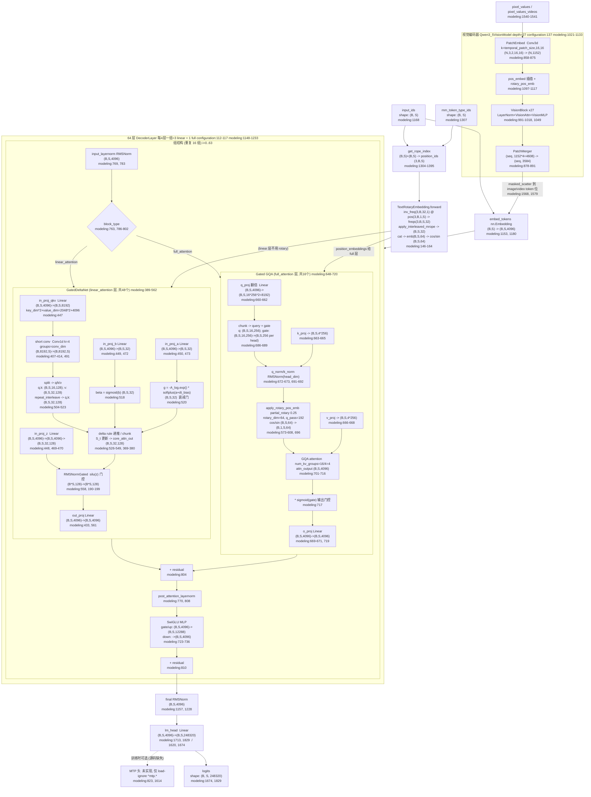

# Qwen3.5 架构分析

> 基于 `research/qwen3.6/modeling_qwen3_5.py`（2075 行）与 `configuration_qwen3_5.py`（200 行）真实源码撰写。
> 所有结论标注 `[源码事实 文件:行号]`，`modeling` 指 `modeling_qwen3_5.py`，`configuration` 指 `configuration_qwen3_5.py`。

---

## 0. 总体规模与配置事实

| 配置项 | 默认值 | 行号 |
|---|---|---|
| `vocab_size` | 248320 | configuration:82 |
| `hidden_size` | 4096 | configuration:83 |
| `intermediate_size` | 12288 | configuration:84 |
| `num_hidden_layers` | 32（默认） | configuration:85 |
| `num_attention_heads` | 16 | configuration:86 |
| `num_key_value_heads` | 4（GQA） | configuration:87 |
| `head_dim` | 256 | configuration:97 |
| `hidden_act` | silu | configuration:88 |
| `partial_rotary_factor` | 0.25 | configuration:111 |
| `linear_conv_kernel_dim` | 4 | configuration:98 |
| `linear_key_head_dim` / `linear_value_head_dim` | 128 / 128 | configuration:99-100 |
| `linear_num_key_heads` / `linear_num_value_heads` | 16 / 32 | configuration:101-102 |
| 视觉 `depth` | 27 | configuration:137 |
| 视觉 `spatial_merge_size` | 2 | configuration:144 |
| 视觉 `out_hidden_size` | 3584 | configuration:146 |
| `mrope_section` | [11, 11, 10] | modeling:118 |

**层类型分布**：`__post_init__` 中按 `full_attention_interval=4` 生成 `layer_types`，规则为 `(i+1)%4==0` 则 `full_attention`，否则 `linear_attention` [源码事实 configuration:112-117]。即每 4 层一组 = `[linear, linear, linear, full]`。默认 `num_hidden_layers=32` [源码事实 configuration:85]；用户所述 27B 变体若为 64 层，则依该 pattern 产生 **48 个 Gated DeltaNet（线性注意力）+ 16 个 Gated GQA（全注意力）= 16 组**。下文按 64 层展开，pattern 机制同源 [源码事实 configuration:112-117]。

**MTP 头说明**：源码中 **未实现 MTP 头**，仅在加载时忽略 `^mtp.*` 权重键 [源码事实 modeling:823, 1614]。故本文件中 MTP 头标注为「占位/未实现」。

---

## 1. 架构 Mermaid 流程图（input_ids → logits）



**数据流说明**：
- 视觉路径：`pixel_values → PatchEmbed(Conv3d) → 27×VisionBlock → PatchMerger` 输出 3584 维 patch embedding，再 `masked_scatter` 替换 `inputs_embeds` 中 image/video 占位 token [源码事实 modeling:1108-1133, 1560-1579]。
- 文本路径：`input_ids → embed_tokens → (MRoPE 计算 position_embeddings) → 64×DecoderLayer → final RMSNorm → lm_head → logits` [源码事实 modeling:1180, 1215, 1217-1228, 1674]。
- 线性注意力层（48 个）**不使用 rotary**，走 short conv + delta rule 递推；全注意力层（16 个）使用 MRoPE 的 `cos/sin` [源码事实 modeling:786-802, 696]。

---

## 2. 关键函数表

### 2.1 `Qwen3_5ForConditionalGeneration.forward`
| 项 | 值 |
|---|---|
| 文件:行号 | modeling:1748-1842 |
| 输入 shape | `input_ids (B,S)`、`pixel_values (?)`、`image_grid_thw (num_img,3)`、`mm_token_type_ids (B,S)` |
| 输出 shape | `logits (B, S, 248320)`、`loss`、`rope_deltas` |
| 核心代码 | `outputs = self.model(input_ids, pixel_values, position_ids, attention_mask, past_key_values, inputs_embeds, mm_token_type_ids, **kwargs)` `hidden_states = outputs[0]` `slice_indices = slice(-logits_to_keep, None) if isinstance(logits_to_keep, int) else logits_to_keep` `logits = self.lm_head(hidden_states[:, slice_indices, :])` `if labels is not None: loss = self.loss_function(logits, labels, vocab_size=...)` |
| 作用 | 多模态条件生成总入口：融合视觉/文本嵌入、调用语言模型、投影到词表 [modeling:1811-1833]。 |

### 2.2 `Qwen3_5TextModel.forward`
| 项 | 值 |
|---|---|
| 文件:行号 | modeling:1166-1233 |
| 输入 shape | `input_ids (B,S)` 或 `inputs_embeds (B,S,4096)`、`position_ids (4,B,S)` |
| 输出 shape | `last_hidden_state (B,S,4096)` |
| 核心代码 | `if inputs_embeds is None: inputs_embeds = self.embed_tokens(input_ids)` `position_ids = position_ids[1:]  # 取 T,H,W 三维` `causal_mask_mapping = {"full_attention": create_causal_mask(**mask_kwargs), "linear_attention": create_recurrent_attention_mask(**mask_kwargs)}` `position_embeddings = self.rotary_emb(hidden_states, position_ids)` `for i, decoder_layer in enumerate(self.layers): hidden_states = decoder_layer(..., attention_mask=causal_mask_mapping[self.config.layer_types[i]], ...)` `hidden_states = self.norm(hidden_states)` |
| 作用 | 文本主干：嵌入→构造双路 mask（full/linear）→逐层解码→终归一化 [modeling:1180, 1193-1212, 1217-1228]。 |

### 2.3 `Qwen3_5DecoderLayer.forward`
| 项 | 值 |
|---|---|
| 文件:行号 | modeling:772-812 |
| 输入 shape | `hidden_states (B,S,4096)`、`position_embeddings (cos,sin)` |
| 输出 shape | `hidden_states (B,S,4096)` |
| 核心代码 | `residual = hidden_states; hidden_states = self.input_layernorm(hidden_states)` `if self.block_type == "linear_attention": hidden_states = self.linear_attn(hidden_states=..., cache_params=past_key_values, ...)` `elif self.block_type == "full_attention": hidden_states, _ = self.self_attn(hidden_states=..., position_embeddings=..., ...)` `hidden_states = residual + hidden_states` `residual = hidden_states; hidden_states = self.post_attention_layernorm(hidden_states); hidden_states = self.mlp(hidden_states); hidden_states = residual + hidden_states` |
| 作用 | 按 `block_type` 分派到 GatedDeltaNet 或 Gated GQA，统一 pre-norm 残差结构 [modeling:763, 786-810]。 |

### 2.4 `Qwen3_5GatedDeltaNet.forward`
| 项 | 值 |
|---|---|
| 文件:行号 | modeling:453-562 |
| 输入 shape | `hidden_states (B,S,4096)` |
| 输出 shape | `output (B,S,4096)` |
| 核心代码 | `mixed_qkv = self.in_proj_qkv(hidden_states).transpose(1,2)` `z = self.in_proj_z(hidden_states).reshape(B,S,-1,head_v_dim); b = self.in_proj_b(hidden_states); a = self.in_proj_a(hidden_states)` `mixed_qkv = causal_conv1d_fn(mixed_qkv, self.conv1d.weight.squeeze(1), ..., activation=self.activation)` `query,key,value = torch.split(mixed_qkv, [key_dim,key_dim,value_dim], dim=-1)` `beta = b.sigmoid(); g = -self.A_log.float().exp() * F.softplus(a.float() + self.dt_bias)` `core_attn_out, last = self.chunk_gated_delta_rule(query,key,value,g=g,beta=beta, ..., use_qk_l2norm_in_kernel=True)` `core_attn_out = self.norm(core_attn_out.reshape(-1,head_v_dim), z).reshape(B,S,-1)` `output = self.out_proj(core_attn_out)` |
| 作用 | 线性注意力：QKV+Z+B+A 四投影 → short conv(k=4) → delta rule 递推/分块 → RMSNormGated(silu 门) → 输出投影 [modeling:447-450, 491, 518-520, 538, 558, 561]。 |

### 2.5 `Qwen3_5Attention.forward`（Gated GQA）
| 项 | 值 |
|---|---|
| 文件:行号 | modeling:675-720 |
| 输入 shape | `hidden_states (B,S,4096)`、`position_embeddings (cos(B,S,64), sin(B,S,64))` |
| 输出 shape | `attn_output (B,S,4096)` |
| 核心代码 | `query_states, gate = torch.chunk(self.q_proj(hidden_states).view(*input_shape,-1,head_dim*2), 2, dim=-1)` `query_states = self.q_norm(query_states.view(hidden_shape)).transpose(1,2)` `key_states = self.k_norm(self.k_proj(hidden_states).view(hidden_shape)).transpose(1,2)` `query_states, key_states = apply_rotary_pos_emb(query_states, key_states, cos, sin)` `attn_output, _ = attention_interface(self, query_states, key_states, value_states, attention_mask, scaling=self.scaling, ...)` `attn_output = attn_output.reshape(*input_shape,-1); attn_output = attn_output * torch.sigmoid(gate)` `attn_output = self.o_proj(attn_output)` |
| 作用 | 全注意力 GQA：q_proj 翻倍出 gate → partial rotary → 标准 attention → sigmoid 输出门控 → o_proj [modeling:660-662, 686-688, 696, 716-719]。 |

### 2.6 `Qwen3_5MLP.forward`（SwiGLU）
| 项 | 值 |
|---|---|
| 文件:行号 | modeling:734-736 |
| 输入 shape | `x (B,S,4096)` |
| 输出 shape | `(B,S,4096)` |
| 核心代码 | `def forward(self, x):` `    down_proj = self.down_proj(self.act_fn(self.gate_proj(x)) * self.up_proj(x))` `    return down_proj` |
| 作用 | SwiGLU 前馈：`down(silu(gate(x)) * up(x))`，`hidden_act=silu` [modeling:729-735, configuration:88]。 |

### 2.7 `get_rope_index`
| 项 | 值 |
|---|---|
| 文件:行号 | modeling:1304-1395 |
| 输入 shape | `input_ids (B,S)`、`mm_token_type_ids (B,S)`、`image_grid_thw (num_img,3)`、`video_grid_thw (num_vid,3)` |
| 输出 shape | `position_ids (3, B, S)`、`mrope_position_deltas (B,1)` |
| 核心代码 | `for batch_idx, current_input_ids in enumerate(input_ids):` `    for modality_type, start_idx, end_idx in input_type_group:` `        if modality_type == 0:  # text` `            llm_pos_ids_list.append(torch.arange(text_len).view(1,-1).expand(3,-1) + current_pos)` `        else:  # image(1)/video(2)` `            vision_position_ids = self.get_vision_position_ids(current_pos, grid_thw, 1, spatial_merge_size, ...)` `            current_pos += max(grid_thw[1], grid_thw[2]) // spatial_merge_size` `    position_ids[:, batch_idx] = torch.cat(llm_pos_ids_list, dim=1).reshape(3,-1)` `    mrope_position_deltas.append(llm_positions.max()+1 - len(current_input_ids))` |
| 作用 | 多模态 M-RoPE 三维位置编码：文本段用一维连续位置复制到 T/H/W 三轴；视觉段用 `get_vision_position_ids` 生成 (T,H,W) 网格位置；输出 (3,B,S) 与 delta [modeling:1345-1351, 1374-1393]。 |

### 2.8 `apply_interleaved_mrope`
| 项 | 值 |
|---|---|
| 文件:行号 | modeling:166-181 |
| 输入 shape | `freqs (3, B, S, 32)`、`mrope_section [11,11,10]` |
| 输出 shape | `freqs_t (B, S, 32)` |
| 核心代码 | `def apply_interleaved_mrope(self, freqs, mrope_section):` `    freqs_t = freqs[0]  # T 轴为基础` `    for dim, offset in enumerate((1, 2), start=1):  # H, W` `        length = mrope_section[dim] * 3` `        idx = slice(offset, length, 3)` `        freqs_t[..., idx] = freqs[dim, ..., idx]` `    return freqs_t` |
| 作用 | 把分块布局 `[TTT...HHH...WWW]` 重排为交错布局 `[THWTHWTHW...TT]`，保持频率连续性 [modeling:167-181]。 |

### 2.9 `apply_rotary_pos_emb`
| 项 | 值 |
|---|---|
| 文件:行号 | modeling:573-608 |
| 输入 shape | `q (B,H,S,256)`、`k (B,K,S,256)`、`cos/sin (B,S,64)` |
| 输出 shape | `q_embed/k_embed (B,H,S,256)` |
| 核心代码 | `cos = cos.unsqueeze(unsqueeze_dim); sin = sin.unsqueeze(unsqueeze_dim)` `rotary_dim = cos.shape[-1]  # =64` `q_rot, q_pass = q[..., :rotary_dim], q[..., rotary_dim:]  # 64 / 192` `q_embed = (q_rot * cos) + (rotate_half(q_rot) * sin)` `k_embed = (k_rot * cos) + (rotate_half(k_rot) * sin)` `q_embed = torch.cat([q_embed, q_pass], dim=-1)` |
| 作用 | 对 q/k 的前 `rotary_dim=64` 维（partial_rotary=0.25×256）施加旋转，后 192 维直通拼接 [modeling:597-607, configuration:111]。 |

---

## 3. Gated DeltaNet 的 delta rule 递推公式与 torch 回退实现

### 3.1 数学公式（由 modeling:369-380 反推）

设 `S_t ∈ R^{head_k_dim × head_v_dim}` 为递推状态，`g_t`、`β_t`、`q_t/k_t/v_t` 均为单步张量：

1. **衰减门**（标量 per head）：`g_t = exp( -A · softplus(a_t + dt_bias) )`，`A = exp(A_log)`，范围 (0,1) [源码事实 modeling:520, 373]
2. **beta 门**：`β_t = sigmoid(b_t)` [源码事实 modeling:518]
3. **状态衰减**：`S'_t = S_{t-1} · g_t` [源码事实 modeling:376]
4. **检索**：`r_t = S'_t · k_t = Σ_{d_k} S'_t · k_t`（沿 key 维求和）[源码事实 modeling:377]
5. **delta 修正**：`δ_t = (v_t - r_t) · β_t` [源码事实 modeling:378]
6. **状态更新**（外积）：`S_t = S'_t + k_t ⊗ δ_t` [源码事实 modeling:379]
7. **读出**：`o_t = S_t · q_t` [源码事实 modeling:380]

> 该规则使状态学习「新值 v_t 相对旧检索 r_t 的修正量」并以 β 控制修正幅度，g 控制遗忘速度。

### 3.2 torch 回退实现（modeling:369-380 原文）

```python
# modeling:344-385  torch_recurrent_gated_delta_rule  的核心递推段
for i in range(sequence_length):
    q_t = query[:, :, i]
    k_t = key[:, :, i]
    v_t = value[:, :, i]
    g_t = g[:, :, i].exp().unsqueeze(-1).unsqueeze(-1)
    beta_t = beta[:, :, i].unsqueeze(-1)

    last_recurrent_state = last_recurrent_state * g_t
    kv_mem = (last_recurrent_state * k_t.unsqueeze(-1)).sum(dim=-2)
    delta = (v_t - kv_mem) * beta_t
    last_recurrent_state = last_recurrent_state + k_t.unsqueeze(-1) * delta.unsqueeze(-2)
    core_attn_out[:, :, i] = (last_recurrent_state * q_t.unsqueeze(-1)).sum(dim=-2)
```

**张量维度注释**（按默认配置）：
- `query/key`: `(B, 32, S, 128)`，`value`: `(B, 32, S, 128)`（经 `repeat_interleave` 把 16 key-head 扩展到 32 value-head [modeling:521-523]）
- `last_recurrent_state`: `(B, 32, 128, 128)` = `k_head_dim × v_head_dim` [modeling:363-366]
- `g_t`/`beta_t`: 标量 per head，广播到 `(B,32,1,1)` / `(B,32,1)` [modeling:373-374]
- `kv_mem`、`delta`、`o_t`: `(B, 32, 128)`，`k_t.unsqueeze(-1) * delta.unsqueeze(-2)` 为外积 `(B,32,128,128)` [modeling:377-380]

> 训练/长序列优先用 FLA 的 `chunk_gated_delta_rule`（分块并行，modeling:538）；单步解码（`seq_len==1`）用 `fused_recurrent_gated_delta_rule` [modeling:526-537]。FLA 不可用时回退到上述 torch 实现 [modeling:435-436, 438-443]。

---

## 4. MRoPE 的 [11,11,10] 拆分与 interleaved 重排

### 4.1 [11,11,10] 的来源与维度对齐

- `mrope_section = config.rope_parameters.get("mrope_section", [11, 11, 10])` [源码事实 modeling:118]
- 三段分别对应 **T(时间)、H(高)、W(宽)** 三个轴的频率数，合计 `11+11+10 = 32` [源码事实 modeling:118]
- 与 head_dim/partial_rotary 的对齐：`head_dim=256`、`partial_rotary_factor=0.25` → 旋转维 `dim = 256×0.25 = 64` → `inv_freq` 长度 `64/2 = 32` [源码事实 configuration:97, 111; modeling:136-141]。即 32 个频率恰好被拆成 11+11+10。
- `inv_freq` 计算后扩展到 3 轴：`inv_freq_expanded (3, B, 32, 1)` 与 `position_ids_expanded (3, B, 1, S)` 矩阵乘得 `freqs (3, B, S, 32)` [源码事实 modeling:151-158]。

### 4.2 interleaved 重排代码（modeling:166-181 原文）

```python
def apply_interleaved_mrope(self, freqs, mrope_section):
    """Apply interleaved MRoPE to 3D rotary embeddings.
    Reorganizes frequency layout from chunked [TTT...HHH...WWW] to
    interleaved [THWTHWTHW...TT], preserving frequency continuity.
    args:
        x: (3, bs, seq_len, head_dim // 2)
        mrope_section: (3,)
    returns:
        x_t: (bs, seq_len, head_dim // 2)
    """
    freqs_t = freqs[0]  # just overwrite the first dimension T
    for dim, offset in enumerate((1, 2), start=1):  # H, W
        length = mrope_section[dim] * 3
        idx = slice(offset, length, 3)
        freqs_t[..., idx] = freqs[dim, ..., idx]
    return freqs_t
```

### 4.3 重排索引展开（mrope_section=[11,11,10]）

基础 `freqs_t = freqs[0]`（T 轴）保留所有 32 列，随后用 H、W 轴覆盖对应交错位置 [源码事实 modeling:176-180]：

| 轴 | dim | offset | length = section×3 | idx = slice(offset, length, 3) | 覆盖列索引 | 列数 |
|---|---|---|---|---|---|---|
| T | 0 | — | — | 保留基础 | {0,3,6,9,12,15,18,21,24,27,30} | 11 |
| H | 1 | 1 | 11×3=33 | slice(1, 33, 3) | {1,4,7,10,13,16,19,22,25,28,31} | 11 |
| W | 2 | 2 | 10×3=30 | slice(2, 30, 3) | {2,5,8,11,14,17,20,23,26,29} | 10 |

最终 32 列顺序为：`[T0,H0,W0, T1,H1,W1, ..., T9,H9,W9, T10,H10]`（10 个完整 THW 三元组 = 30 列，再加 T10、H10 = 32 列）[源码事实 modeling:176-181]。

### 4.4 后续拼接

```python
emb = torch.cat((freqs, freqs), dim=-1)  # (B,S,32) -> (B,S,64)
cos = emb.cos() * self.attention_scaling
sin = emb.sin() * self.attention_scaling
```
`cat` 把 32 个频率复制成 64 维以匹配 `rotate_half` 的两半结构，再算 cos/sin 送入 `apply_rotary_pos_emb` [源码事实 modeling:160-164, 565-569]。

---

## 5. 两套输出门控：sigmoid 全注意力 vs silu 线性注意力

Qwen3.5 对两类 token mixer 使用**不同的输出门控激活函数**，这是区分两种层的核心信号。

### 5.1 全注意力层：sigmoid 门控（Gated GQA）

- **门来源**：`q_proj` 输出维度翻倍 `num_attention_heads * head_dim * 2`，再 `torch.chunk(..., 2, dim=-1)` 拆成 `query` 与 `gate` [源码事实 modeling:660-662, 686-688]
- **门施加位置**：标准 attention 输出之后、`o_proj` 之前
- **激活函数**：`sigmoid`

```python
# modeling:716-719
attn_output = attn_output.reshape(*input_shape, -1).contiguous()
attn_output = attn_output * torch.sigmoid(gate)
attn_output = self.o_proj(attn_output)
```

- `gate` shape：`(B, S, num_attention_heads, head_dim)` → reshape `(B, S, 4096)`，与 `attn_output` 逐元素相乘 [源码事实 modeling:689, 716-717]
- 该门**不在归一化内部**，是裸的逐维 sigmoid 缩放。

### 5.2 线性注意力层：silu 门控（RMSNormGated）

- **门来源**：独立投影 `in_proj_z`：`(B,S,4096) → (B,S,32,128)` [源码事实 modeling:448, 469-470]
- **门施加位置**：delta rule 输出 `core_attn_out` 经 `RMSNorm` 后再乘 `silu(z)`，封装在 `Qwen3_5RMSNormGated` 内
- **激活函数**：`silu`
- **实例化**：`self.norm = Qwen3_5RMSNormGated(self.head_v_dim, eps=...)`（FLA 不可用时）或 `FusedRMSNormGated`（FLA 可用时）[源码事实 modeling:423-431]
- **调用**：`core_attn_out = self.norm(core_attn_out, z)` [源码事实 modeling:558]

```python
# modeling:184-199  Qwen3_5RMSNormGated.forward
def forward(self, hidden_states, gate=None):
    input_dtype = hidden_states.dtype
    hidden_states = hidden_states.to(torch.float32)
    variance = hidden_states.pow(2).mean(-1, keepdim=True)
    hidden_states = hidden_states * torch.rsqrt(variance + self.variance_epsilon)
    hidden_states = self.weight * hidden_states.to(input_dtype)
    hidden_states = hidden_states * F.silu(gate.to(torch.float32))   # <- silu 门
    return hidden_states.to(input_dtype)
```

- `hidden_states`（即 `core_attn_out`）shape `(B*S, 128)`，`gate=z` shape `(B*S, 128)`，逐维相乘 [源码事实 modeling:556-558, 190-197]
- 该门**嵌在 RMSNorm 之后**：`norm → ×weight → ×silu(gate)`，与 sigmoid 门的结构不同。

### 5.3 对比小结

| 维度 | sigmoid 全注意力 | silu 线性注意力 |
|---|---|---|
| 层类型 | `full_attention`（16 层） | `linear_attention`（48 层） |
| 门来源 | `q_proj` 翻倍 chunk | 独立 `in_proj_z` |
| 激活函数 | `sigmoid` | `silu` |
| 门施加位置 | attention 输出后、`o_proj` 前，裸乘 | RMSNorm 内部，`norm → ×silu(z)` |
| 代码位置 | modeling:717 | modeling:197（定义）、558（调用） |
| 配套机制 | partial_rotary 0.25 + GQA | short conv k=4 + delta rule |

[源码事实 modeling:660-662, 686-689, 716-719, 423-431, 448, 556-558, 184-199]

---

## 附：关键类/函数行号索引

| 类/函数 | 行号 |
|---|---|
| `Qwen3_5VisionRotaryEmbedding` | modeling:85-96 |
| `Qwen3_5TextRotaryEmbedding`（含 `apply_interleaved_mrope`） | modeling:99-181 |
| `Qwen3_5RMSNormGated`（silu 门） | modeling:184-199 |
| `causal_conv1d_update` / `causal_conv1d_fn` | modeling:214-254 |
| `torch_chunk_gated_delta_rule` | modeling:263-341 |
| `torch_recurrent_gated_delta_rule` | modeling:344-385 |
| `Qwen3_5GatedDeltaNet` | modeling:388-562 |
| `apply_rotary_pos_emb` | modeling:573-608 |
| `eager_attention_forward` | modeling:623-645 |
| `Qwen3_5Attention`（Gated GQA, sigmoid 门） | modeling:648-720 |
| `Qwen3_5MLP`（SwiGLU） | modeling:723-736 |
| `Qwen3_5RMSNorm` | modeling:739-756 |
| `Qwen3_5DecoderLayer` | modeling:759-812 |
| `Qwen3_5VisionPatchEmbed` / `PatchMerger` | modeling:858-891 |
| `Qwen3_5VisionAttention` / `VisionBlock` | modeling:908-1018 |
| `Qwen3_5VisionModel` | modeling:1021-1133 |
| `Qwen3_5TextModel` | modeling:1148-1233 |
| `Qwen3_5Model.get_rope_index` | modeling:1304-1395 |
| `Qwen3_5Model.compute_3d_position_ids` | modeling:1482-1529 |
| `Qwen3_5Model.forward` | modeling:1531-1604 |
| `Qwen3_5ForCausalLM`（lm_head） | modeling:1607-1686 |
| `Qwen3_5ForConditionalGeneration` | modeling:1705-2027 |
| 配置 `Qwen3_5TextConfig` | configuration:29-121 |
| 配置 `Qwen3_5VisionConfig` | configuration:126-148 |
| 配置 `Qwen3_5Config` | configuration:153-197 |
